## Конфигурация виртуальной машины
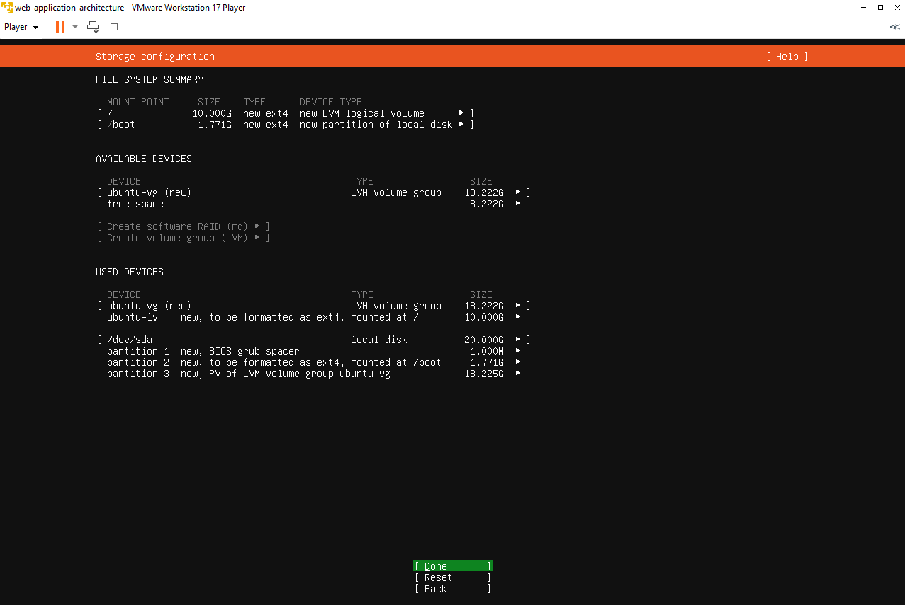
## Командная строка Ubuntu после установки с приглашением фамилия@фамилия:~$
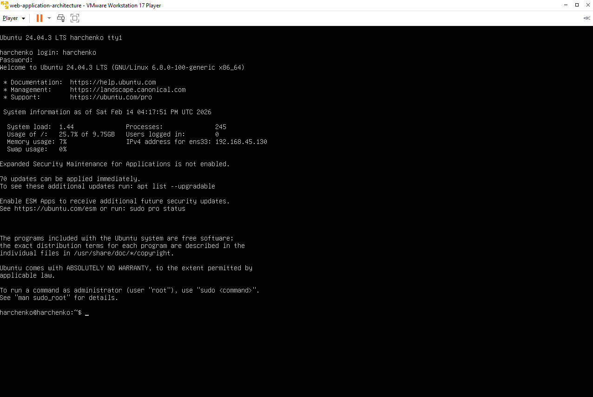
## Вывод cat ~/report/01-system.txt
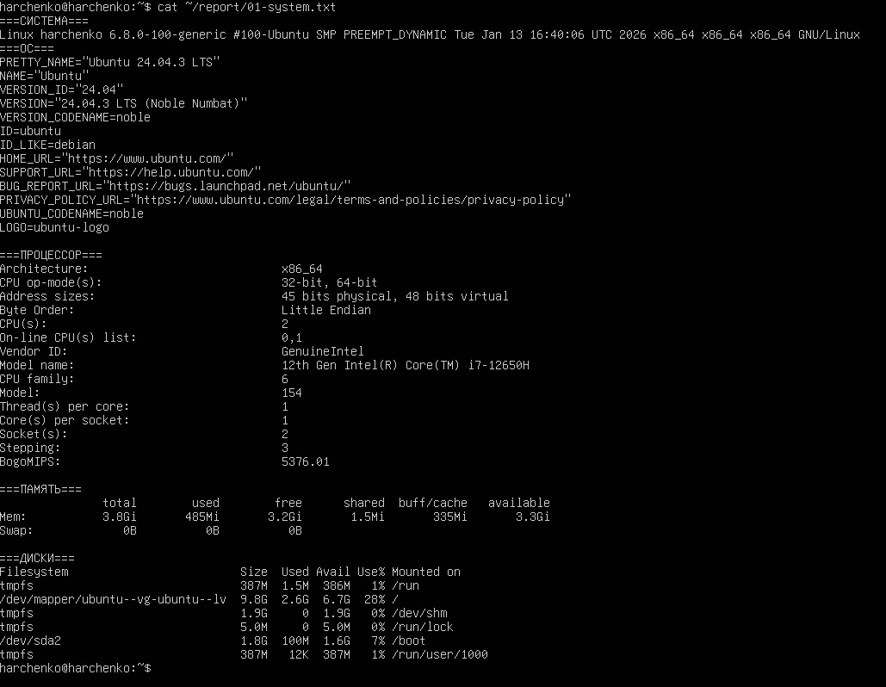
## Вывод ip addr show
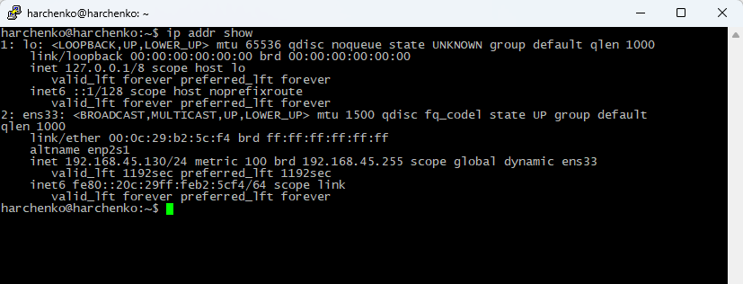
## Вывод sudo ss -tlnp
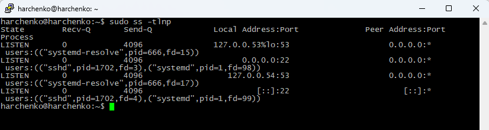
## Вывод sudo systemctl status ssh
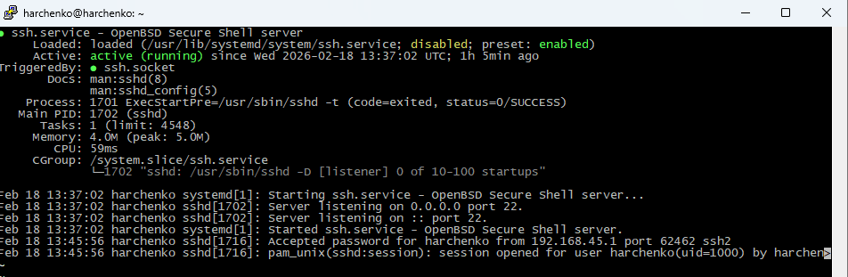
## Вывод sudo ss -tlnp | grep ssh
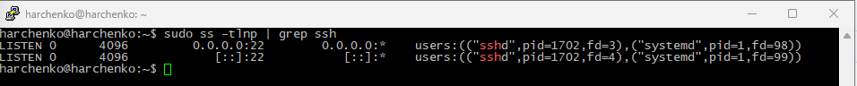
## Вывод grep '/bin/bash' /etc/passwd
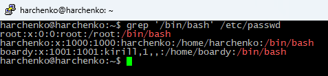
## Процесс создания нового пользователя boardy
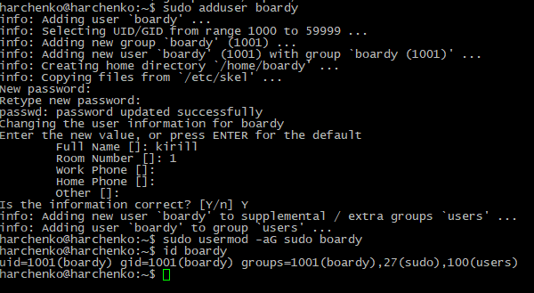
## [Вывод id boardy
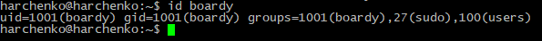
## Вывод ls -la /
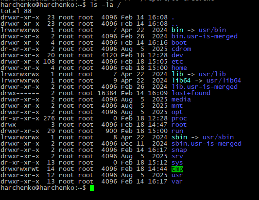
## Вывод ls -la ~
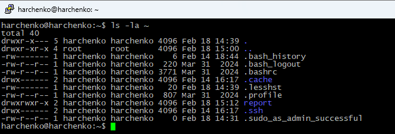
## Вывод ls -ld / /etc /var /tmp /home
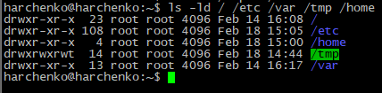
## Три состояния testfile.txt (до, после chmod 755, после chmod 600)
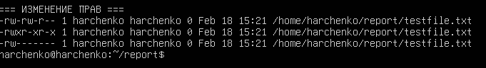
## Вывод dpkg -l | grep -E 'openssh|python|git|curl|vim|nano'
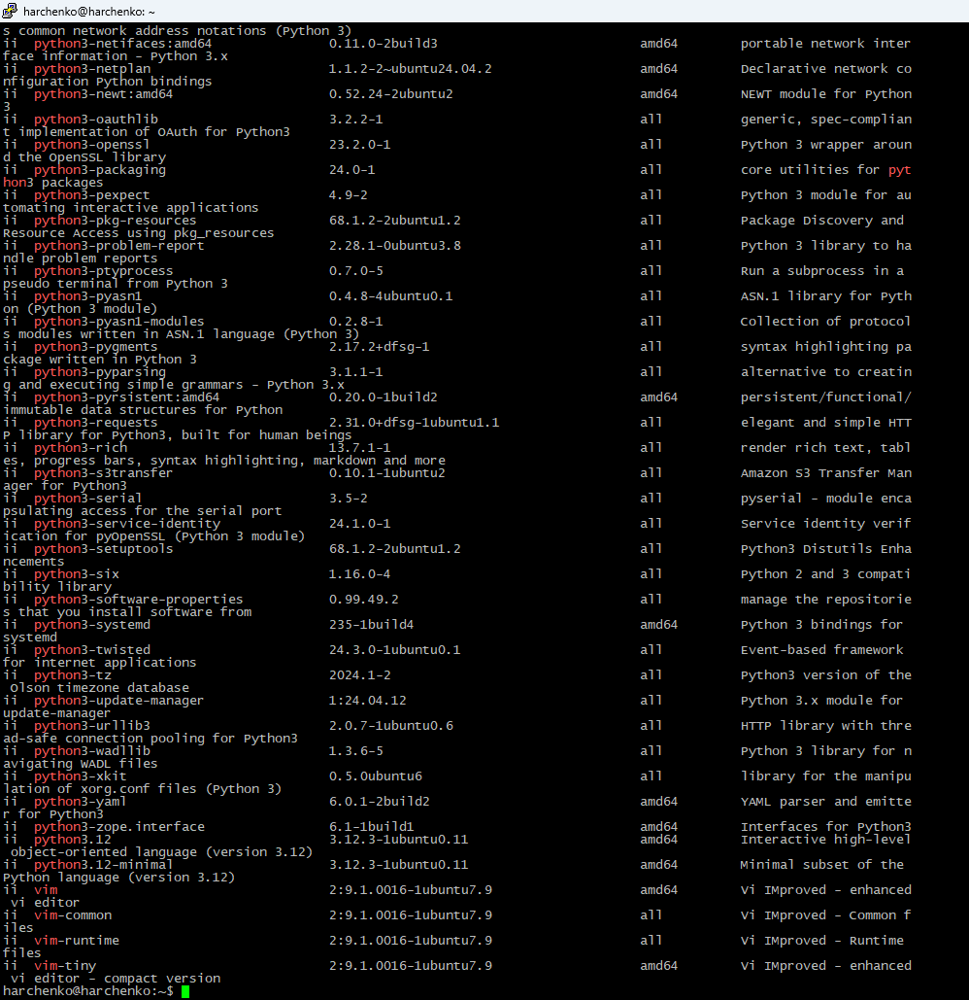
## Вывод systemctl list-units --type=service --state=running
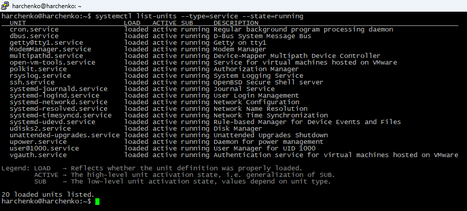
## Вывод ps aux --sort=-%mem | head -11
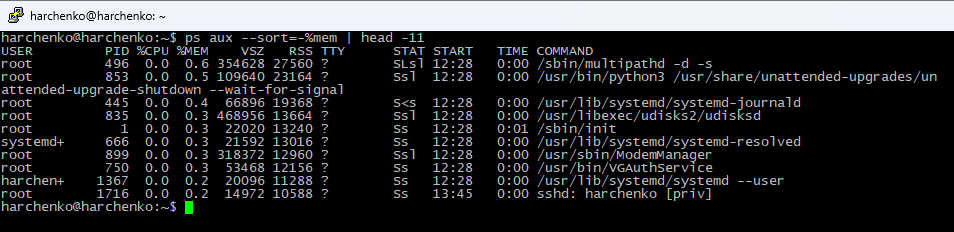
## Вывод процессов по пользователям
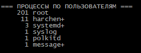
## Вывод топ-10 больших файлов в /var
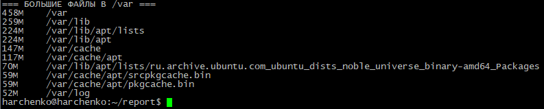
## Вывод ls -lh ~/report/ со всеми файлами
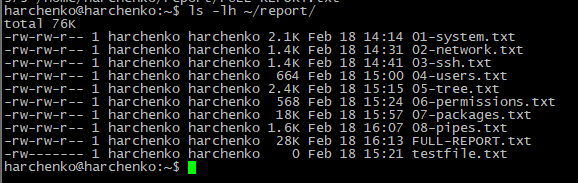