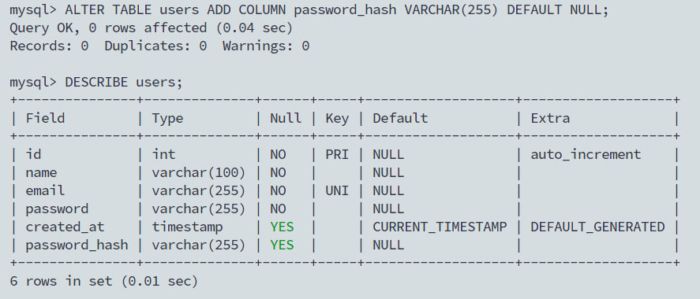
Сейчас хэш занимает 60 символов, но функция может обновиться, и хэш начнёт занимать больше символов.

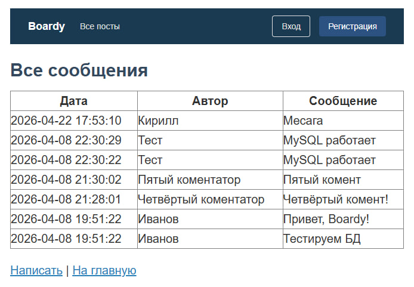

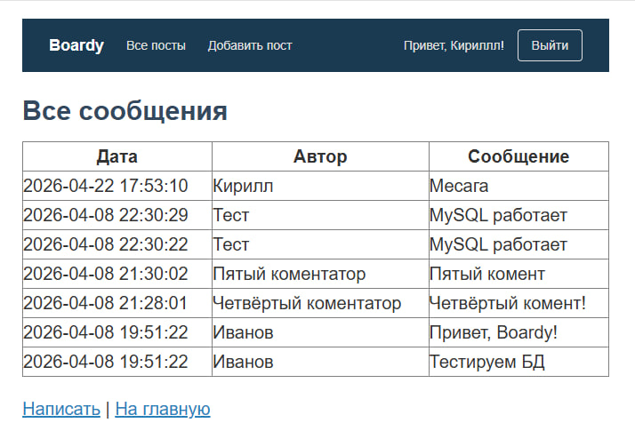
Так мы соблюдаем прицип DRY, новая ссылка появится сразу везде

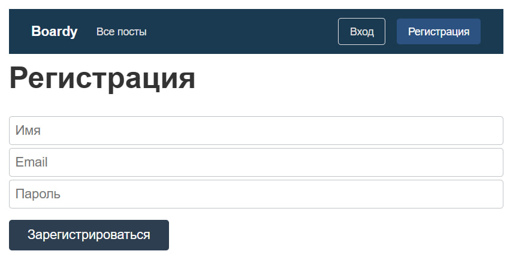

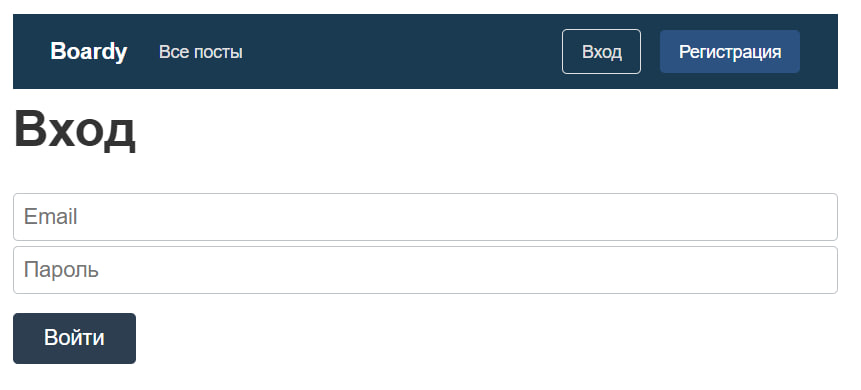

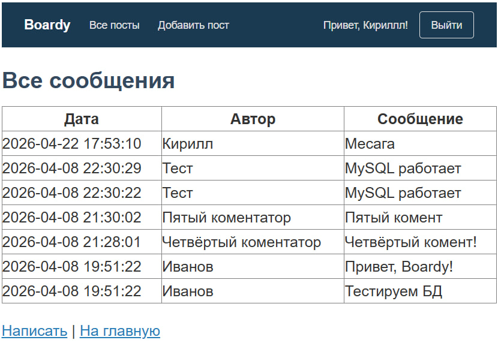

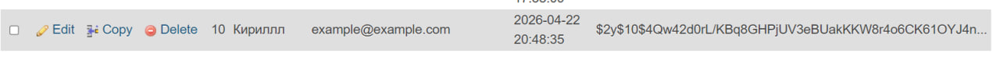
Это хеш алгоритма bcrypt, где $2y$ обозначает версию алгоритма, 10$ — коэффициент вычислительной сложности, далее идут соль и итоговый хеш, а увеличение стоимости до 15 сделает процесс проверки пароля в 32 раза медленнее

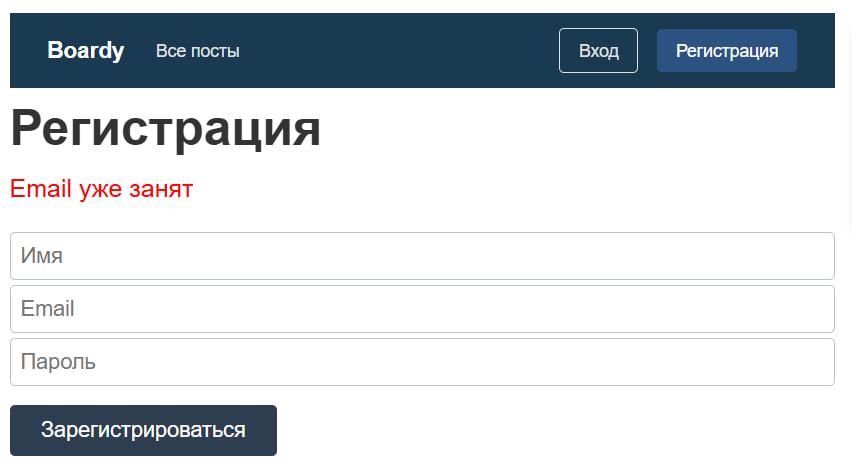
Может существовать 2 пользователя с одним email.

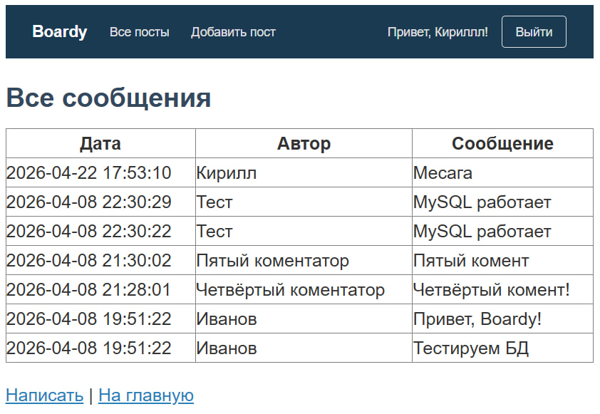

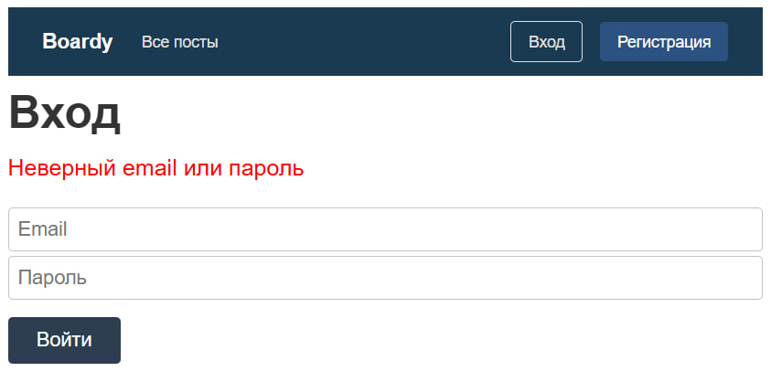
Защитная от перебора имени пользователя

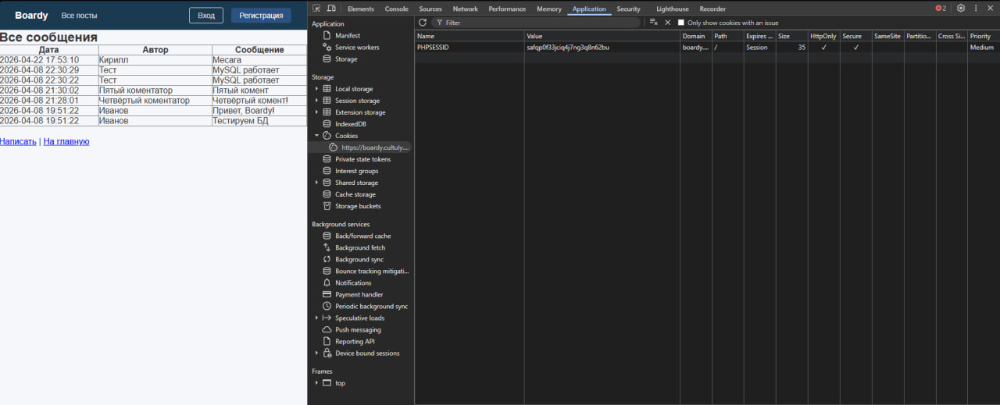
В куке хранится идентификатор сессии - случайная строка символов, которую генерирует сервер при успешном входе

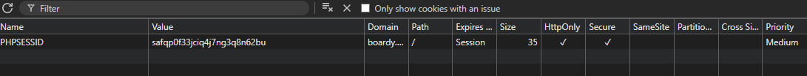
Если убрать флаг HttpOnly, то JavaScript получит доступ к кукам через document.cookie, что при наличии XSS-уязвимости позволит злоумышленнику украсть session_id и полностью перехватить сессию пользователя.

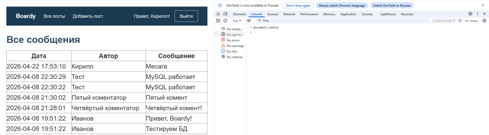
Благодря флагу HttpOnly

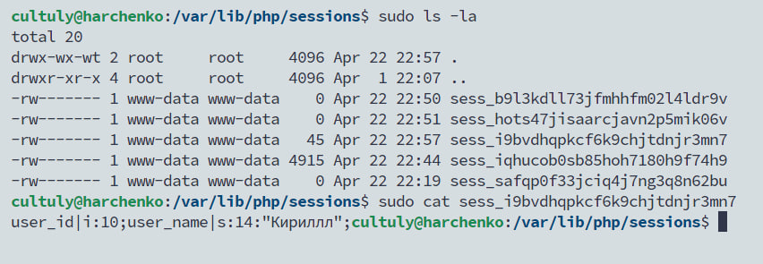
В файле на сервере хранится полезная информация: id пользователя, имя, все, что мы положим в $_SESSION. А в куке хранится только ID сессии.
Данные так разделяют для безопасности, чтоб нельзя было поменять user_id или попасть в чужой аккаунт. 

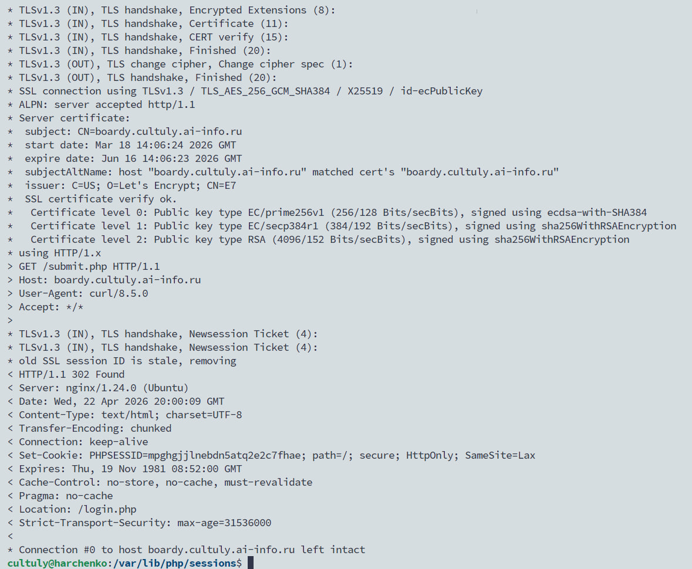

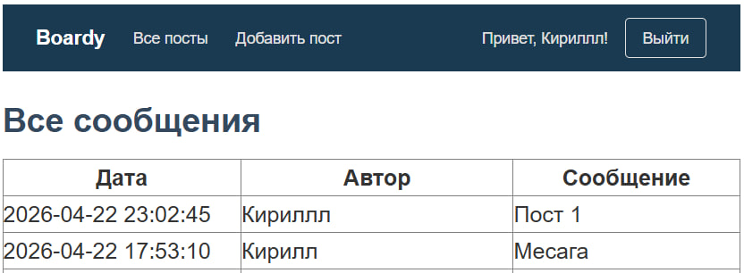
напишите SQL с JOIN, которым вы тянете посты. Почему JOIN, а не два отдельных запроса?

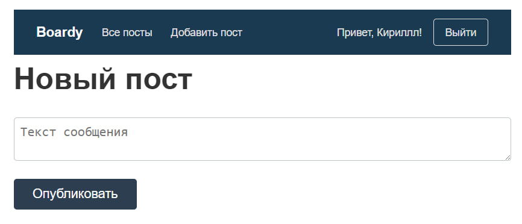

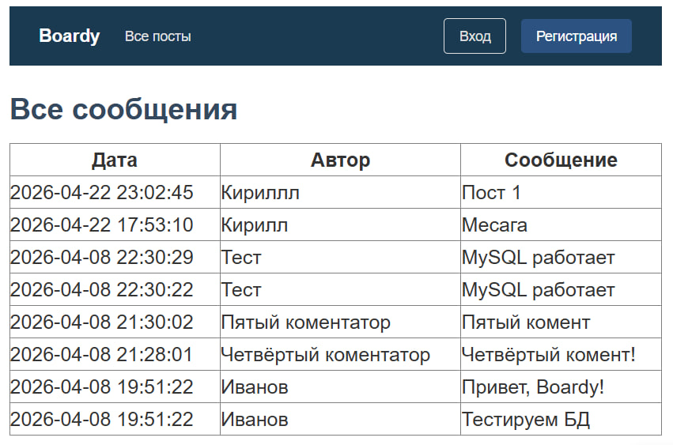

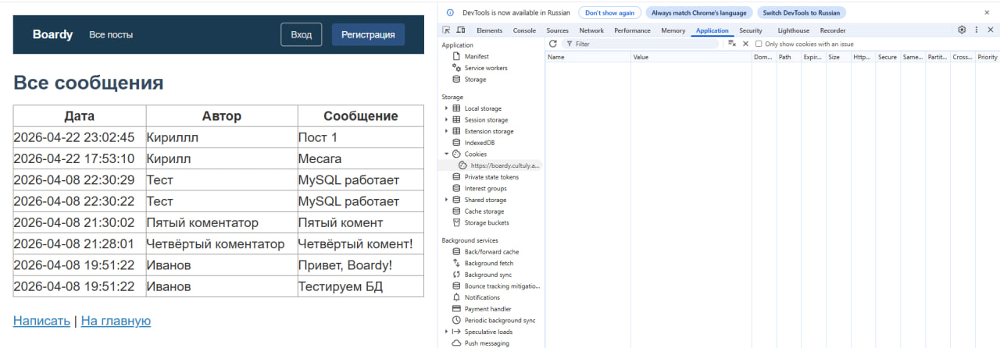
session_destroy() удаляет данные сессии только на сервере, но не трогает куку в браузере, поэтому без setcookie() с прошедшей датой браузер продолжит отправлять старый PHPSESSID, и при следующем session_start() PHP создаст новую сессию (отсюда мгновенное появление новой куки); если выполнить только session_destroy() — на клиенте останется «мёртвая» кука, которая будет создавать пустые сессии, а если только setcookie() — на сервере останется «файл-зомби»

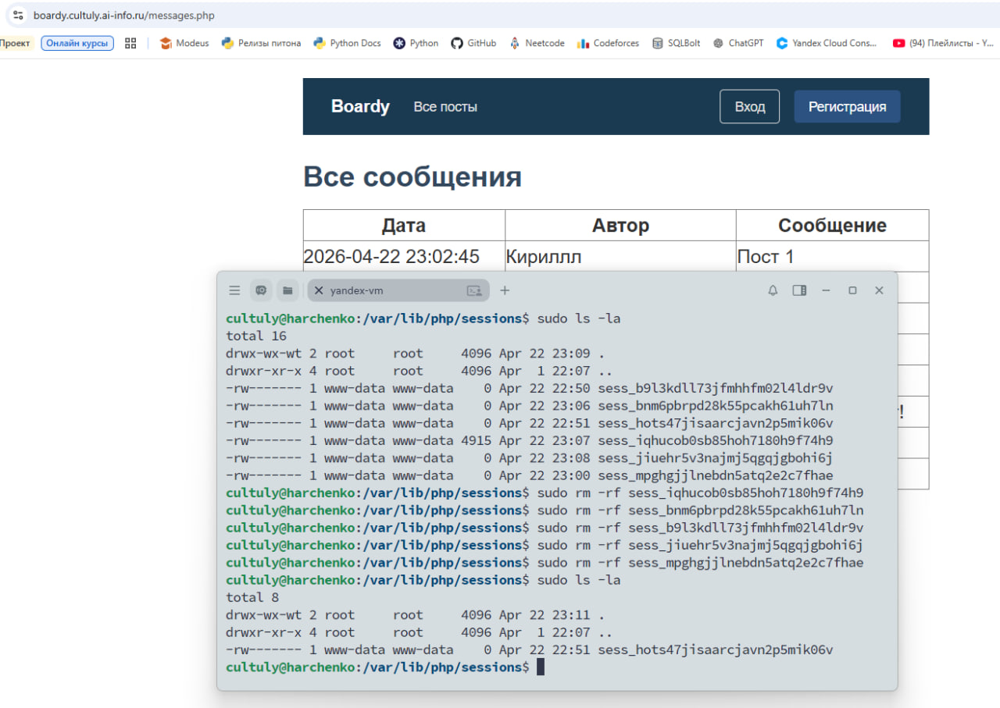
Когда мы удаляем файл сессии, бразуер об этом не знает и продолжает отправлять куку с ID.
