# 1. Ответ по запросу без авторизации:
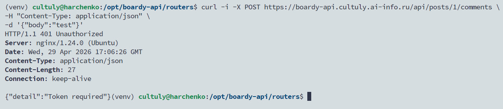
## Ответ на вопрос:
    Bearer это тип схемы заголовка (анотация типа схемы) Authorization в формате: 
```http
Authorization: Bearer <token>
```
**Почему не просто токен? :**
Потому что HTTP по стандарту ожидает получить и тип схемы и сами данные.

```http
Authorization: <schema> <credentials>
```

# 2. Запрос на /api/me.php с кукой
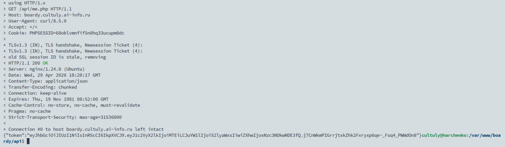
## Ответ на вопрос:
    me.php использует session_start() вместо логина и пароля, потому что пользователь уже залогинился через форму логина или oauth аутентификацию и его личность сохранена в серверной сессии а клиент идентифицируется кукой PHPSESSID
**Какую роль играет кука? : Без куки сервер просто не поймёт чью сессию открывать**

# 3. React получает JWT
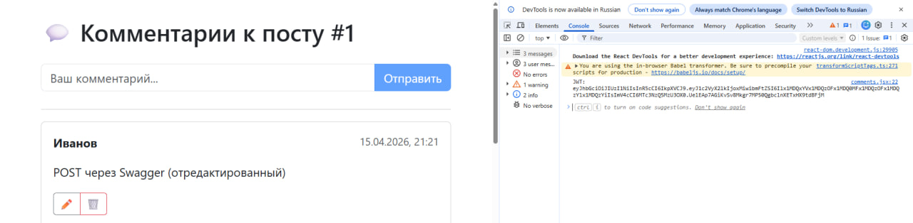

# 4. Authorization: Bearer в fetch
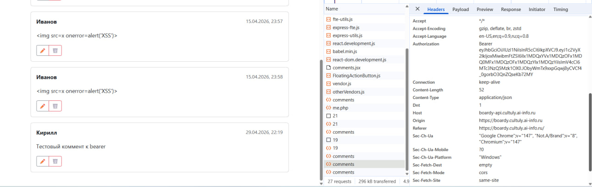

# 5. Комментарий создан, автор указан правильный
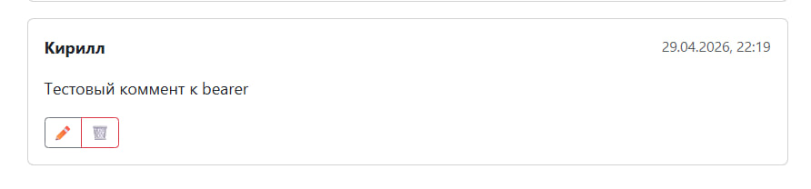

# 6. Декодирование JWT токена на jwt.io
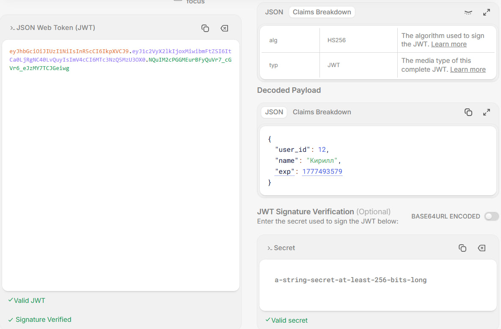
## Ответ на вопрос:
    payload закодирован в формате Base64URL, но не зашифрован.

    Получив JWT токен злоумышленник получит доступ ко всем указанным полям в JWT токене.

    Это не проблема так как JWT токен и не используется для сокрытия данных, он используется для подтверждения подлинности этих данных. 
    
    Плюс если трафик идёт по HTTPS, то перехватить токен на лету не получится, практически невозможно, но даже если получится, у JWT токена обычно небольшое время жизни.

# 7. 401 - Token Expired
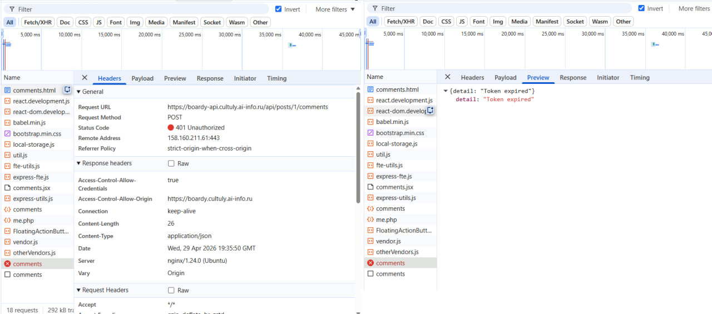

# 8. Невалидный токен
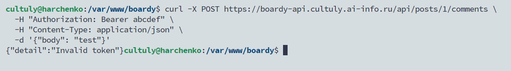

# 9. Github oauth app
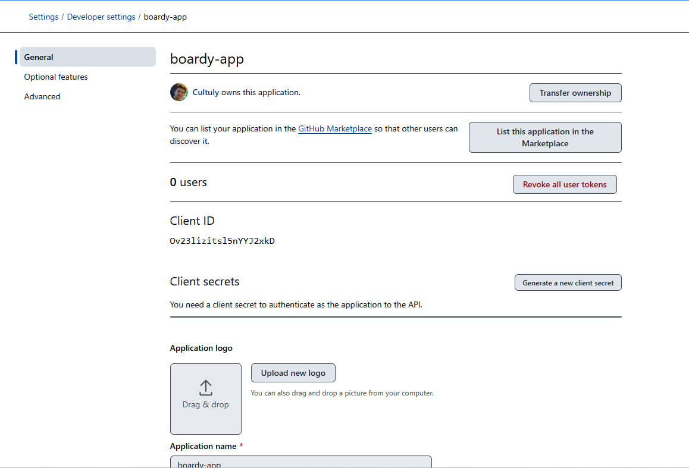

# 10. Добавление столбца github_id в таблицу users
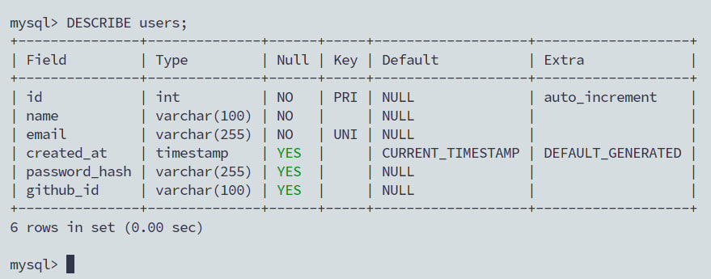

# 11. Кнопка «Войти через GitHub»
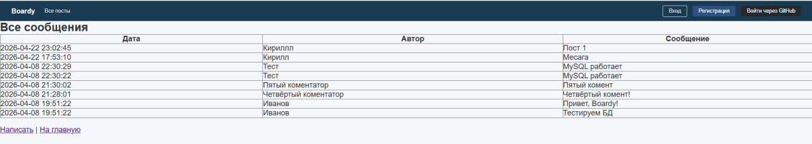

# 12. Oauth flow
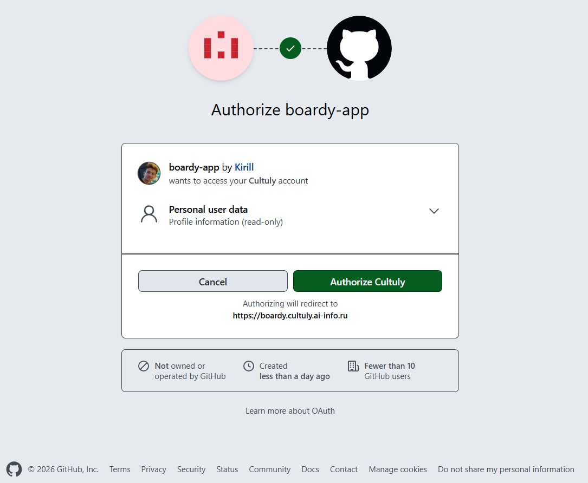

# 13. Redirect после логина через GitHub
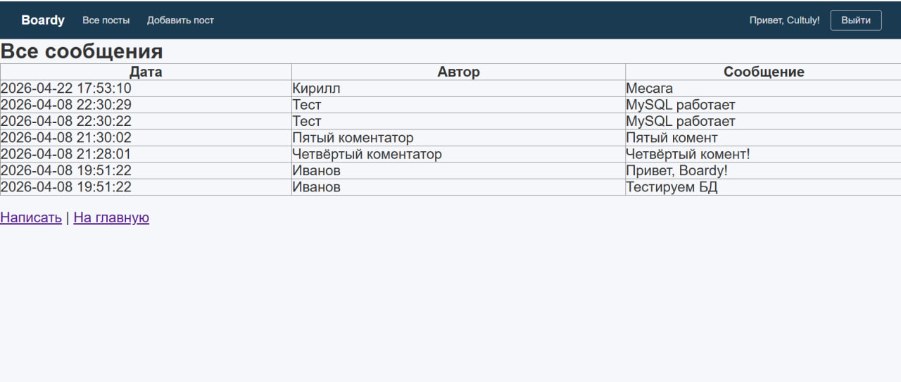

# 14. Запись в базе данных с github_id
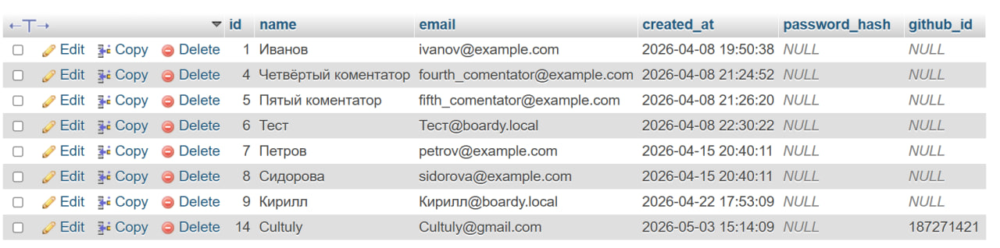
## Ответ на вопрос:
        Поиск по github_id надёжнее так как это уникальный идентификатор пользователя, а почту пользователь может поменять в любой момент или не передавать вовсе

# 15. Комментарий создан имя = логин на GitHub
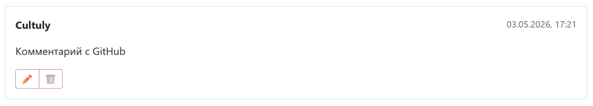
state - это случайная строка, генерируемая перед редиректом на провайдера и сохраняемая в сессии для защиты от CSRF-атак путём сверки при возврате.
Сценарий атаки без state: злоумышленник начинает OAuth-flow со своего аккаунта и получает временный code. Затем формирует вредоносную ссылку на oauth-callback.php?code=вредоносный_код и отправляет жертве. Затем жертва (уже авторизованная на сайте) переходит по ссылке. callback принимает чужой code, обменивает его на токен злоумышленника и получает его github_id. Скрипт привязывает сессию жертвы к аккаунту хакера, после чего все действия жертвы выполняются от имени злоумышленника.

# 16. Таблица users с тремя разными пользователями
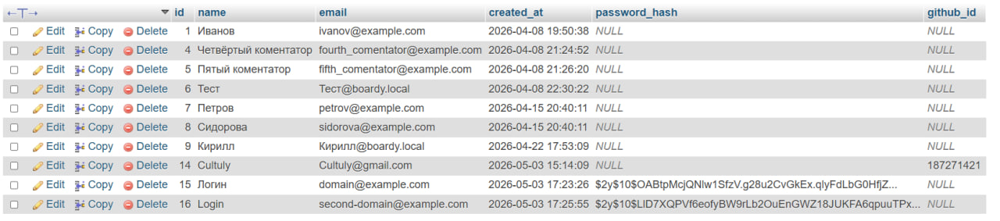
+------------------------+---------------------------+---------------------------+---------------------------+ | Вопрос | Куки + Сессии | JWT | OAuth (GitHub) | +------------------------+---------------------------+---------------------------+---------------------------+ | Где хранятся данные? | Файлы/БД на сервере | В самом токене (клиент) | У провайдера (GitHub) | +------------------------+---------------------------+---------------------------+---------------------------+ | Кто прикрепляет? | Браузер автоматически | Клиент (React/JS) | Браузер (редиректы) | +------------------------+---------------------------+---------------------------+---------------------------+ | Для каких клиентов? | SSR, SPA (тот же домен) | SPA, Mobile, Cross-domain | Любые (единый вход) | +------------------------+---------------------------+---------------------------+---------------------------+ | Можно ли отозвать? | Да (уничтожить сессию) | Нет (ждать истечения) | Да (в настройках GitHub) | +------------------------+---------------------------+---------------------------+---------------------------+ | Кросс-доменно? | Нет (ограничение CORS) | Да (заголовок Auth) | Да (протокол OAuth2) | +------------------------+---------------------------+---------------------------+---------------------------+

Секрет в коде: Опасен утечкой через Git и подделкой токенов, решается пакетом Passport (RSA-ключи хранятся в файлах, добавляются в .gitignore). Нет механизма отзыва: Опасен тем, что заблокированный пользователь сохраняет доступ до истечения срока JWT, решается Passport (таблица oauth_access_tokens с флагом revoked для мгновенной инвалидации). Ручная CSRF-защита (state): Опасна человеческим фактором (забыли проверить → дыра), решается Socialite (автоматическая генерация, хранение и строгая верификация state внутри пакета).
