# 1. ConnectionManager:
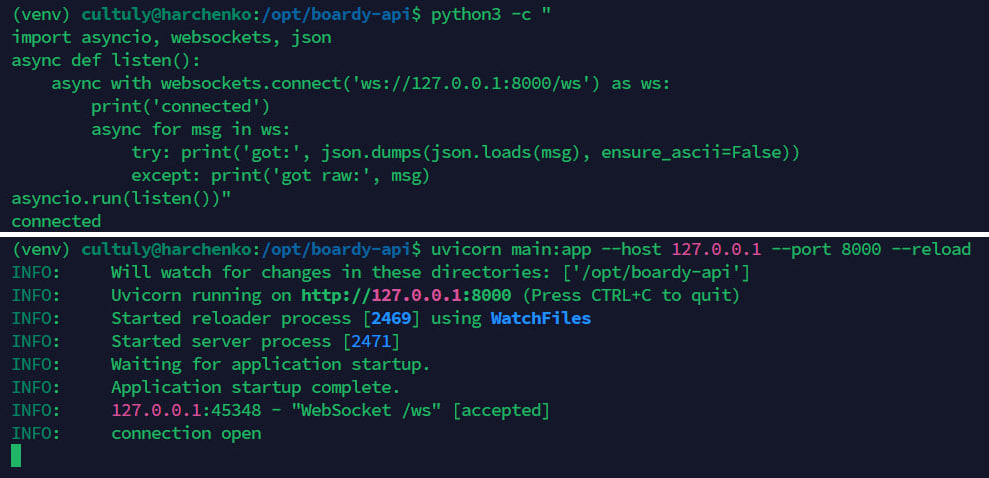
## Пояснение:
Python-клиент пишет connected и соединение открыто

## Ответ на вопросы:
**Почему self.active — список в памяти процесса, а не в базе данных?**:
Потому что соединение через WebSocket это долгоподдерживамое "alive" соединение которое невозможно сохранить в обычную бд. И чтобы не лезть постоянно в бд за сообщениями (тем самым ещё больше повышая нагрузку на неё), сохраняя их в оперативке (так быстрее)

**Что произойдёт если Uvicorn перезапустится?**:
Все активные соединения закроются (произойдёт onclose) и при новом включении переподключится через set-timeout 

# 2. /internal/broadcast:
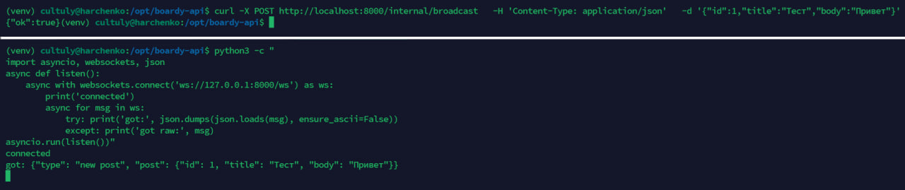
## Пояснение:
Запрос отправлен и зафиксирован, сообщение получено (нужно было добавить json и сдампить json объект назад в python объект чтобы получить читаемый ответ а не экранированный unicode последовательности (\u****))

## Ответ на вопрос:

**Почему /internal/broadcast не требует JWT-авторизации?**:
Потому что этот эндпоинт не для пользоваталей а межсерверного взаимодействия самого laravel с FastAPI, и так как у самого laravel нет JWT-токена, тут JWT-авторизация неприменима  

# 3. Два клиента:
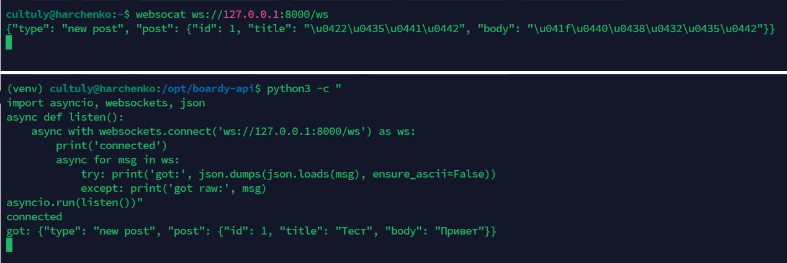
## Пояснение:
На верхней части скрина websocat ответ полученный клиентом верный, просто не переведён назад в python объект из-за чего вместо текста экранированные unicode последовательности, как я писал раньше

## Ответ на вопросы:
**Что произойдёт если один из клиентов отключился, а broadcast уже начался?**: 
Вылетит ошибка при попытке послать сообщение на "мёртвый" сокет, но сама программа не упадёт, а просто пропустит этот сокет и продолжит отправку на остальные

**Где в коде это обрабатывается?**: 
В файле routers/ws.py есть асинхронная функция broadcast которая рассылает уведомление по активным соединениям, а не активные перемещает в список dead, попавшие в этот список затем стираются из общего списка self.active 

# 4. PostController:
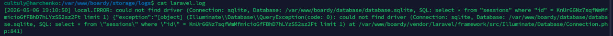
## Пояснение:
Не уверен что это то, но полистав логи (и последние и первые) не нашёл ошибки связанной с WS broadcast failed

## Ответ на вопросы
**Зачем timeout(2)?**: 
Это задержка на получение данных от FastAPI, если ограничение превышено (FastAPI завис или медленно отвечает) laravel закроет HTTP-соединение, чтобы пользователь не ждал бесконечно загрузки страницы

**Что случится если FastAPI недоступен и timeout не указан?**:
 Если FastAPI упал или завис и таймаут не задан, PHP-FPM будет ждать ответа от FastAPI до тех пор пока не сработает ограничение по глобальному лимиту max_execution_time. Для пользователя это будет выглядеть как бесконечное зависание сайта при попытке опубликовать пост

# 5. Проверка Callback:
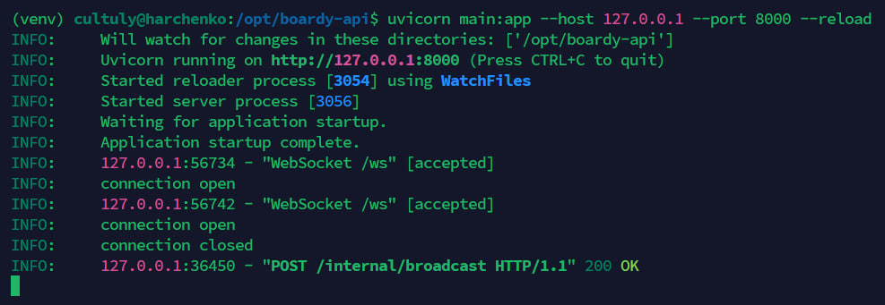
## Ответ на вопрос: 
**Почему HTTP-callback называют костылём?**:
Потому что в этой схеме синхронный HTTP-запрос используется для асинхронной задачи уведомления. Laravel вынужден напрямую знать внутренний сетевой адрес FastAPI, жестко зависеть от его доступности в момент создания поста и тратить ресурсы на ожидание ответа

**3 конкретные проблемы:**
1) **Жёсткая связь** Laravel должен знать точный IP/порт или домен FastAPI, если API переедет на другой сервер, придется менять конфигурацию

2) **Отказоустойчивость** Если в момент создания поста FastAPI будет перезапускаться или упадёт, HTTP-запрос упадёт с ошибкой. Сообщение будет потеряно и пользователи в ленте его не увидят

3) **Несколько экземпляров** Если одновременно будет запущено несколько экземпляров FastAPI за балансировщиком нагрузки, laravel отправит HTTP-callback только на один случайный. В итоге пост улетит только тем клиентам, которые подключены к этому конкретному серверу, а остальные ничего не увидят

# 6. Интеграция WebSocket в Blade:
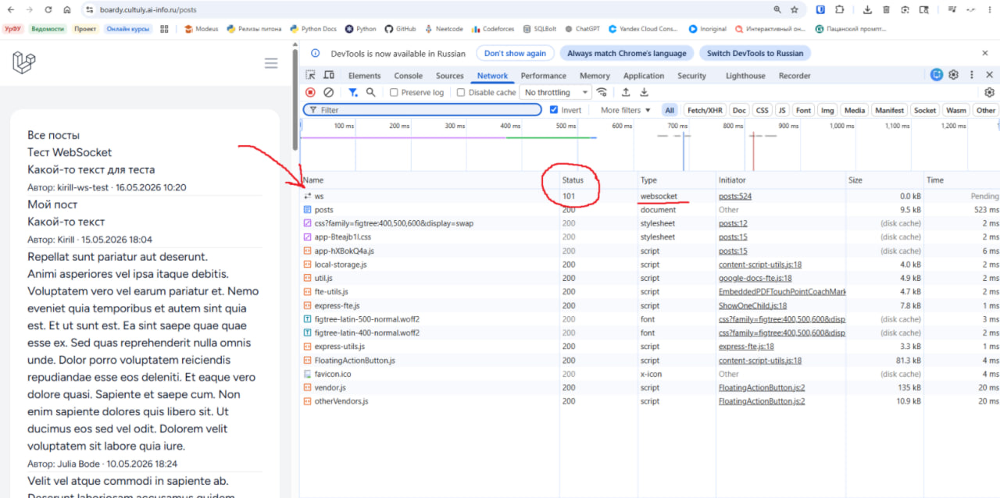
## Ответ на вопросы:

**Почему на локалке нужно ws://, а на проде wss://?**:
Потому что по дефолту локальная машина работает на порту 80 (обычный HTTP), а сайт на 443 (HTTPS), поэтому при попытке подключиться с защищённого https:// на незащищённый ws:// поэтому браузер запретит подключение
 
**Что произойдёт если использовать wss:// без TLS?**: 
Защищённое соединение просто не установится и оборвётся с ошибкой, так как протокол ожидает handshake с шифрование а сервер просто отдаст нешифрованный трафик

# 7-8. Два браузера:
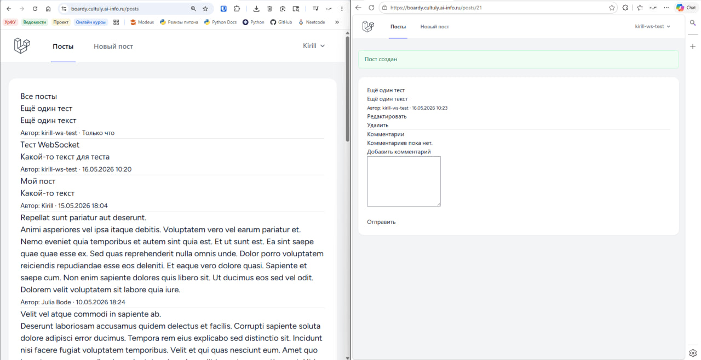

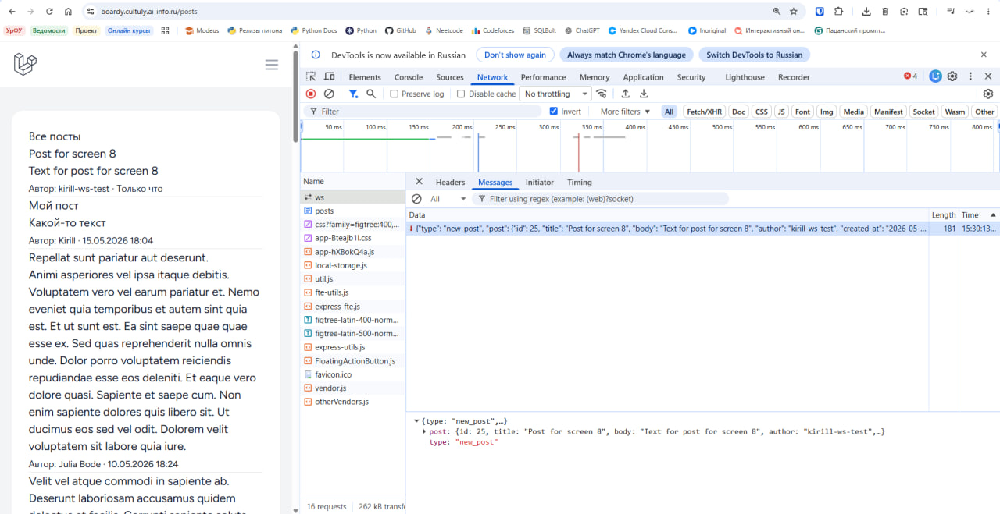

# 9. XSS - атака:
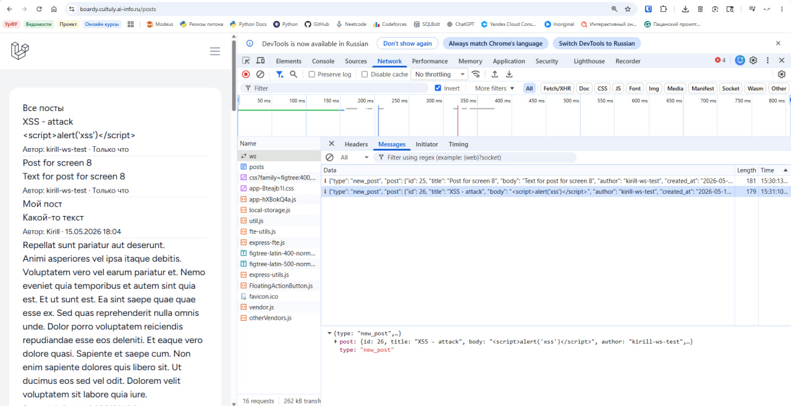
## Ответ на вопросы:

**Что делает функция escapeHtml()?**:
Она преобразует специальные символы из HTML в их безопасные строковые варианты (&lt;, &gt; и.т.д.). И браузер не будет пытаться выполнить их как код, а будет распознавать их как обычный текст (защита от атак)

**Что случится если вставить данные напрямую в innerHTML без экранирования?**:
В этом случае откроется окно для атаки (XSS к примеру) можно будет вставлять вредоносный скрипт в форму приёма текста (создание поста или коммента например) без функции экранирования html-теги будут восприниматься как код для исполнения, а не как обычный текст

# 10. Переподключение WS соединения:
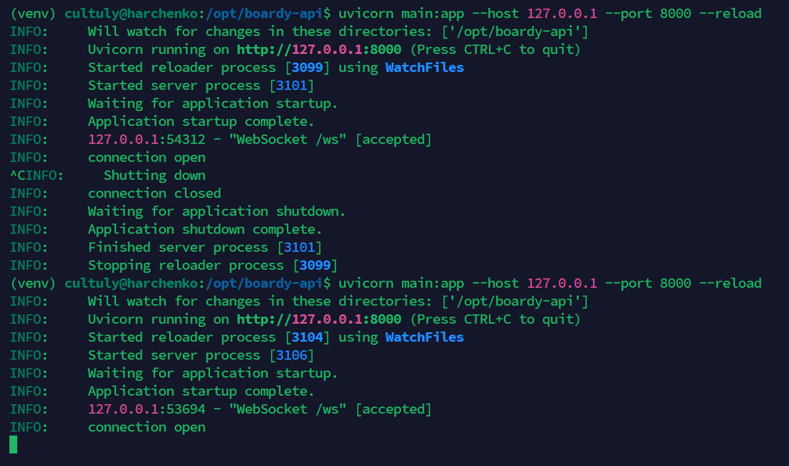
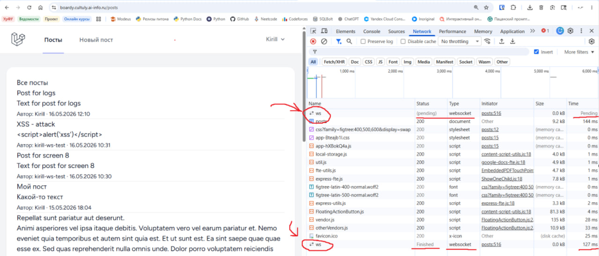
## Пояснение:
Открытое и закрытое соединения

# 11. WS - проксирование:
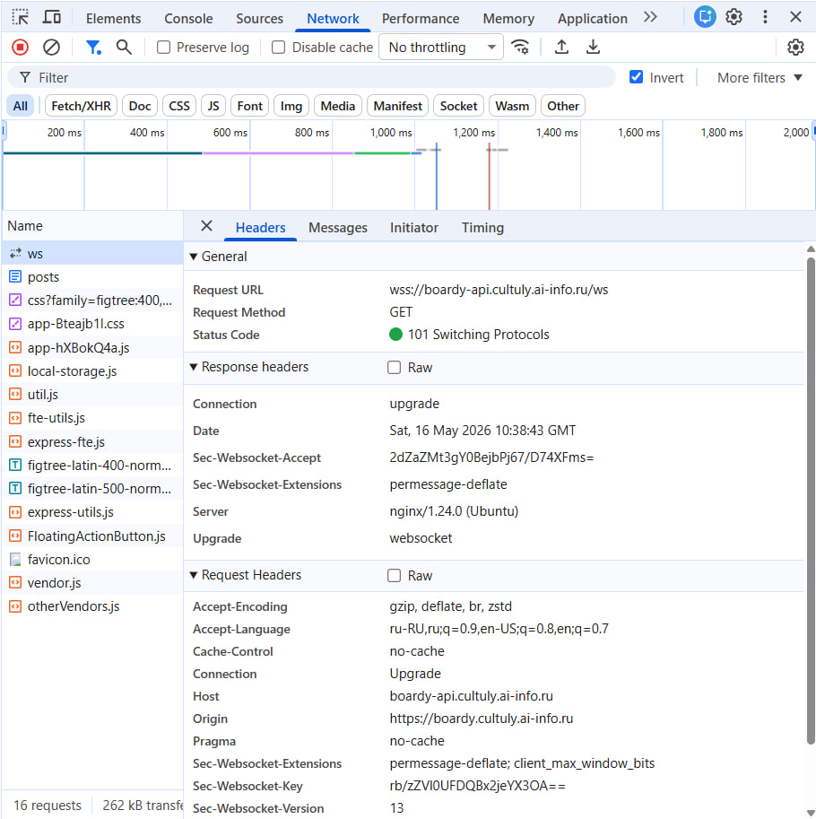
## Ответ на вопросы:

**Что сломается если убрать proxy_http_version 1.1?**:
Nginx по умолчанию проксирует запросы по протоколу HTTP/1.0. А WebSocket требует заголовок Upgrade, который поддерживается только начиная с версии HTTP/1.1. Без этой директивы апгрейд соединения не произойдет

**Если убрать proxy_set_header Upgrade?**: 
Nginx не передаст FastAPI запрос на апгрейд соединения, FastAPI воспримет этот запрос как обычный GET запрос и вернет ошибку из-за чего WebSocket соединение сбросится

**Если убрать proxy_read_timeout?**:
Начнет действовать базовый таймаут Nginx (обычно минута). Если в течение него в канале не будет никакой активности, Nginx посчитает соединение неактивным и закроет его, заставляя клиентов постоянно переподключаться

# 12. Закрытый /internal:
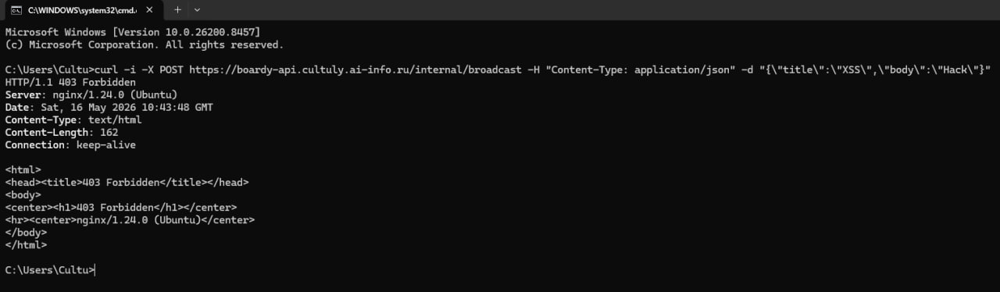
## Ответ на вопросы:

**Почему /internal/broadcast опасен без ограничения доступа?**:
Потому что без ограничения доступа кто угодно со стороны мог бы сделать запрос на этот эндпоинт и делать запросы в бд и создавать поддельный контент, рассылая его пользователям (в обход валидации)

**Кто мог бы его вызвать?**:
Абсолютно кто угодно со стороны, эндпоинт открыт для всех кто смог бы сделать запрос на api домен с эндпоинтом /internal/broadcast
