## Важное уточнение:
Некоторые скрины я делал уже после укомплектовки сервисов в docker потому некоторые скрины могут быть на localhost но у меня есть и старые скрины для моих основных доменов (просто к паре заданий скрины делал уже после докера (финальные правки перед итоговой сдачей)) (дубликаты скринов с основными доменами не стал прикреплять чтобы не засорять лишними практически одинаковыми скринами лаборторную)

## Задание 1. Установка и SPA-клиент

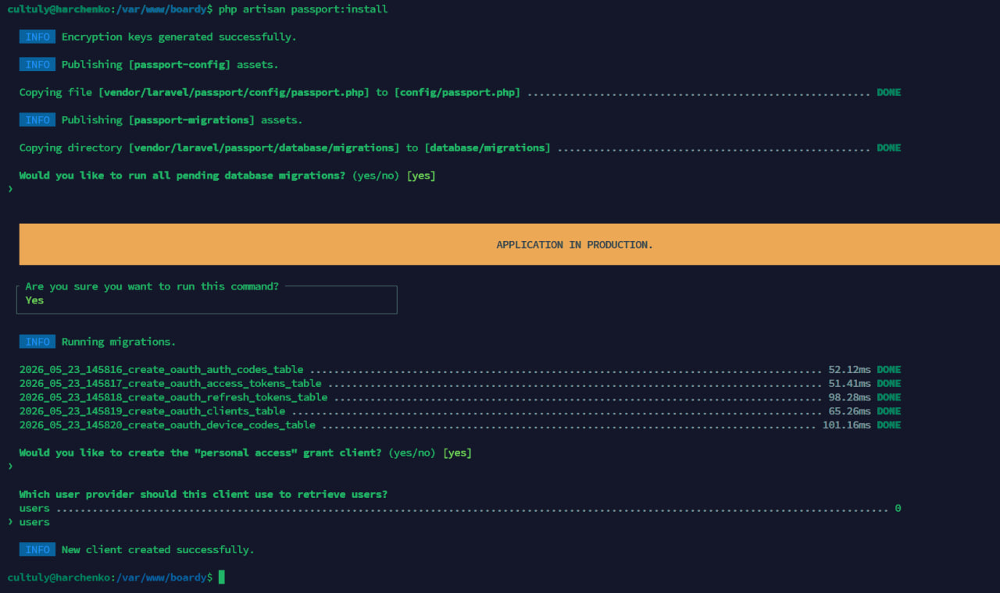
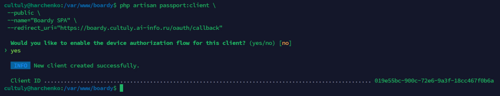

### Ответы на вопросы:
### Почему публичный клиент без secret?

Публичный клиент предназначен для SPA-приложений, которые работают полностью в браузере пользователя. В браузере невозможно безопасно хранить `client_secret` — любой сможет открыть DevTools и увидеть его в исходном коде или сетевых запросах. Поэтому публичный клиент не использует секрет, а вместо него использует механизм авторизации по PKCE flow.

### Чем PKCE заменяет client_secret и от какой атаки защищает?

PKCE генерирует рандомную строку (ограниченной длины) — `code_verifier`, затем хэширует её выбранным алгоритмом (SHA-256), получая `code_challenge`. Вместо `client_secret` на подтверждение для получения пары access и refresh токенов идёт сначала `code_challenge` (при запросе на авторизацию через авторизационный сервер), а затем после получения `code` отправляется сам `code_verifier`, который авторизационный сервер хэширует и сравнивает оба хэша — если они совпадут, то выдаст токены. PKCE защищает от перехвата кода авторизации (**authorization code injection**).

---

## Задание 2. TTL и refresh

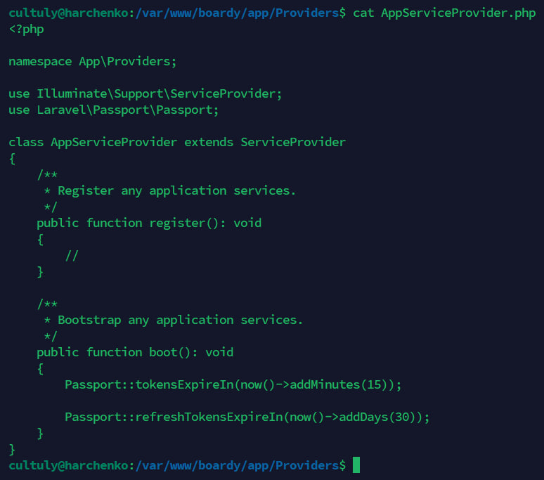

### Ответы на вопросы:
### Почему access короткий, а refresh длинный?

Иметь долгоживущий access-токен небезопасно:
если его скомпрометируют, злоумышленник получит доступ к ресурсам пользователя. Поэтому токены идут в паре access короткий (15 минут) для доступа к API, а refresh длинный (30 дней) для обновления access-токена когда тот истечёт. При этом refresh-токен хранится в HttpOnly cookie и недоступен из JavaScript.

### Что произойдёт если access будет 24 часа?

У злоумышленника будет 24 часа свободного доступа к API от имени пользователя. За это время он сможет прочитать все данные, создать/удалить комментарии, выполнить любые действия от имени жертвы (как раз то от чего защищает пара токенов короткий/длинный access/refresh).

---

## Задание 3. Проверка выдачи через curl

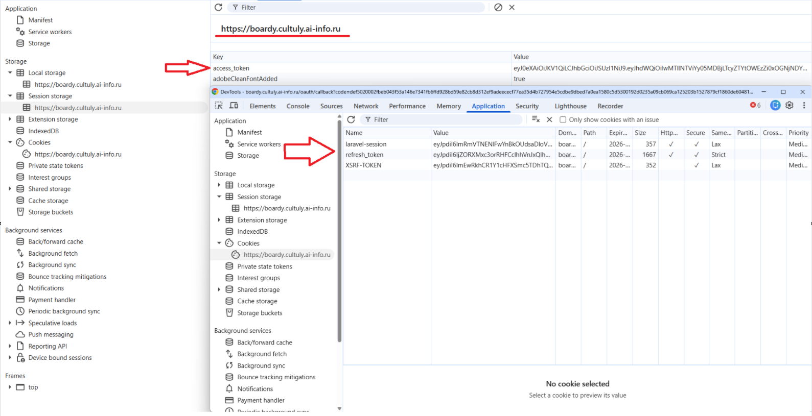

### Ответы на вопросы:
### Какие шаги OAuth flow прошёл этот curl-запрос?

1. **Генерация PKCE-пары** — создание `code_verifier` (случайная строка) и `code_challenge` (SHA-256 хэш от verifier).
2. **Authorization Request** — GET-запрос на `/oauth/authorize` с параметрами `client_id`, `redirect_uri`, `response_type=code`, `code_challenge`, `code_challenge_method=S256` и `state`.
3. **Авторизация пользователя** — Laravel показывает форму согласия (или использует текущую сессию) и выдаёт authorization `code` через редирект на `redirect_uri`.
4. **Token Exchange** — POST-запрос на `/oauth/token` с `grant_type=authorization_code`, `code`, `redirect_uri`, `client_id` и `code_verifier`. Сервер хэширует `code_verifier`, сравнивает с сохранённым `code_challenge`, и при совпадении выдаёт `access_token` + `refresh_token`.

---

## Задание 4. Создание boardy_api

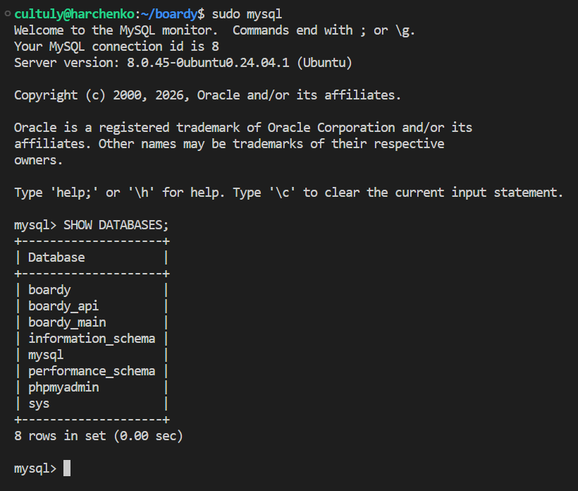
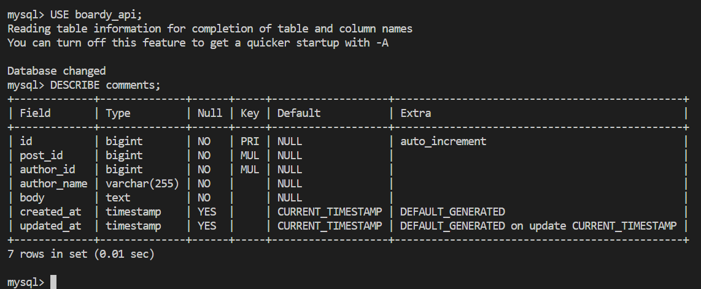

### Ответы на вопросы:
### Почему в comments нет FK на posts и users? Что делать с целостностью данных?

Таблица `comments` находится в базе `boardy_api`, а таблицы `posts` и `users` — в `boardy_main`. MySQL не поддерживает внешние ключи между разными базами данных на уровне движка (особенно если используются разные подключения или серверы). Это осознанное архитектурное решение микросервисной архитектуры — каждый сервис владеет своей БД.

Целостность данных поддерживается на уровне приложения через события Redis: при создании поста Laravel публикует событие `new_post`, при изменении имени пользователя — событие `user.renamed`. FastAPI подписан на эти события и обновляет денормализованное поле `author_name`. Это паттерн **eventual consistency** — данные в конечном счёте станут согласованными, хотя возможна кратковременная задержка.

## Уточнение:
boardy бд - legacy (не используется сейчас)
---

## Задание 5. FastAPI подключён к новой БД

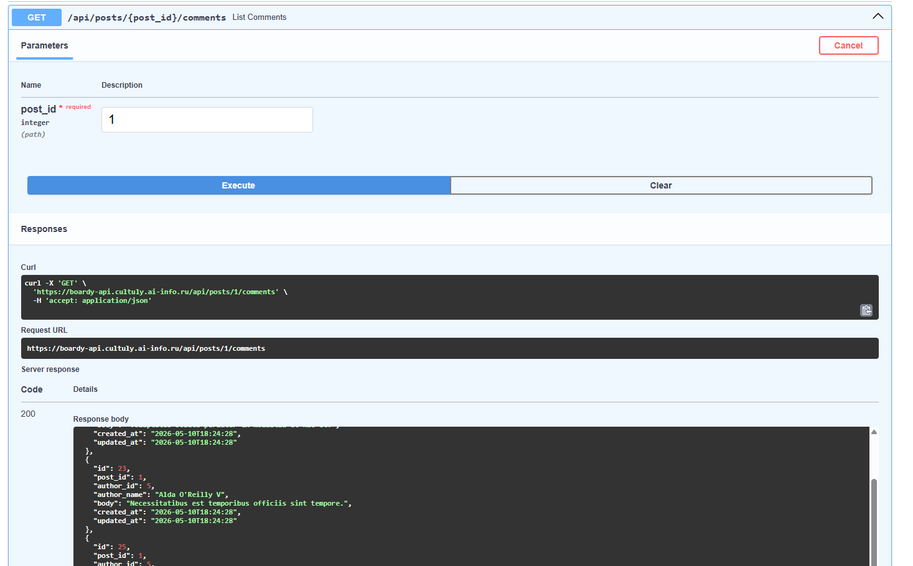

---

## Задание 6. RS256 проверка

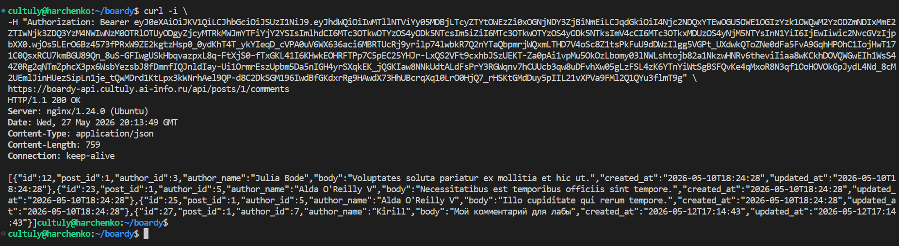
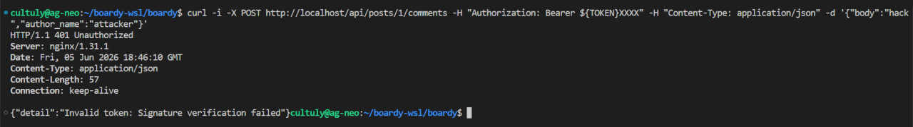

### Ответы на вопросы:
### Почему RS256 безопаснее HS256 для распределённых систем?

HS256 — симметричный алгоритм: один и тот же секретный ключ используется и для подписи, и для проверки токена. Это значит, что FastAPI должен знать секрет Laravel — если FastAPI скомпрометирован, злоумышленник может не только читать, но и **создавать** валидные токены.

RS256 — асимметричный алгоритм: приватный ключ (для подписи) хранится только в Laravel (Passport), а FastAPI получает лишь публичный ключ (для проверки). Даже если публичный ключ утечёт, создать поддельный токен невозможно — нужен приватный ключ. Это критически важно в микросервисной архитектуре, где каждый сервис — потенциальная точка атаки.

---

## Задание 7. Полный CRUD с author_name

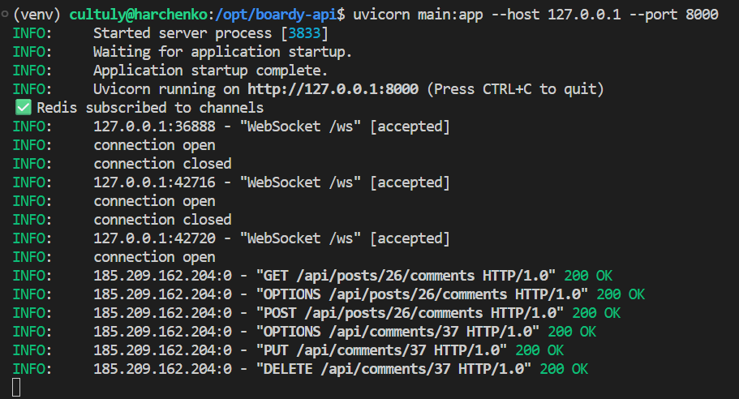

### Ответы на вопросы:
### Почему author_name передаётся в payload запроса, а не извлекается из токена?

Стандартный JWT от Passport содержит в payload только `sub` (ID пользователя), `exp`, `iat`, `jti` и информацию о scopes. Имя пользователя (`name`) в токен не включается. FastAPI работает с отдельной базой `boardy_api` и не имеет доступа к таблице `users` в `boardy_main`, поэтому не может по `sub` узнать имя. Передача `author_name` в payload запроса — простое решение для денормализации.

### Что было бы если зашить в JWT custom claim?

Если добавить `name` как custom claim в JWT, то имя будет «заморожено» на момент выдачи токена. Если пользователь сменит имя, все токены, выданные до смены, будут содержать старое имя — до их истечения (до 15 минут). Кроме того, в Passport добавление custom claims требует переопределения `BearerTokenResponse`, что усложняет код. Текущий подход с передачей в payload + синхронизация через Redis `user.renamed` более гибкий.

---

## Задание 8. Owner check

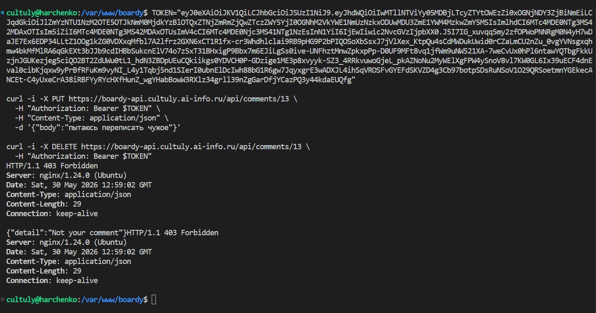

### Ответы на вопросы:
### Где в коде проверяется владелец?

В endpoint'ах PUT и DELETE в FastAPI: перед обновлением или удалением комментария код сравнивает `author_id` комментария из БД с `sub` (ID пользователя) из JWT-токена. Если они не совпадают — возвращается `403 Forbidden`.

### Что произойдёт если убрать эту проверку?

Любой авторизованный пользователь сможет редактировать и удалять чужие комментарии. Достаточно знать `id` комментария, чтобы изменить его текст или удалить — это уязвимость типа **IDOR** (Insecure Direct Object Reference), нарушающая авторизацию на уровне объектов.

---

## Задание 9. CORS

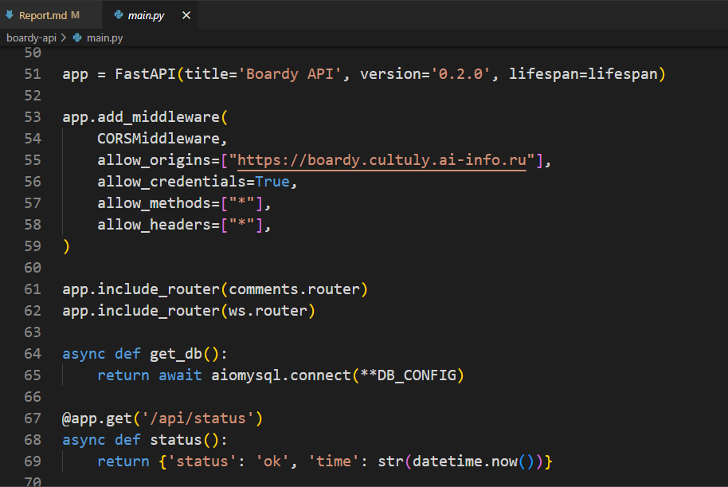

### Ответы на вопросы:
### Почему allow_origins=['*'] + credentials=true браузер блокирует?

Спецификация CORS запрещает комбинацию `Access-Control-Allow-Origin: *` с `Access-Control-Allow-Credentials: true`. Браузер блокирует такой ответ как небезопасный, потому что wildcard `*` означает «любой сайт», а `credentials: true` разрешает отправку cookies. Вместе это позволило бы любому вредоносному сайту отправлять запросы с cookies пользователя к нашему API — классическая CSRF-атака.

### Что произошло бы с куками если бы пропустил?

Если бы браузер пропустил эту комбинацию, любой сторонний сайт мог бы выполнять запросы к `boardy-api.cultuly.ai-info.ru` с автоматической отправкой HttpOnly cookie (содержащей refresh-токен). Злоумышленник мог бы обновить access-токен и получить полный доступ к аккаунту жертвы — без её ведома.

---

## Задание 10. PKCE утилиты

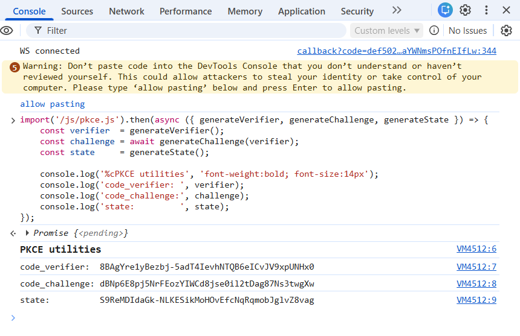

### Ответы на вопросы:
### Почему code_challenge передаётся в /authorize, а code_verifier — в /token?

Это двухшаговая защита. На первом шаге (`/authorize`) клиент отправляет `code_challenge` (хэш) — сервер его запоминает. На втором шаге (`/token`) клиент отправляет оригинальный `code_verifier` — сервер хэширует его и сравнивает с сохранённым `code_challenge`. Если совпали — значит, токен запрашивает тот же клиент, который инициировал авторизацию.

### Что если перепутать?

Если отправить `code_verifier` в `/authorize`, а `code_challenge` в `/token`, то сервер сохранит сам verifier, а затем получит хэш и захэширует его повторно — хэши не совпадут, в выдаче токена будет отказано (`invalid_grant`). Кроме того, передача `code_verifier` в первом запросе (через URL) делает его видимым в логах, истории браузера и рефереру — это полностью обнуляет защиту PKCE.

---

## Задание 11. Login flow

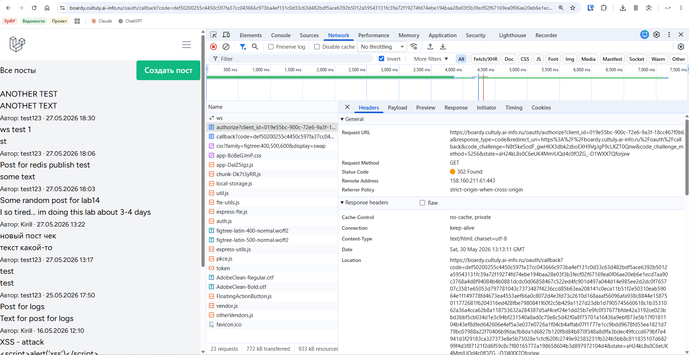
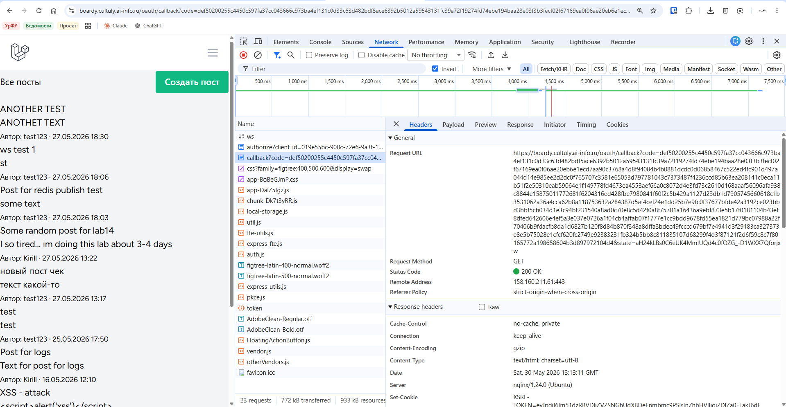

---

## Задание 12. Обмен code на токены

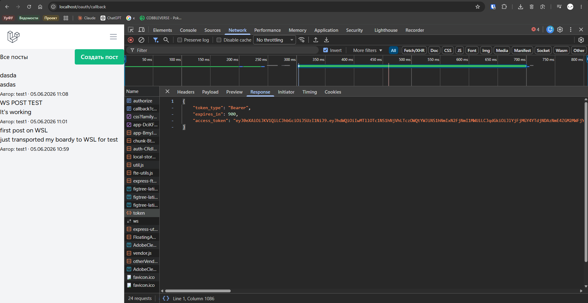

### Ответы на вопросы:
### Что произойдёт если убрать проверку state? Какая атака возможна?

Параметр `state` защищает от **CSRF-атаки на OAuth flow**. Без проверки `state` злоумышленник может:

1. Начать OAuth flow от своего имени и получить authorization `code`.
2. Подсунуть жертве ссылку с этим `code` (например, через redirect на callback URL).
3. Браузер жертвы обменяет чужой `code` на токен — и жертва окажется залогинена под аккаунтом злоумышленника.
4. Всё, что жертва сделает дальше (комментарии, личные данные), будет привязано к аккаунту атакующего.

Проверка `state` гарантирует, что callback пришёл в ответ на запрос, инициированный именно этим браузером.

---

## Задание 13. Refresh token в HttpOnly cookie

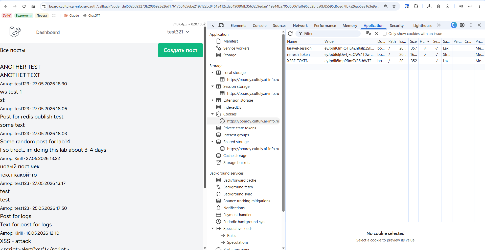

### Ответы на вопросы:
### Что случится если refresh положить в localStorage и сайт получит XSS?

Если на сайте есть XSS-уязвимость (внедрение вредоносного JavaScript), атакующий получит полный доступ к `localStorage`. Он сможет прочитать refresh-токен, отправить его на свой сервер и использовать для получения новых access-токенов — фактически захватив сессию пользователя на весь срок жизни refresh-токена (30 дней).

HttpOnly cookie недоступна из JavaScript — даже при XSS атакующий не сможет прочитать или украсть refresh-токен. Он может лишь отправлять запросы «от имени» пользователя пока открыта вкладка, но не может извлечь токен и использовать его извне.

---

## Задание 14. Silent refresh

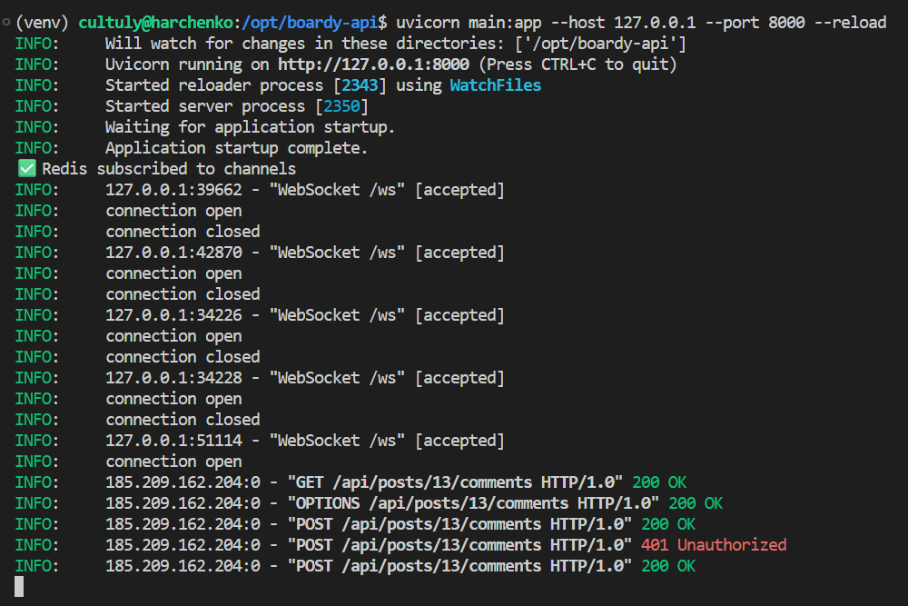

---

## Задание 15. Redis установлен

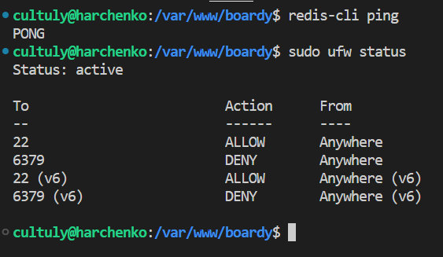

---

## Задание 16. Laravel publish new_post

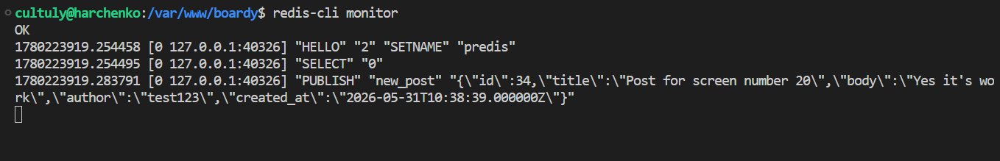

### Ответы на вопросы:
### Чем Redis::publish архитектурно лучше Http::post() к FastAPI?

**Http::post()** создаёт прямую синхронную связь между сервисами: Laravel должен знать URL FastAPI, ждать ответа, обрабатывать ошибки сети и таймауты. Если FastAPI недоступен — создание поста может упасть или зависнуть.

**Redis::publish** — это асинхронная шина сообщений (fire-and-forget). Laravel публикует событие и продолжает работу, не зная и не заботясь о том, кто подписан. Преимущества:

- **Слабая связанность** — сервисы не знают друг о друге, общаются через канал.
- **Отказоустойчивость** — если FastAPI временно недоступен, Laravel продолжает работать.
- **Масштабируемость** — можно добавить любое количество подписчиков без изменения кода Laravel.
- **Нет location /internal в Nginx** — не нужен внутренний HTTP-маршрут, уменьшается поверхность атаки.

---

## Задание 17. FastAPI subscriber на new_post

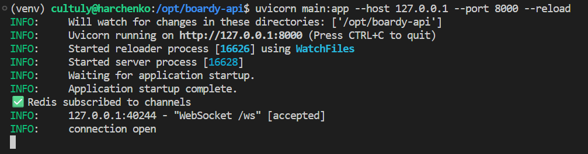
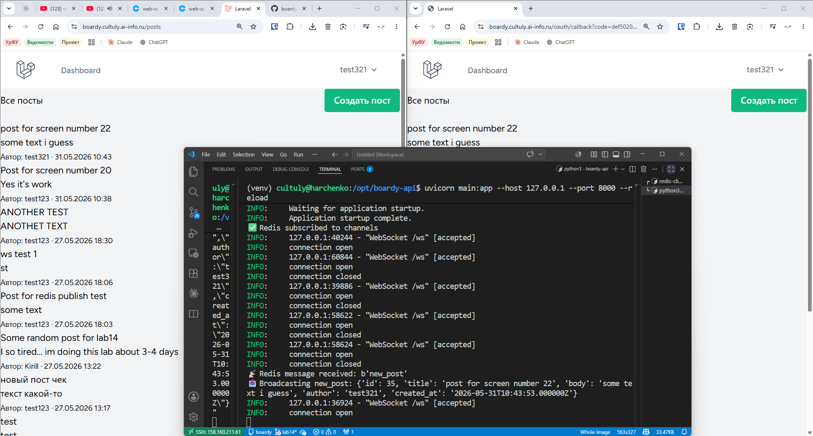

---

## Задание 18. User observer и user.renamed

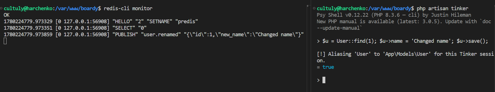

### Ответы на вопросы:
### Почему UserObserver вызывается автоматически? Где это магия Laravel?

Laravel использует паттерн **Observer** — класс `UserObserver` регистрируется в `AppServiceProvider::boot()` через вызов `User::observe(UserObserver::class)`. После этого Eloquent автоматически вызывает соответствующие методы Observer'а (`created`, `updated`, `deleted` и т.д.) при каждом событии жизненного цикла модели.

«Магия» реализована в трейте `HasEvents` модели Eloquent: при вызове `$user->save()` Eloquent проверяет, изменились ли атрибуты (`wasChanged`), и если да — вызывает зарегистрированные Observer'ы. В нашем случае метод `updated()` в `UserObserver` проверяет `$user->wasChanged('name')` и, если имя изменилось, публикует событие `user.renamed` в Redis.

---

## Задание 19. Денормализация имени

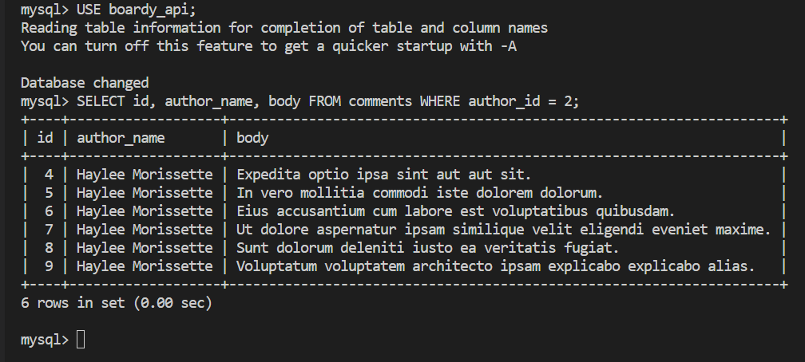
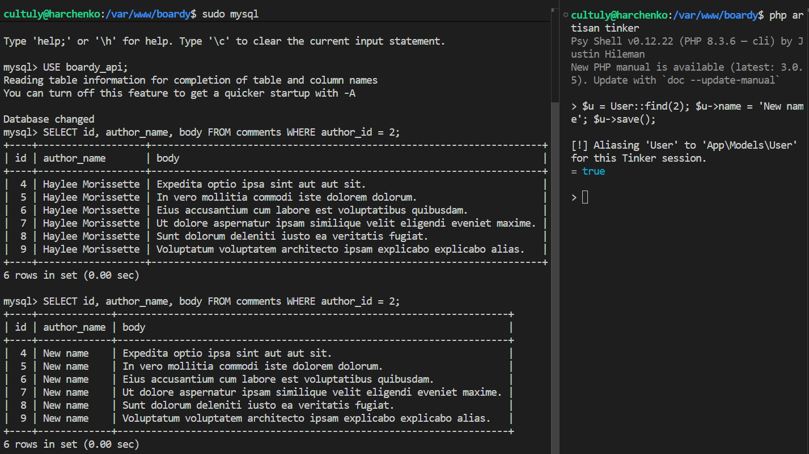

### Ответы на вопросы:
### Что такое eventual consistency?

**Eventual consistency** (согласованность в конечном счёте) — это модель согласованности данных в распределённых системах, при которой после обновления данных в одном сервисе все остальные сервисы **в конечном счёте** получат актуальную версию, но не мгновенно. В отличие от строгой консистентности (strong consistency), здесь допускается временное расхождение данных между сервисами.

### Когда между сменой имени и обновлением comments может быть задержка?

Задержка возникает на нескольких этапах цепочки: Laravel сохраняет имя в `boardy_main` → Observer публикует событие в Redis → Redis доставляет сообщение подписчику → FastAPI выполняет `UPDATE comments SET author_name=... WHERE author_id=...` в `boardy_api`. В нормальных условиях это миллисекунды, но задержка может вырасти при:

- Высокой нагрузке на Redis или MySQL.
- Большом количестве комментариев пользователя (долгий UPDATE).
- Сетевых задержках (если сервисы на разных серверах).
- Перезапуске FastAPI (подписчик перезапускается, сообщения теряются — Redis Pub/Sub не хранит историю).

---

## Задание 20. Два браузера: посты в реалтайме

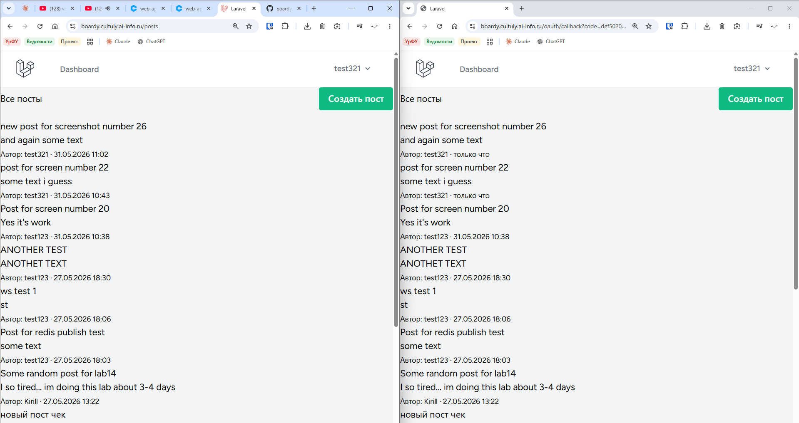

---

## Задание 21. Два браузера: комментарии в реалтайме

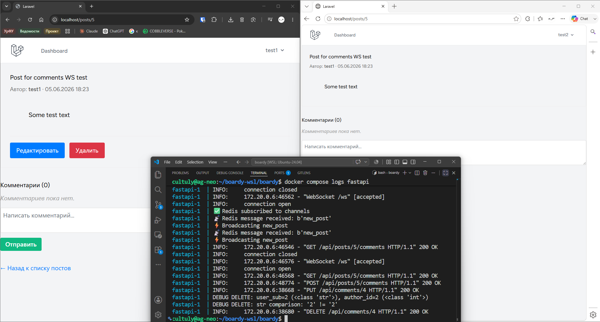

---

## Задание 22. Никаких прямых HTTP-вызовов

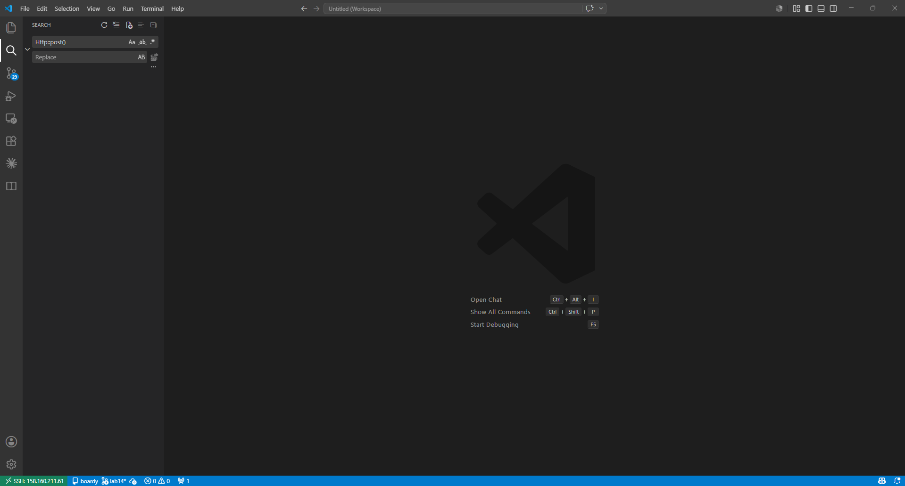
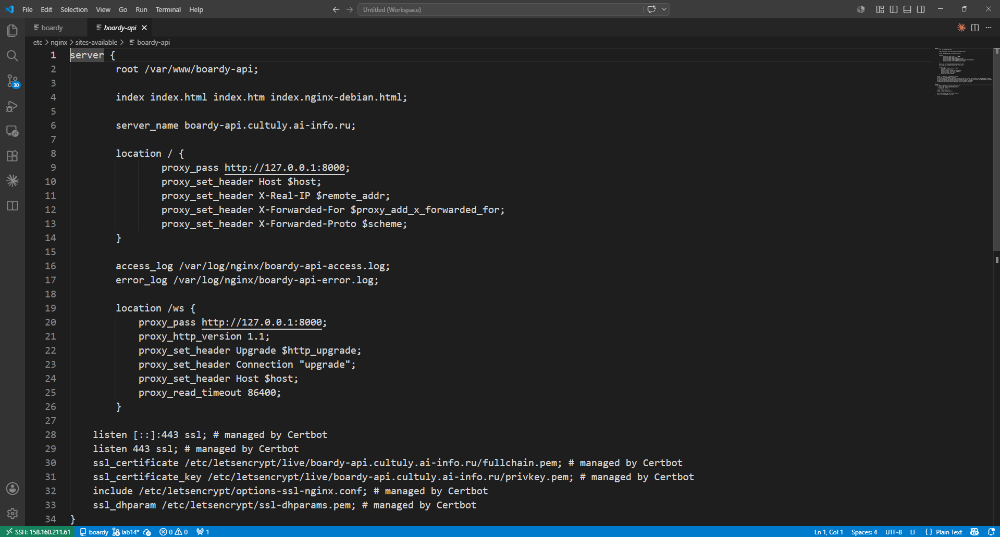
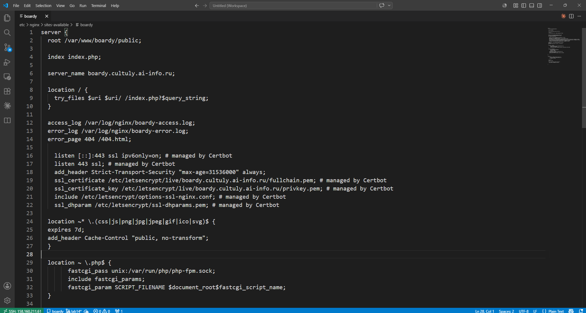

---