## Задание 1. PHP-FPM с расширениями

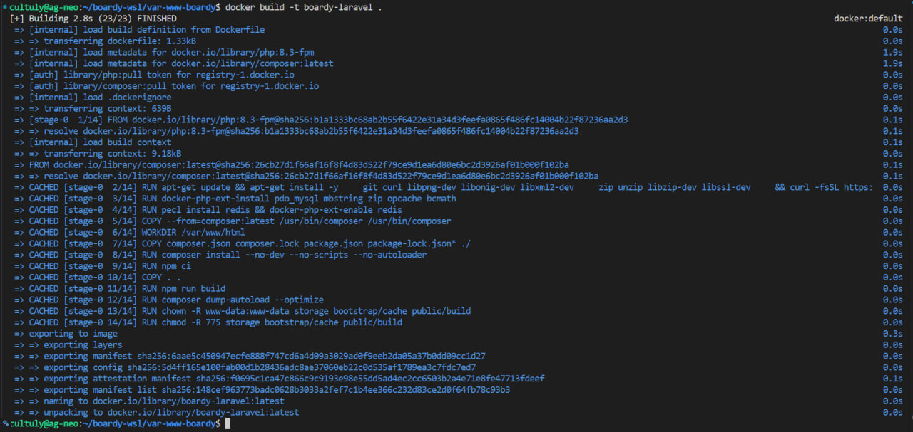

## Ответы на вопросы:
## Зачем PHP-FPM в Docker, а не Apache+PHP?
PHP-FPM это отдельный менеджер процессов, который умеет только исполнять PHP по протоколу FastCGI.
Раздачей статики и проксированием занимается nginx в своём контейнере.
Огромный плюс в разделении ролей и ответственности по контейнерам.

## Какое архитектурное преимущество?
Архитектурное преимущество в том, что веб-сервер и интерпретатор PHP развязаны. 
Их можно независимо обновлять, перезапускать и масштабировать: за одним nginx можно поставить несколько PHP-FPM контейнеров, не трогая фронтовый слой. 
Образ PHP-FPM легче, чем Apache с встроенным mod_php, и в нём нет лишнего веб-сервера. Apache+mod_php держит интерпретатор внутри каждого рабочего процесса веб-сервера это тяжелее и плохо ложится на главную идею докера про разделение ответственностей по контейнерам.

---

## Задание 2. Кеширование composer-зависимостей

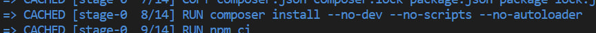

## Ответы на вопросы:
## Что произойдёт, если COPY всего проекта сделать ДО composer install? Объясните механизм кеширования слоёв
Docker кеширует каждую инструкцию Dockerfile как слой.
Слой переиспользуется из кеша, только если сама инструкция и её входные данные не изменились.
Если хоть один слой инвалидируется, все идущие после него пересобираются заново.

Если `COPY . .` стоит перед `composer install`, то изменение любого файла проекта меняет этот слой, инвалидирует кеш — и `composer install` выполняется заново при каждой сборке, хотя зависимости не менялись. 
Это лишние затраты по времени на каждый билд.

Правильный порядок:
1) `COPY composer.json composer.lock`
2) `composer install`
3) `COPY . .`
Тогда слой с установкой зависимостей пересобирается лишь при изменении манифестов, а правки кода его не трогают и он остаётся кэшированным (CACHED). На практике при повторной сборке без изменений в зависимостях в выводе появится `CACHED` напротив composer install.

---

## Задание 3. 

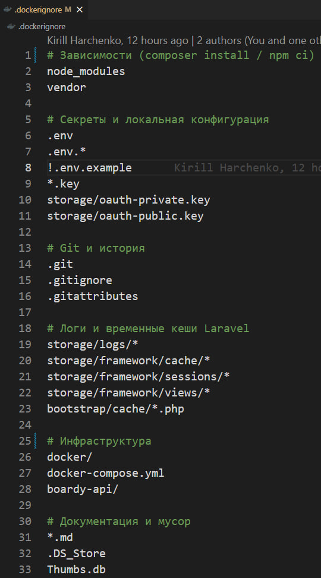

## Ответы на вопросы:
## Что произойдёт, если не исключить .env из образа? Какая угроза безопасности?
`.env` содержит секреты: пароли БД, `APP_KEY`, OAuth-ключи, токены.
Если не исключить его через `.dockerignore`, `COPY . .` оставит секреты в слоях образа.
Любой, у кого есть образ, достанет секреты (через `docker history` или распаковку слоёв), даже если потом удалить он останется в истории слоёв.

Это прямая утечка учётных данных.
Плюс образ становится непереносимым в него зашит конкретный набор паролей.
Поэтому `.env` исключается из контекста сборки.

---

## Задание 4.  

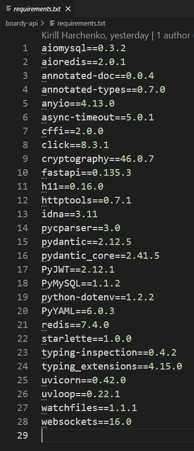

## Ответы на вопросы:
## Почему версии фиксируем, а не пишем 'latest'? 
Фиксация версий обеспечивает воспроизводимость сборки. С закреплёнными версиями образ соберётся одинаково и сегодня, и через год. Без фиксации pip/npm на каждой сборке будет подтягивать самые свежие версии на текущий момент.

## Что произойдёт через год без фиксации?
Через год без фиксации при пересборке подтянутся уже другие, более новые версии библиотек и некоторые из них могут нарушить совместимость с другими и код просто перестанет работать.

---

## Задание 5. Сборка образа

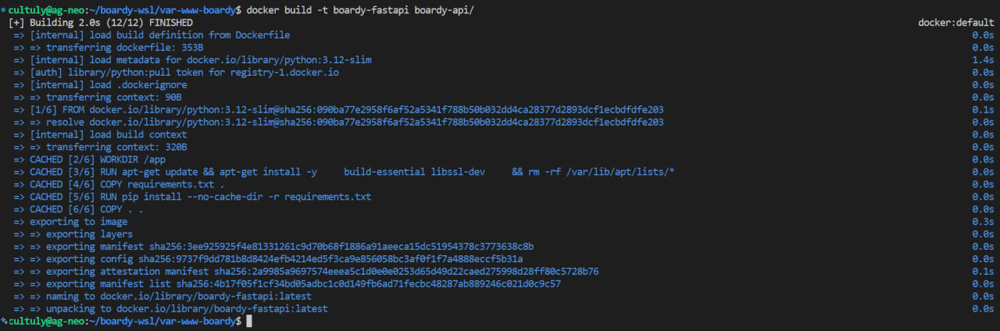

---

## Задание 6.  Что сломается с 127.0.0.1?

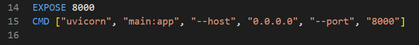

## Ответы на вопросы:
## Почему uvicorn --host 0.0.0.0, а не 127.0.0.1?
`127.0.0.1` означает слушать только loopback внутри контейнера.
Но запросы из других контейнеров приходят на сетевой интерфейс контейнера в docker сети, а не на loopback.
Если uvicorn слушает только `127.0.0.1`, для соседних контейнеров порт фактически закрыт: nginx с proxy_pass `http://fastapi:8000` получит connection refused, комменты и WebSocket работать не будут.

`0.0.0.0` означает слушать на всех интерфейсах контейнера, включая тот, по которому приходит трафик из сети Docker. Поэтому в контейнере сервис почти всегда должен биндиться на `0.0.0.0` иначе он будет недоступен снаружи самого контейнера.

---

## Задание 7.  

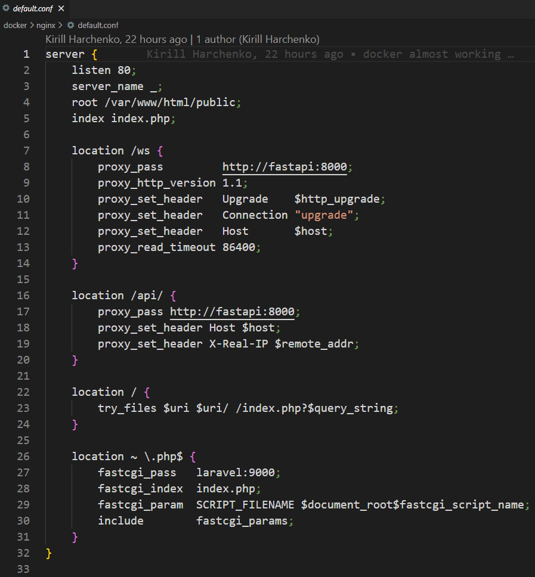

## Ответы на вопросы:
## Почему laravel:9000, а не 127.0.0.1:9000?
Внутри nginx контейнера `127.0.0.1` указывает на сам nginx контейнер, а не на Laravel.
PHP-FPM там не слушает, поэтому fastcgi_pass `127.0.0.1:9000` дал бы connection refused.

## Как Docker резолвит имена контейнеров?
В user-defined сети Docker работает встроенный DNS. Он резолвит имя сервиса из docker-compose.yml в актуальный IP соответствующего контейнера. Поэтому `fastcgi_pass laravel:9000` и `proxy_pass http://fastapi:8000` обращаются по именам сервисов, и DNS подставляет нужный IP.
Это надёжнее, чем хардкодить IP.

---

## Задание 8. WebSocket location

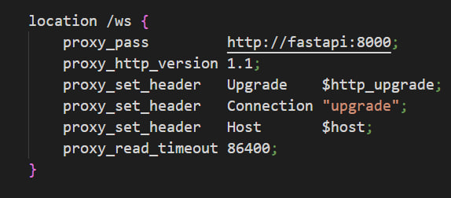

---

## Задание 9. Пять сервисов

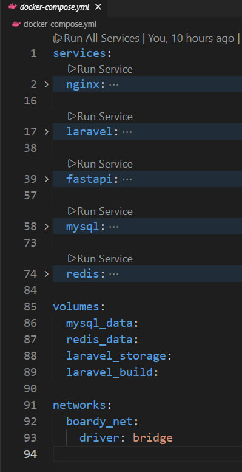

---

## Задание 10.  

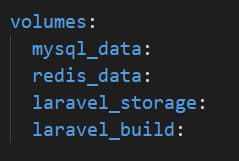

## Ответы на вопросы:
## Что станет с данными MySQL без mysql_data volume при docker compose down?
Без volume на `/var/lib/mysql` данные MySQL лежат в writable-слое самого контейнера. `docker compose down` удаляет контейнеры вместе с ними исчезает и этот слой, то есть все данные БД пропадают.
С `mysql_data:/var/lib/mysql` данные хранятся в отдельном volume и переживают `docker compose down` подняв стек заново, данные будут теми же.

## Чем именованный volume отличается от bind-mount?
Именованный volume управляется Docker, хранится в его служебной области и не привязан к конкретному пути на хосте он переносим, Docker сам его создаёт и инициализирует. 
bind-mount монтирует конкретную папку хоста внутрь контейнера это зависит от структуры файловой системы хоста, прав доступа и путей. 
bind-mount удобен для кода в разработке, а для данных БД лучше именованный volume меньше проблем с правами и производительностью + не привязан к конкретной машине.

---

## Задание 11.  

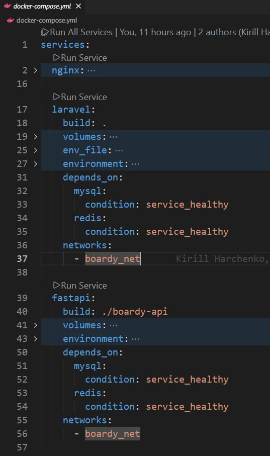

## Ответы на вопросы:
## Почему depends_on без healthcheck недостаточно?
`depends_on` без `condition` ждёт только того, что контейнер зависимость запущен, но не того, что сервис готов принимать соединения.
Контейнер MySQL отмечается запущенным почти мгновенно, но сам сервер инициализируется не в тот же момент особенно при первом старте, когда выполняется init.sql.
Laravel и FastAPI поднимутся сразу после старта mysql и попытаются подключиться к ещё не готовой БД получат connection refused и упадут или уйдут в рестарт.

## Какая race condition возникает?
Как раз гонка между готовностью БД и попыткой приложения к ней подключиться. Решается через `depends_on: condition: service_healthy` + `healthcheck` у mysql/redis Laravel стартует только после того, как healthcheck базы прошёл успешно.

---

## Задание 12.  

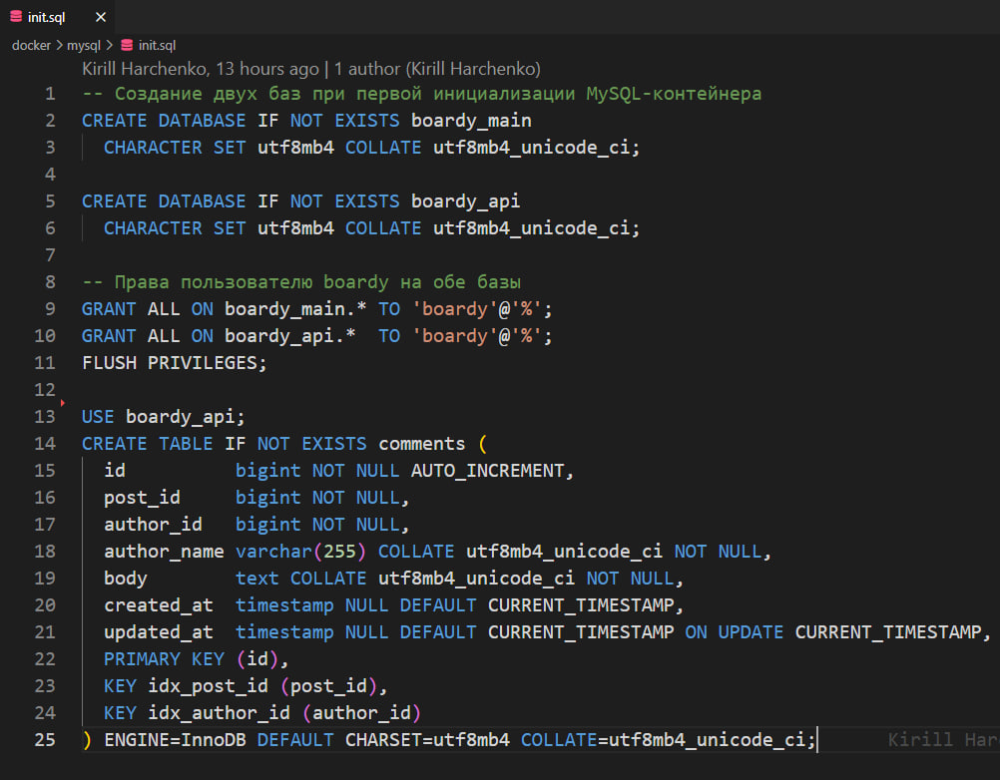
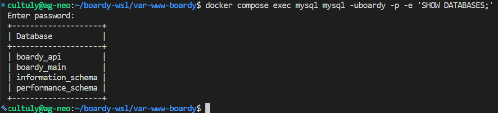

## Ответы на вопросы:
## Почему init.sql выполняется только при первом запуске?
Образ MySQL выполняет скрипты из `/docker-entrypoint-initdb.d` только тогда, когда каталог данных `/var/lib/mysql` пуст то есть при самой первой инициализации. 
Это сделано намеренно: при каждом последующем старте entrypoint видит, что данные уже есть, и пропускает инициализацию, чтобы не перезатереть существующую БД.

## Что будет, если изменить файл после первого запуска?
Если изменить `init.sql` после первого запуска и просто перезапустить стек изменения не применятся потому что volume уже инициализирован.
Чтобы новый init.sql отработал, нужно начать с пустого volume или удалить именно `mysql_data` и поднять заново.

---

## Задание 13.  

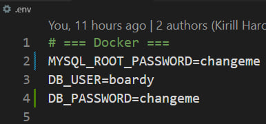
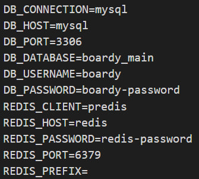

## Ответы на вопросы:
## Зачем два разных .env?
По логике методички файлов два, потому что у них разные потребители и разные жизненные циклы.
Корневой `.env` нужен docker-compose для интерполяции (пароли для создания контейнера MySQL) — он работает на этапе оркестрации.
Второй `.env` в папке Laravel это рантайм конфиг приложения.
Разделение не смешивает оркестрационные секреты с конфигом приложения.

У меня используется один корневой `.env` он одновременно хранит переменные для интерполяции compose и подключается к Laravel через `env_file`.
Так проще поддерживать один файл в нашем небольшом проекте так удобнее.

## Почему DB_HOST=mysql, а не 127.0.0.1?
`DB_HOST=mysql`, а не `127.0.0.1`, потому что Laravel контейнер подключается к базе по docker-сети.
Имя сервиса `mysql` резолвится встроенным DNS Docker в IP контейнера БД. 
`127.0.0.1` указывал бы на сам Laravel контейнер, где MySQL нет и мы получили бы ошибку подключения.

---

## Задание 14. docker compose up

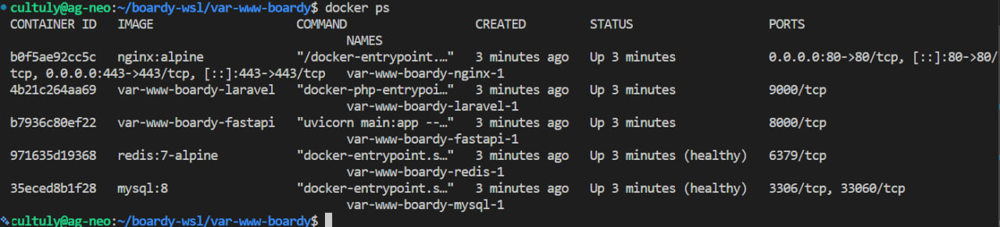

---

## Задание 15. 

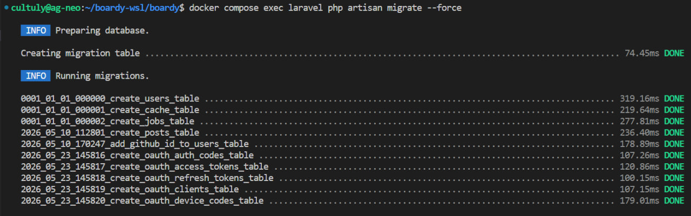
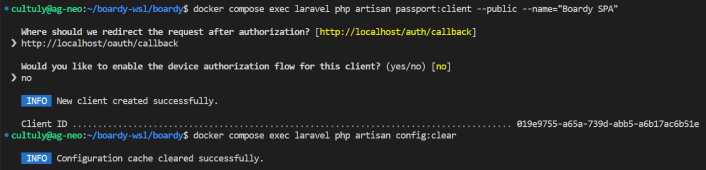

## Ответы на вопрос:
## Чем docker compose exec отличается от docker compose run?
`docker compose exec` выполняет команду внутри уже запущенного контейнера сервиса как подключиться к работающему серверу.
Контейнер должен быть поднят.

`docker compose run` создаёт новый временный контейнер из образа сервиса и выполняет команду в нём с теми же volume, сетью и переменными, но это отдельный инстанс, не основной рабочий контейнер.
Удобно для разовых задач, когда основной контейнер не запущен или нужен изолированный прогон.
По умолчанию `run` не пробрасывает порты сервиса наружу.

---

## Задание 16. Приложение работает

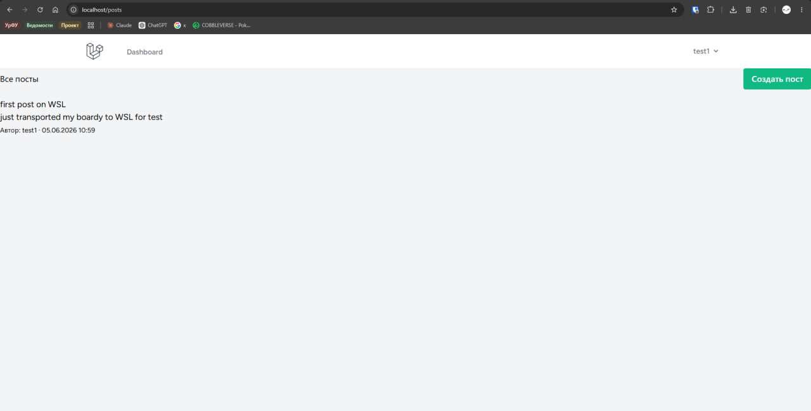
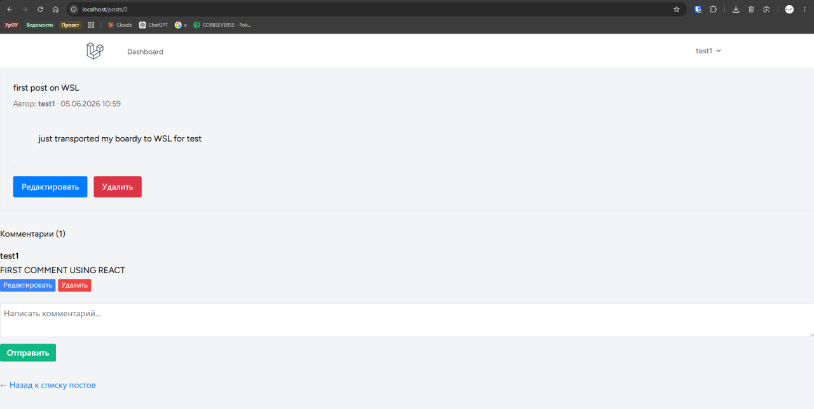

---

## Задание 17. Реалтайм работает

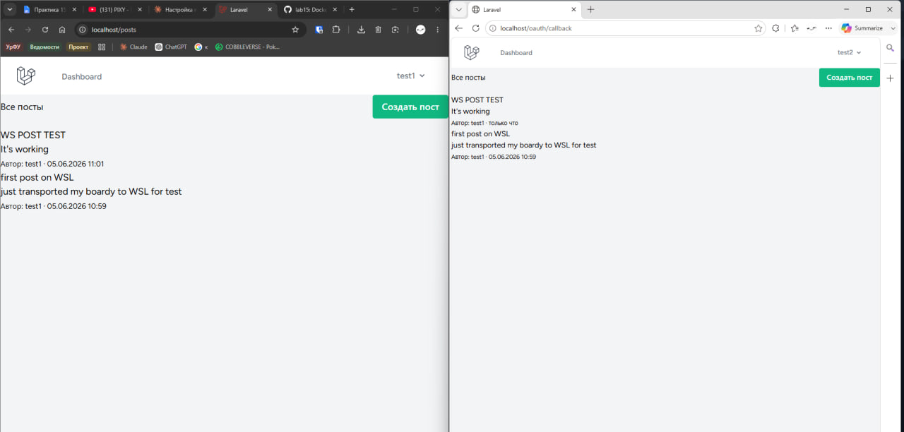
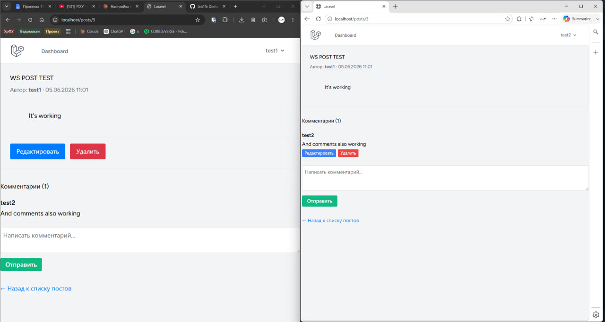

---

## Задание 18.  

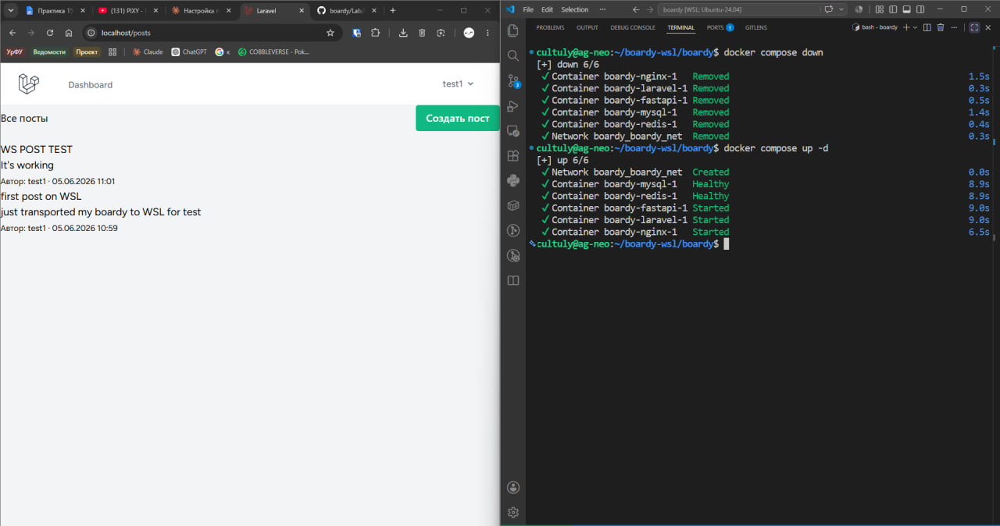

## Ответы на вопросы:
## Что произойдёт с данными при docker compose down -v?
`docker compose down` без `-v` останавливает и удаляет контейнеры и сеть, но именованные volume остаются данные целы, при следующем `up` всё на месте.

## В чём опасность флага -v?
`docker compose down -v` дополнительно удаляет именованные volume объявленные в compose (базы, ключи Passport и данные Redis стираются безвозвратно).
Опасность в том, что всего один флаг стирает самое ценное (данные) недопустимо на проде (ну разве что нет цели прогнать новый init.sql к примеру).

---

## Задание 19. 

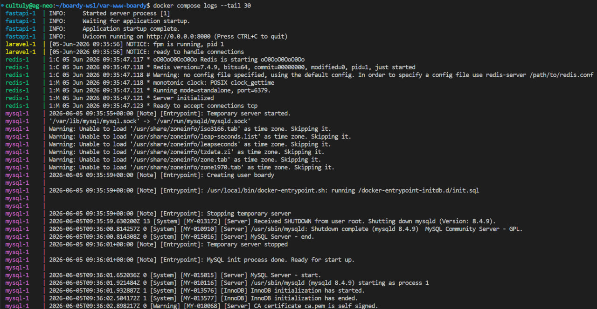

## Ответы на вопрос:
## Плюсы централизованных логов Docker по сравнению с tail -f /var/log/* на хосте?
`docker compose logs -f` собирает stdout/stderr всех контейнеров в единый поток, помечая каждую строку именем сервиса, по одной команде; `docker compose logs laravel` показывает логи только одного сервиса.

Преимущества перед `tail -f /var/log/*` на хосте:
Один интерфейс ко всем сервисам  не нужно знать, где у каждого приложения лежат лог файлы, и не нужно заходить на каждый сервер или в каждый контейнер. Единый формат с временными метками и удобная фильтрация по сервису.Логи интегрируются с драйверами логирования (json-file, syslog, отправка во внешние системы сбора). А `tail -f /var/log/*` привязан к файловой структуре конкретного хоста, требует доступа к хосту и разных путей для разных сервисов, и не даёт единого взгляда на все контейнеры.

---

## Задание 20. 


## Пояснение:
Как раз специально склонировал репозиторий к себе на WSL для теста всей лабораторной (на основных доменах тоже работает, достаточно настроить несколько переменных в .env)

## Ответы на вопрос:
## Какая команда нужна на новой машине от клона репозитория до рабочего приложения?:

На данный момент после подъёма нужны ещё разовые команды инициализации:

```bash
git clone <repo> boardy && cd boardy
cp .env.example .env
docker compose up -d
docker compose exec laravel php artisan key:generate
docker compose exec laravel php artisan migrate --force
docker compose exec -u www-data laravel php artisan passport:keys --force
docker compose exec laravel php artisan passport:client --public --name="Boardy SPA"
# полученный Client ID в .env (PASSPORT_CLIENT_ID)
docker compose up -d --force-recreate laravel   # пересоздать чтобы подхватить новый .env
```
---
