## Важное уточнение:
16 - 18 скрин не сделал так как делал лабу на **WSL** (пока пытаюсь разобраться как выполнить с помощью неё часть с VPS)

## Задание 1. Скелет workflow

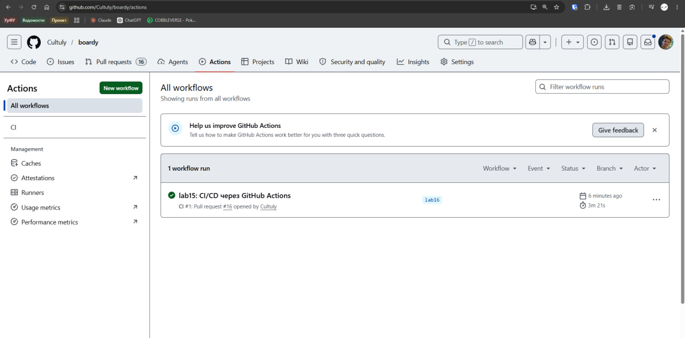

## Задание 2. Lint

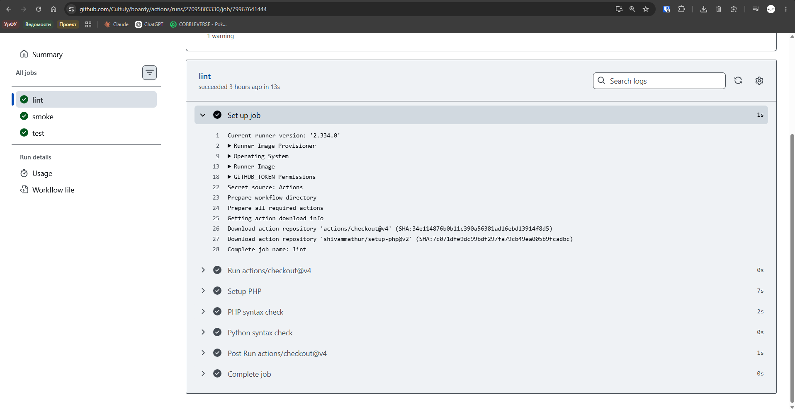

## Ответы на вопросы:
## Почему lint стоит первым в пайплайне?

Lint стоит первым, потому что это самая быстрая и легковесная проверка. Она не требует сборки Docker образов, поднятия контейнеров, установки зависимостей. Если в коде есть какая-то к примеру синтаксическая ошибка, нет смысла тратить минуты и лимиты CI на долгие шаги (smoke, test, build).

## Что он ловит, а что нет?
Ловит: синтаксические ошибки (опечатки, незакрытые скобки, неверные отступы в Python, отсутствие точек с запятой в PHP), которые мешают коду интерпретироваться или компилироваться.

Не ловит: логические ошибки, проблемы с бизнес логикой, неработающие эндпоинты, ошибки в зависимостях, проблемы с конфигурациями или базами данных.

## Задание 3. /health эндпоинты

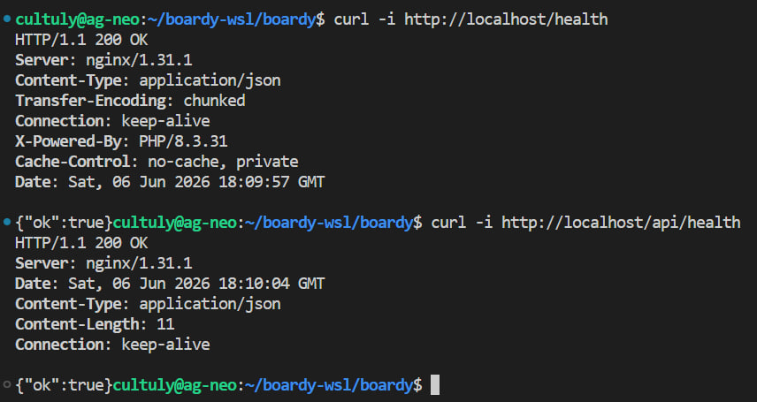

## Ответы на вопросы:
## Зачем отдельный /health, если есть полноценные эндпоинты?
/health нужен для быстрой и легкой проверки того, что процесс приложения жив, загрузился и готов принимать трафик.
Полноценные эндпоинты могут требовать обращения к БД, кэшу или внешним API, что замедляет проверку, делая её тяжелее создавая лишнюю нагрузку.
/health отвечает мгновенно и не зависит от состояния внешних сервисов.

## Где такой паттерн используется в проде?
В оркестраторах к примеру kubernetes, в балансировщиках нагрузки к примеру nginx и в системах мониторинга к примеру zabbix, для автоматического рестарта упавших контейнеров и исключения мертвых нод из ротации.

## Задание 4. Smoke-check

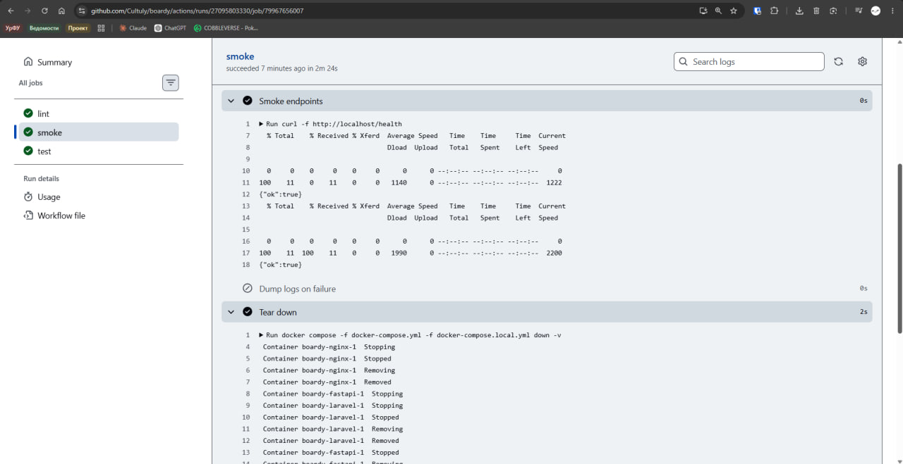

## Ответы на вопросы:
## Какие три класса поломок ловит smoke?
Ошибки сборки образов (ошибки в Dockerfile, нехватка файлов, битые зависимости на этапе install).
Ошибки оркестрации (неверный docker-compose.yml, конфликты портов, неправильные переменные окружения, из-за которых контейнеры не могут стартовать).
Критические ошибки запуска приложения (падение при старте из-за неверной конфигурации БД, отсутствие обязательных файлов, ошибки миграций).

## Что он НЕ ловит?
Не ловит логические ошибки в бизнес логике, некорректную работу специфичных эндпоинтов, проблемы с производительностью, ошибки верстки или утечки памяти. smoke проверяет только статус успешного старта и наличие базового роута.

---

## Задание 5. PHPUnit-тест на /health

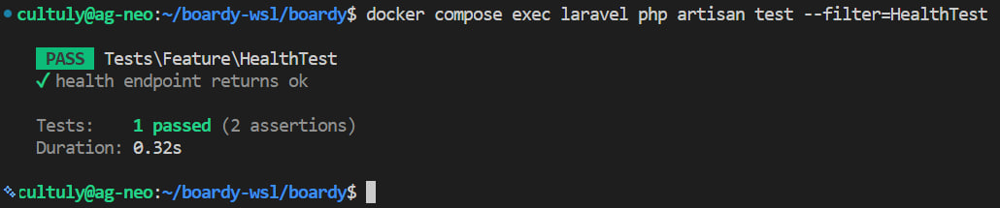

---

## Задание 6. pytest-тест на /health

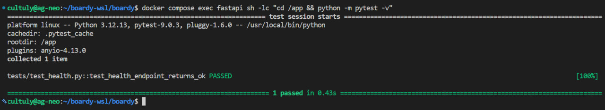

---

## Задание 7. Job test в CI

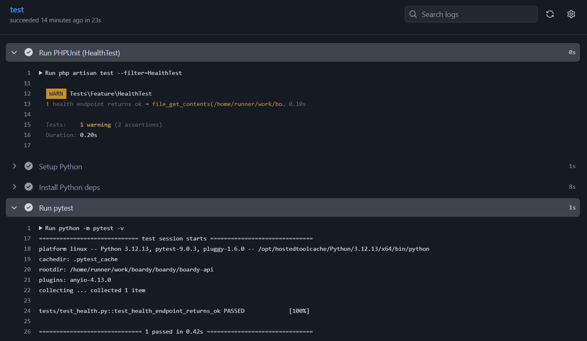

## Важное уточнение:
Тесты проходят, WARN не мешает этому а лишь уведомляет о том что .env не найдем, возникает из-за того что в CI раннере нет .env файла так как он прописан в .gitignore, но я прочитал логи и тест проходит WARN никак не препятствует этому.

## Ответы на вопросы:
## Почему test после smoke, а не до? Что было бы наоборот?
smoke проверяет, что окружение вообще поднимается и приложение стартует без критических ошибок конфигурации. Если приложение падает при старте (к примеру невозможно подключиться к БД), то запуск тестов бессмысленен они все упадут с ошибкой подключения или инициализации.

Если бы test был до smoke, мы бы тратили время CI на установку зависимостей и прогон тестов в окружении, которое может быть битым на уровне базовой конфигурации. Это привело бы к ложным падениям, засорило бы логи ошибками подключения и тратило бы ресурсы раннера впустую.

---

## Задание 8. Блокировка сборки сломанным тестом

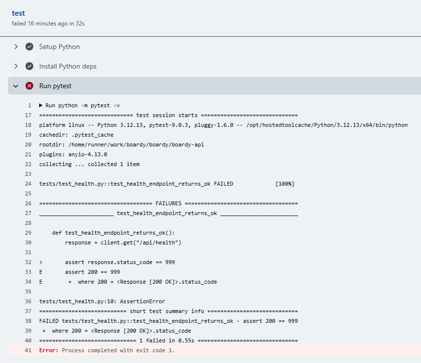

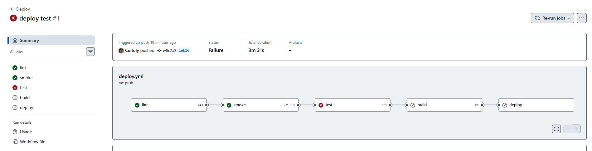

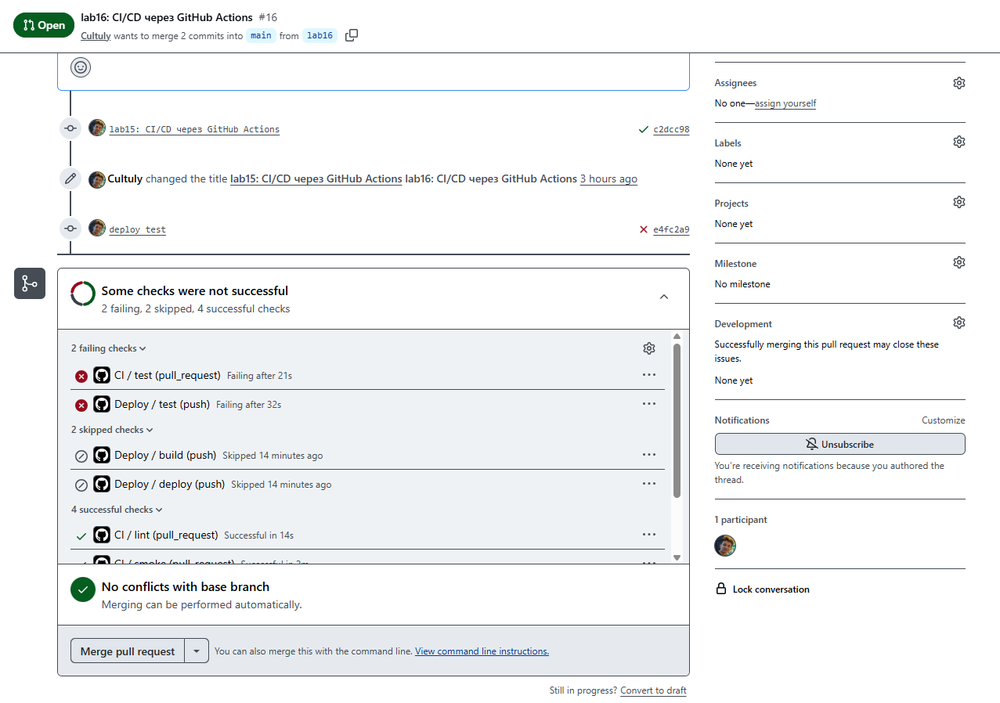

## Ответы на вопросы:

## Опишите цепочку: что бы случилось при ручном деплое в этой ситуации? Сколько времени сэкономил CI?
При ручном деплое особенно когда проект большой легко не заметить падение одного теста среди сотен строк локального вывода, закоммитить код, залить на сервер, пересобрать образы тратя много времени в пустую, перезапустить контейнеры и только после всего этого обнаружить, что что-то сломано или неправильно сконфигурированно. Затем пришлось бы вручную откатывать изменения на сервере, искать ошибку и повторять цикл.
CI сэкономил время на сборку образов, деплой на прод, ручной откат и тестирование прода. Ошибка блокируется на этапе PR за секунды, не допуская мусорные файлы в main и не ломая прод.

---

## Задание 9. Где смотреть логи

## Ответы на вопросы:

## Опишите шаг за шагом как открыть лог упавшего теста — от вкладки Actions до конкретной строки ассерта. Минимум 4 шага.
Перейти на вкладку Actions в репозитории GitHub.
В списке запусков найти нужный запуск с красным крестом и кликнуть на его название.
В открывшемся графе jobs кликнуть на упавший job, чтобы открыть список его шагов.
Кликнуть на конкретный шаг запуска тестов, чтобы раскрыть лог.
В раскрытом логе прокрутить вниз где будет указан файл, номер строки и суть упавшего ассерта.

---

## Задание 10. Защита ветки main

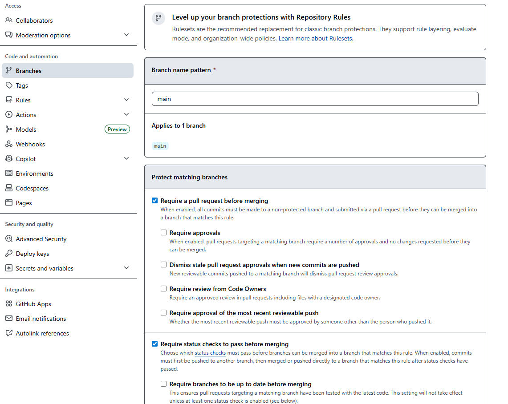

---

## Задание 11. Workflow деплоя

## Ответы на вопросы:

## Почему сборка и деплой в отдельном файле, а не вместе с CI?
ci.yml запускается на каждый PR и push в любые ветки для быстрого фидбэка. deploy.yml должен запускаться только при слиянии в main или релизном теге. Разделение помогает не триггерить тяжелые и потенциально опасные операции (push в реестр, SSH на прод) на каждый черновик кода.

## Зачем повтор lint/smoke/test в deploy.yml?
Чтобы гарантировать, что в main попал действительно рабочий код. Хотя CI уже проверял это в PR, если разрешён  прямой push в main (как мы добавляли rules на ветки в этой лабе) или слияние с обходом проверок может пропустить битый код. Дублирование проверок в deploy.yml это страховка перед тем, как трогать продо.

---

## Задание 12. Login в GHCR

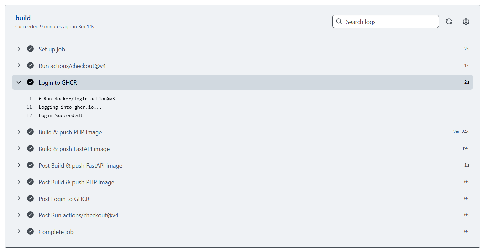

## Ответы на вопросы:

## Что такое GITHUB_TOKEN?
Это автоматически генерируемый GitHub временный токен для аутентификации в рамках текущего запуска workflow. Он позволяет actions взаимодействовать с GitHub API к примеру пушить пакеты в GHCR, создавать релизы, расставлять статусы проверок.

## Чем он отличается от обычного secret-а (минимум 2 отличия)?
**Время жизни:** GITHUB_TOKEN живет только в рамках одного запуска workflow и автоматически истекает после завершения. Обычный secret существует постоянно, пока его не удалят вручную.

**Область действия и права:** Права GITHUB_TOKEN сильно ограничены текущим репозиторием и задаются через permissions в yaml. Обычный secret может иметь доступ к другим репозиториям, организациям или аккаунту, что намного опаснее при утечке.

---

## Задание 13. Сборка и push образов

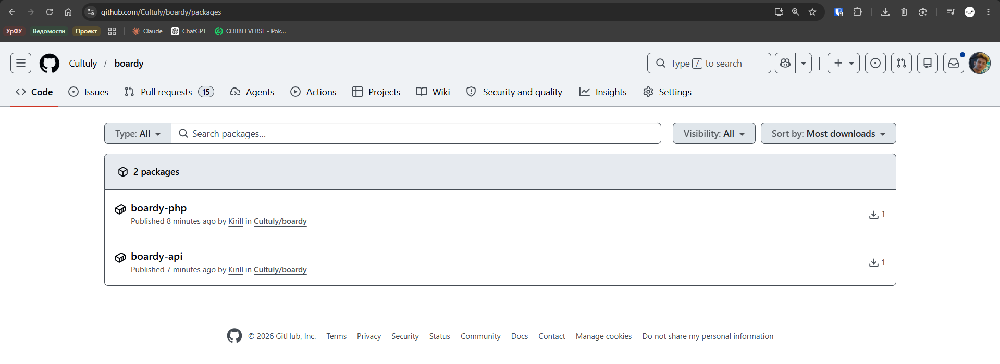

## Ответы на вопросы:

## Зачем два тега? Когда какой используется?
latest используется для удобства и как указание на самую свежую стабильную версию.
Тег по SHA хэшу коммита используется для точного определения версии. Он гарантирует воспроизводимость мы всегда знаем, какой именно код находится в образе, и можем мгновенно откатиться на конкретный коммит, просто поменяв тег в compose без пересборки.

---

## Задание 14. compose тянет из GHCR

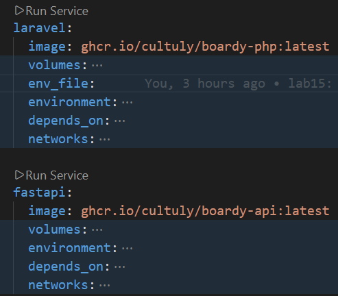

## Ответы на вопросы:

## Сравните с compose из практики 14. Почему сборка ушла с сервера?
В практике 14 docker-compose.yml содержал директиву build:, из-за чего сервер (VPS) тратил свои CPU и RAM на компиляцию образов, скачивание зависимостей и сборку. Это замедляло деплой, нагружало прод-машину и требовало установки dev-зависимостей на прод.
Теперь сервер только скачивает (pull) уже готовые, легкие слои из GHCR. Сборка перенесена в мощные и бесплатные раннеры GitHub Actions. Деплой на сервере сводится к секундам, а на проде не хранится мусор в виде кэша сборок.
Задание 15. SSH-ключ деплоя и секреты
Ответы на вопросы:

## Почему отдельный ключ для деплоя, а не ваш личный?
Личный ключ привязан к конкретному разработчику. Если разработчик уволится, сменит рабочую машину или его личный ключ утечёт, придется менять доступы везде. Отдельный deploy ключ это сервисный аккаунт, он не зависит от людей и живет только на сервере и в CI.

## Что делать если он утечёт?
Как можно быстрее отозвать публичный ключ с сервера, сгенерировать новую пару ключей и обновить приватный ключ в секретах GitHub. Так как это отдельный ключ, компрометация личной машины разработчика не затронет доступ к проду.

---

## Задание 15. SSH-ключ деплоя и секреты

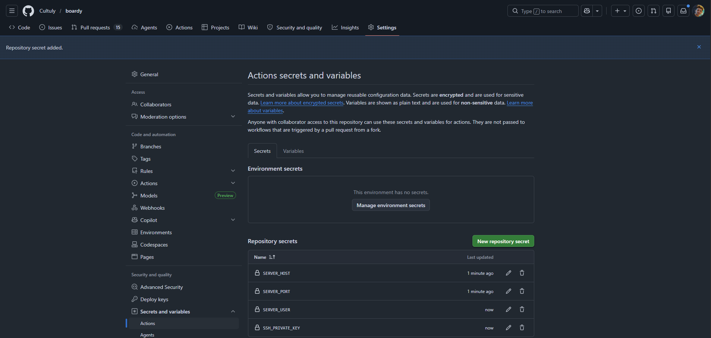

---

## Задание 16. Job deploy

---

## Задание 17. Полный pipeline

## Задание 18. Откат

## Ответы на вопросы:

## Опишите как откатиться на предыдущую версию используя тег по SHA. Какие команды на сервере?
Команды на сервере:
Изменить теги образов в docker-compose.yml на нужный SHA.
docker compose up -d docker подтянет слои для этого SHA и пересоздаст контейнеры.

## Почему не нужно ничего пересобирать?
Потому что образ с этим SHA уже физически лежит в GHCR и, возможно, частично в кэше Docker на сервере. Достаточно просто указать Docker Compose запустить конкретную, уже собранную и протестированную CI версию приложения.

---

## Задание 19. Безопасность пайплайна

## Ответы на вопросы:

## Почему версию стороннего action лучше пинить по SHA, а не по тегу?
Теги в Git являются изменяемыми. Злоумышленник, получив доступ к репозиторию action, может к примеру переписать тег v1 на другой коммит с вредоносным кодом, и пайплайн это подхватит. SHA коммита неизменяем. Пиннинг по SHA гарантирует, что всегда запускается именно тот код, который проверялся при подключении action.

## Что произойдёт если запустить недоверенный код в pull_request_target?
Триггер pull_request_target выполняется в контексте базовой ветки (main) и имеет доступ к секретам репозитория. Если злоумышленник будет запускать в нем код из PR, он сможет украсть секреты (токены, ключи от прода), получить write доступ к репозиторию и добавить вредоносный код в main.

## Почему для публичного репозитория опасен self-hosted runner?
В публичном репозитории любой внешний пользователь может форкнуть его и отправить PR. Если включен self-hosted runner, код из этого PR выполнится на личной или корпоративной машине или сервере, которая имеет доступ к вашей локальной сети, файловой системе и другим ресурсам. Это прямой путь к утечке всей инфраструктуры.

---

## Задание 20. Карта курса

## Ответы на вопросы:

1) Linux, VM — необходим был сервер для деплоя всего проекта (VPS размещённый в интернете).

2) SSH, VPS, Git — удобное подключение к серверу для в целом любой работы с кодом (плюс версионирование приложения с помощью гита).

3) NGINX, DNS — благодаря этому сайтов можно пользоваться не по труднозапоминаемому IP а по удобному и запоминающемосю домену.

4) HTTP — узнали основу общения между клиента и сервера путём HTTP запросов .

5) HTTPS — надстройка над HTTPS позволяющая безопасно передавать чувствительные данные без угрозы их кражи.

6) CGI — важная составляющая для выполнения кода (скрипты на python и php) способ выполнения скриптов на сервере и передача результата.

7) PHP-FPM и FastAPI — управление и в целом запуск бэкэнд составляющей проекта без этого бэк просто не будет работать.

8) MySQL — хранилище данных (БД) для хранения информации (в нашем случае о пользователях, постах в прошлом ещё и комментов) без этого приложение бы каждый раз запускалось с пустыми данными.

9) REST API SSR vs CSR — важный аспект в разделении ролей между бэк и фронт составляющими.

10) Куки и сессии — позволяют сохранять состояние пользователей так как сам по себе HTTP stateless.

11) JWT и OAuth — удобный и надёжный способ аутентификации пользователя для дальнейшей авторизации.

12) Laravel — максимально удобный фреймворк для работы с бэкэнд составляющей проекта на PHP (раньше писали на чисто php что порождало очень много дублей логики, laravel кратно упростил работу).

13) WebSocket — надстройка над HTTP позволяющая сохранять соединение между клиентом и сервером для постоянного обнолвения данных без перезагрузки страницы (полезно к примеру в играх, чатах или постах с комментами как у нас).

14) Redis — механизм кэширования который позволяет кратно снизить нагрузку на БД тем самым разделяя нагрузку и уменьшая вероятность падения БД из-за слишком высокой нагрузки.

15) Docker — удобный способ упаковки данных чтобы приложение можно было запустить на любой машине.

16) CI/CD - автоматический деплой на прод сервер с удобными автоматическими проверками на ошибки перед деплоем что экономит много времени и позволяет видеть подробную статистику.

---
