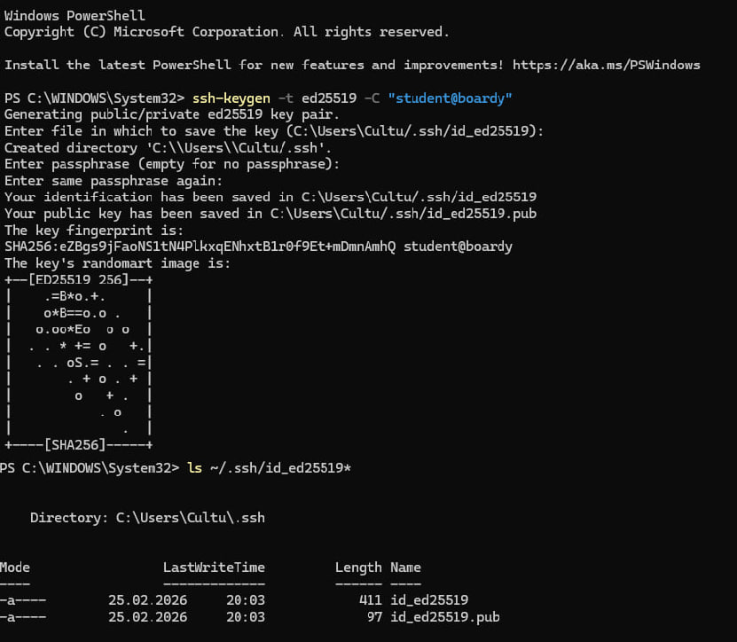
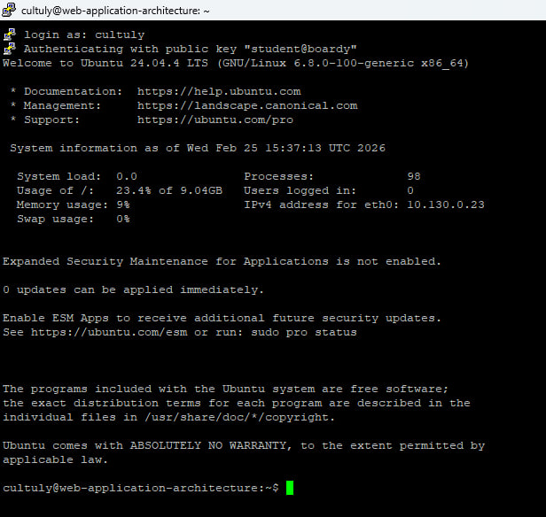
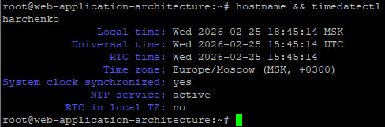
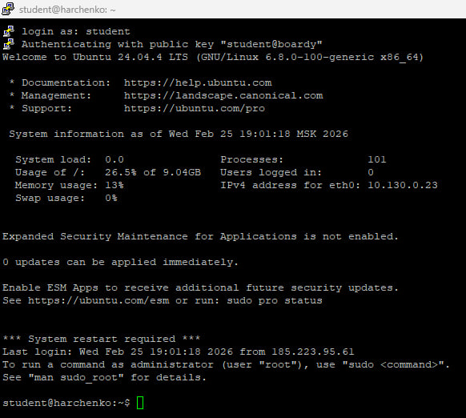
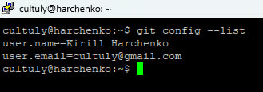
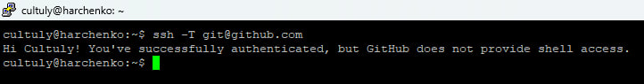
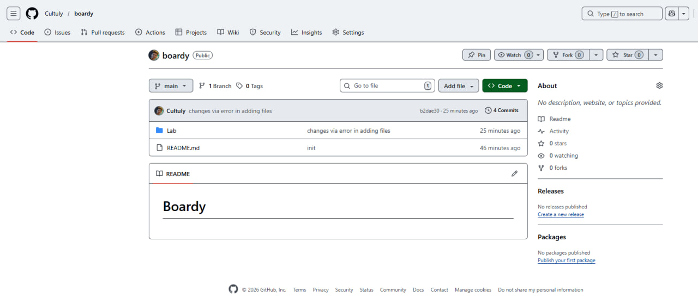
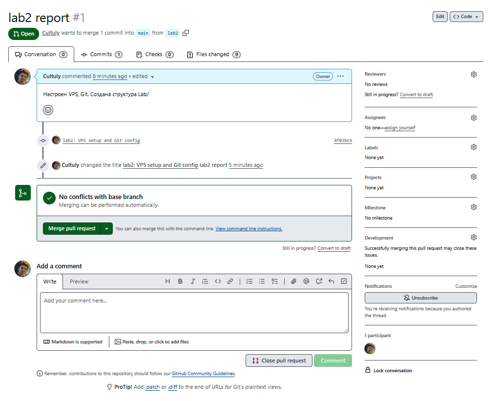

## Создание SSH-ключа

## VPS на Yandex Cloud
 

## Подключение через PuTTY

## Настройка сервера

## Новый пользователь student

## Результат git-config

## Результат ssh-github

## Репозиторий на GitHub с папками Lab/

## Созданный PR на GitHub

