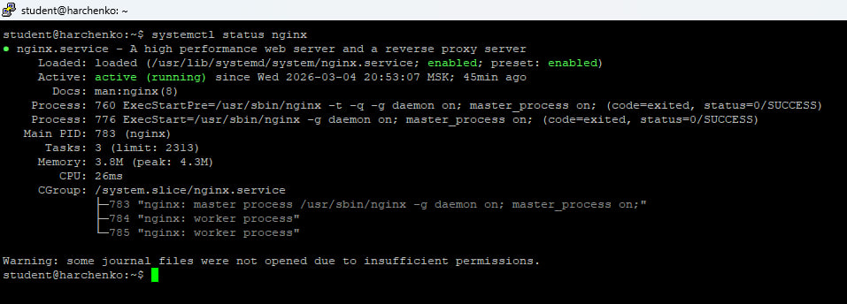
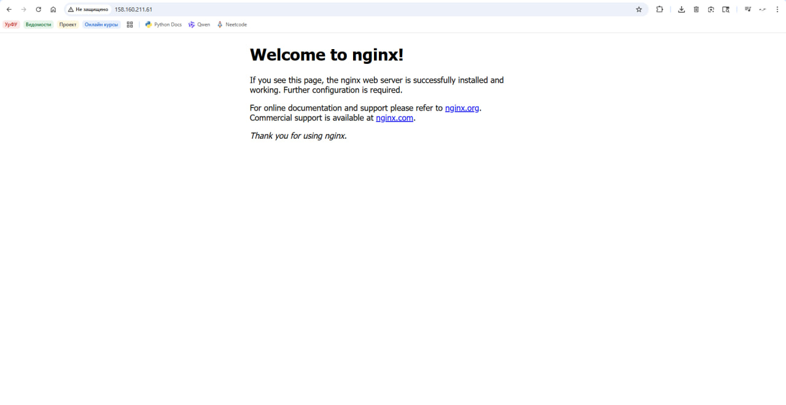
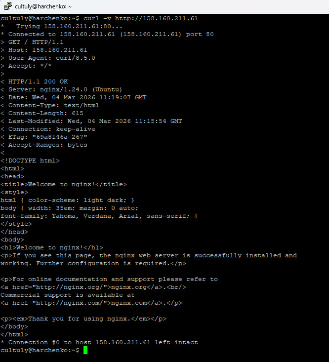
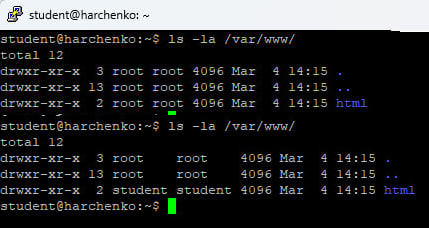
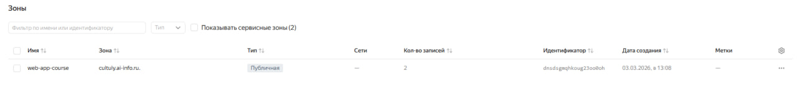
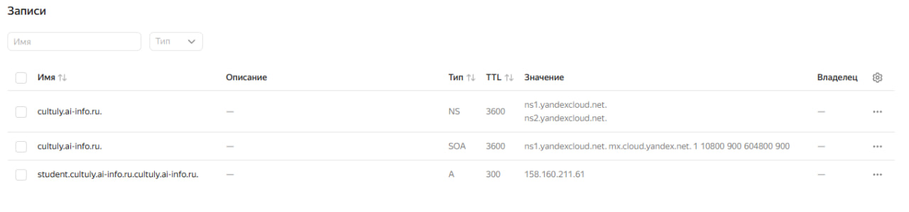
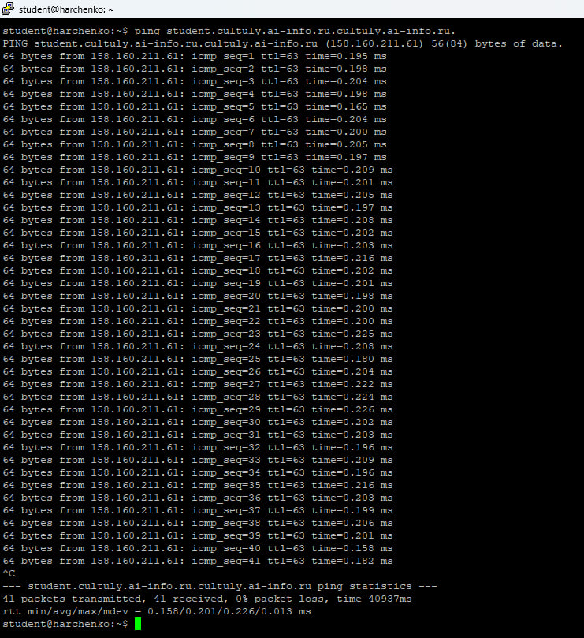
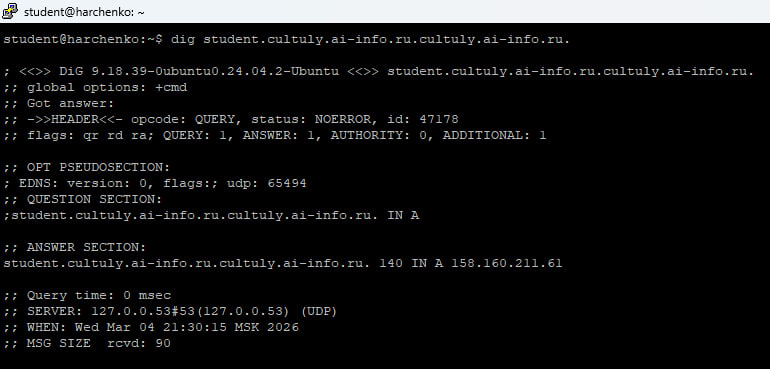
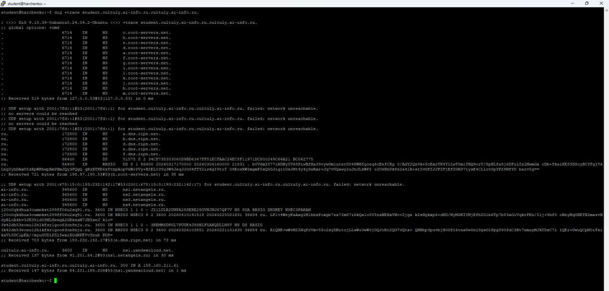

## Вывод systemctl status nginx

## «Welcome to nginx!» в браузере (IP виден в адресной строке)

## Вывод curl -v
### GET / HTTP/1.1
### HTTP/1.1 200 OK
### Content-Type: text/html

## Вывод ls -la /var/www/ ДО и ПОСЛЕ chown

## Конфигурация Nginx
### listen 80 default_server
Директива указывает Nginx принимать HTTP-запросы на порту 80
### root /var/www/html
Директива задаёт корневую директорию для хранения файлов сайта
### server_name _
Директива определяет имена доменов, на которые давать ответ, _ используется для обработки любых запросов, не попавших в другие хосты.
### index 
index.html index.htm index.nginx-debian.html - Директива задаёт приоритетный список файлов, которые Nginx будет искать и отдавать при запросе директории

## Панель Yandex Cloud с созданной зоной

## A-запись в панели Yandex Cloud (домен, IP, TTL видны)

## Вывод ping (домен резолвится в IP VPS)

## Вывод dig с подписями
### QUESTION SECTION
student.cultuly.ai-info.ru.  IN   A
### ANSWER SECTION
student.cultuly.ai-info.ru. 2 IN   A   158.160.211.61
### SERVER
127.0.0.53#53(127.0.0.53) (UDP)

## Вывод dig +trace
### Запрос начался с локального резолвера (127.0.0.53), затем прошёл через корневой сервер m.root-servers.net (170.247.170.2) к TLD-серверу .ru f.dns.ripn.net (194.85.252.62), далее к авторитетному серверу ai-info.ru — ns4.netangels.ru (80.87.101.2), который делегировал поддомен cultuly.ai-info.ru на ns1.yandexcloud.net (84.201.185.208), и тот вернул финальную A-запись: student.cultuly.ai-info.ru.cultuly.ai-info.ru (158.160.211.61)
