# 1) Директория проекта

# 2) Конфиг виртуального хоста
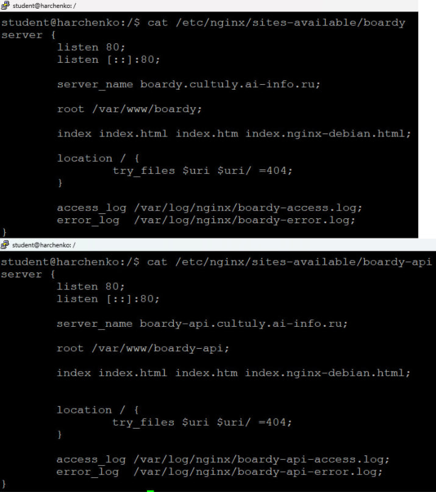
**server_name** указывает имя домена, по которому nginx выбирает соответствующий виртуальный сервер для обработки запроса.

**root** задает корневую директорию на файловой системе, относительно которой располагаются файлы сайта.

**access_log** определяет путь к файлу, в который записывается лог всех обработанных клиентских запросов.

**error_log** задает путь к файлу, куда сохраняются сообщения об ошибках и предупреждениях работы сервера.

**try_files** последовательно проверяет существование указанных файлов или директорий и возвращает первый найденный ресурс или код ответа.

**error_page** настраивает отображение пользовательских страниц при возникновении указанных кодов ошибок HTTP.

# 3) Лендинг
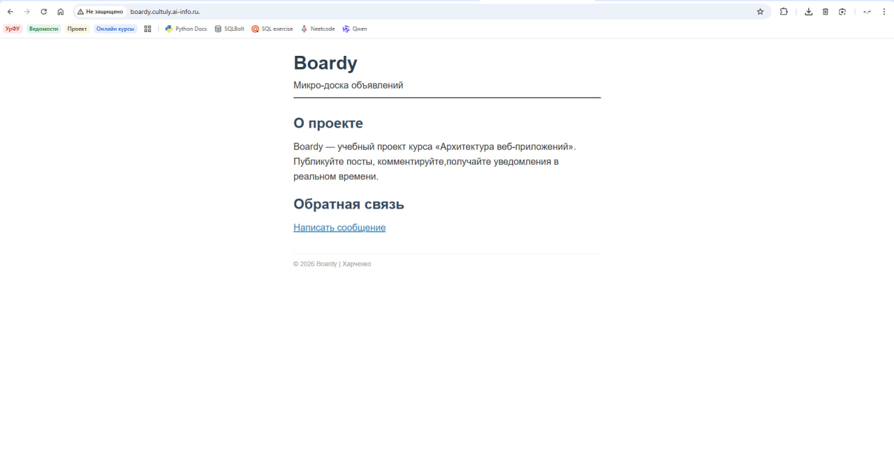

# 4) Форма обратной связи
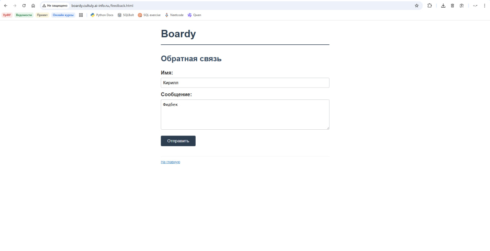

# 5) Стили и 404

# 6) DNS-запись для поддомена
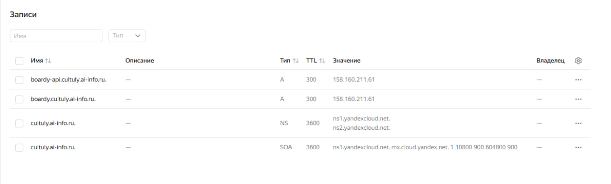

# 7) Проверка DNS
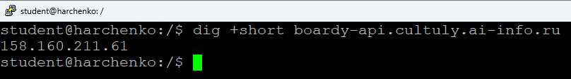

# 8) Конфиг и заглушка API
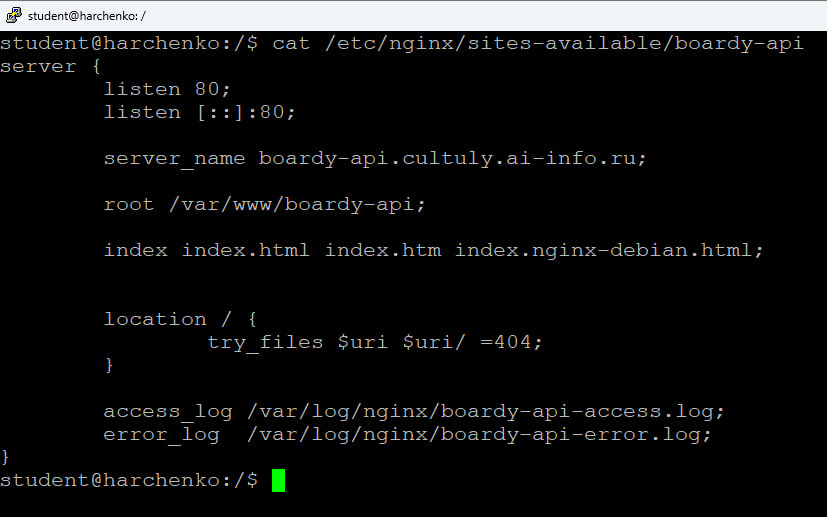

# 9)

# 10) GET-запрос через curl -v
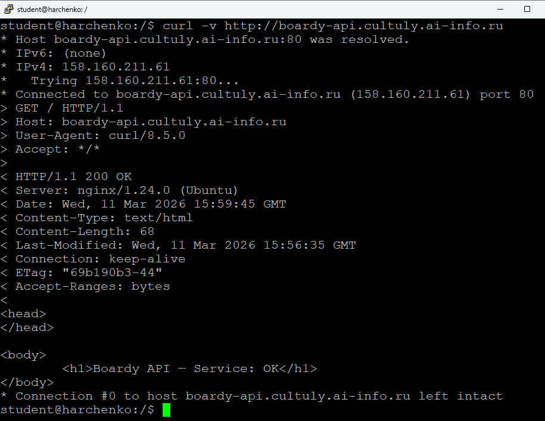
**Стартовая строка** GET / HTTP/1.1
**Заголовок** Host: boardy-api.cultuly.ai-info.ru
**Стартовая строка ответа** HTTP/1.1 200 OK
**Content-Type** text/html
**Content-Length** 68

# 11) Виртуальные хосты в действии
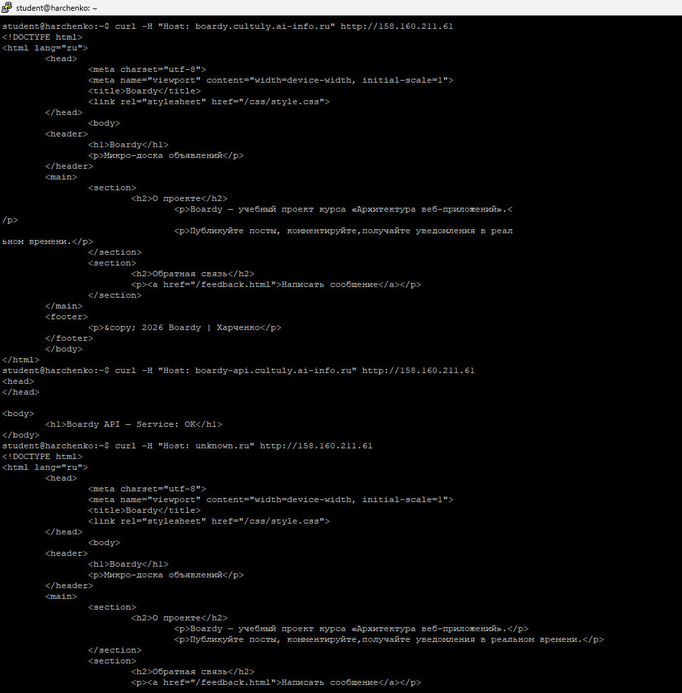
Веб-сервер nginx получает запрос на один IP-адрес, но смотрит на значение заголовка, сравнивает значение Host с директивами server_name в своей конфигурации и выбирает соответствующий блок, третий запрос вернул default_server, потому что не нашёл указаного Host, у меня это boardy-api,
т.к. я его указал таким

# 12) POST-запрос
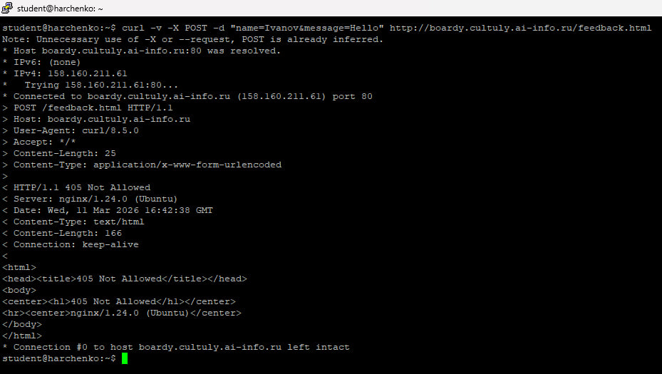
POST /feedback.html HTTP/1.1
Content-Type application/x-www-form-urlencoded
тело запроса name=Ivanov&message=Hello
Потому что Nginx не обрабатывает данные, поэтому выдаёт 405

GET возвращает заголовки и тело ответа, а HEAD только заголовки.
HEAD можно использовать для проверки на существования страницы,получение метаданных, проверка ссылок

# 13) Раздельные логи
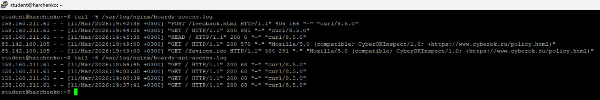

# 14) Фильтрация логов
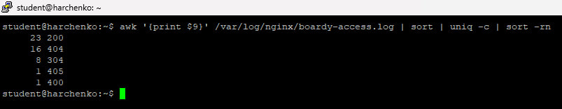

# 15) Скриншот Pull Request
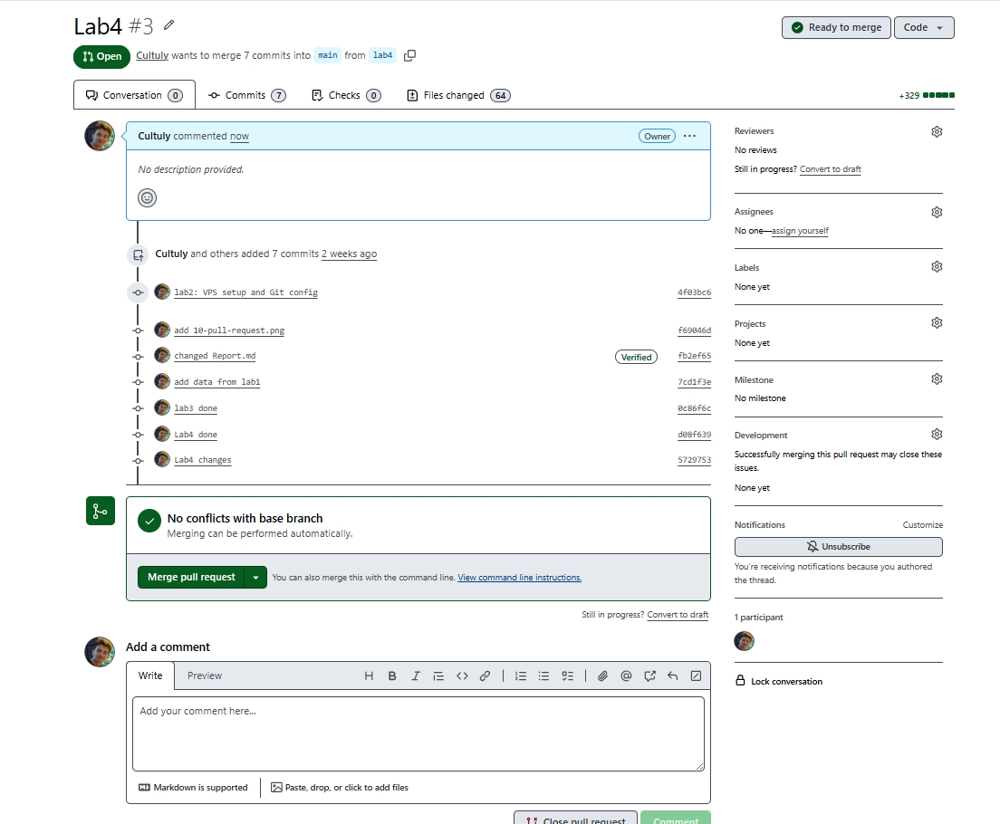
