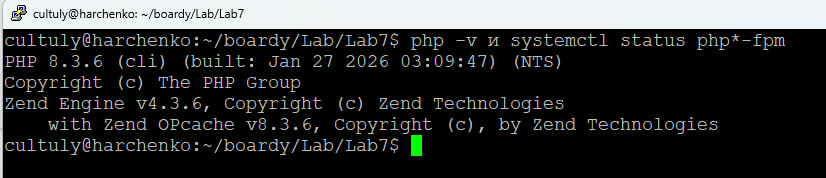

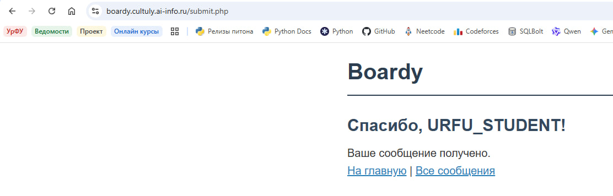

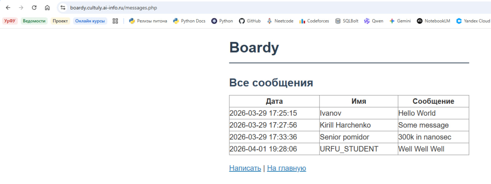

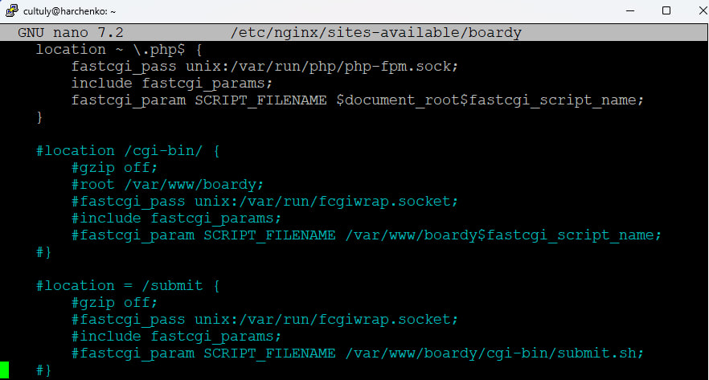
## fastcgi_pass
Это директива nginx для передачи запросов любому FastCGI-серверу, а fcgiwrap - это конкретный сервис-обёртка, позволяющая запускать обычные CGI-скрипты через протокол FastCGI.

## PHP-FPM
Быстрее, потому что использует постоянные рабочие процессы, которые не нужно создавать заново для каждого запроса, в отличие от CGI, где на каждый запрос создается новый процесс.

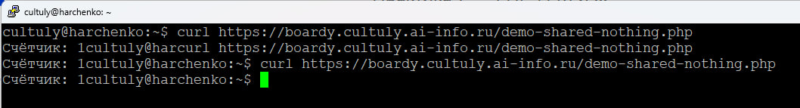
Счётчик не растёт, потому что переменные не сохраняются между запросами, которые обрабатываются изолировано.
## shared nothing
Это архитектурный подход, при котором каждый запрос обрабатывается независимо в собственном процессе с изолированной памятью

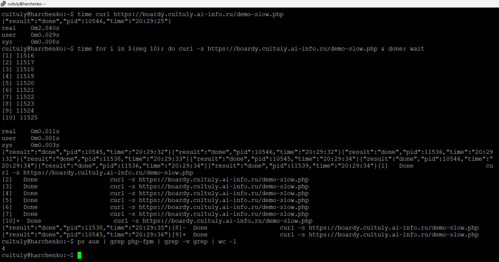
Около 4 секунд.
5 воркеров (PID: 10545, 10546, 11536, 11538, 11539).
10 запросов разделились на 2 "волны" по 5 воркеров:
1-я волна: 5 запросов (20:29:32)
2-я волна: 5 запросов (20:29:34–20:29:36)

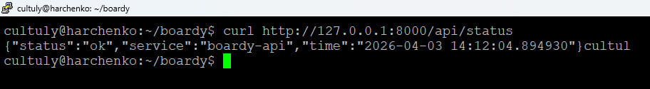

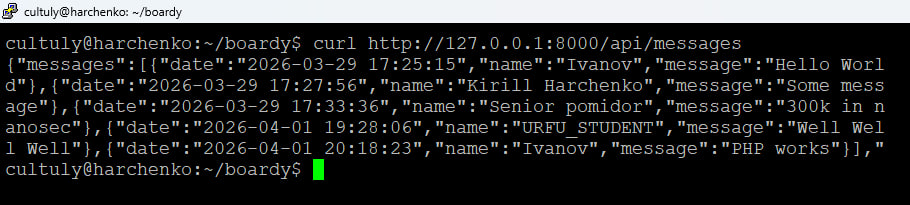

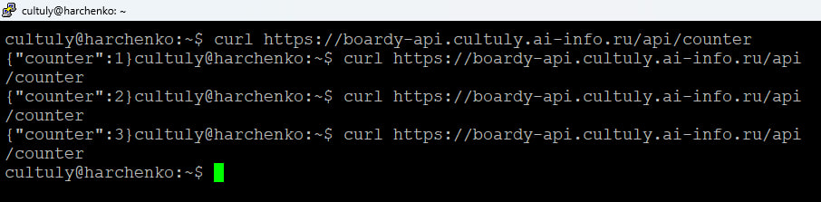
Uvicorn не уничтожает состояние после запроса, поэтому счётчик растёт

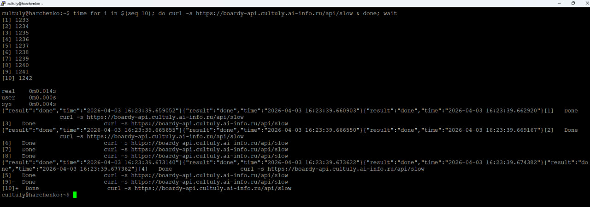
Запросы выполнялись параллельно, поэтому всё заняло даже меньше 2 сек

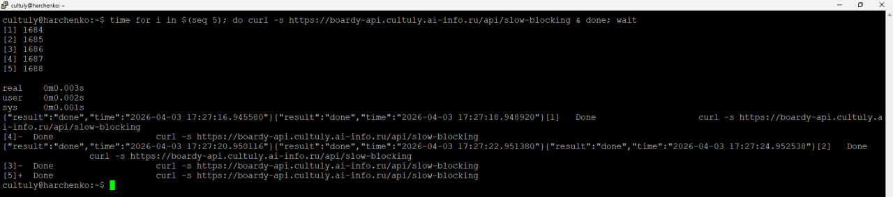
Они отличаются использованием time.sleep, которая блокирует параллельность, поэтому и длится дольше

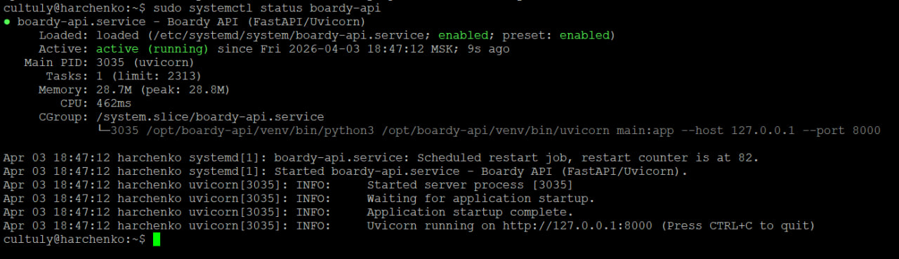

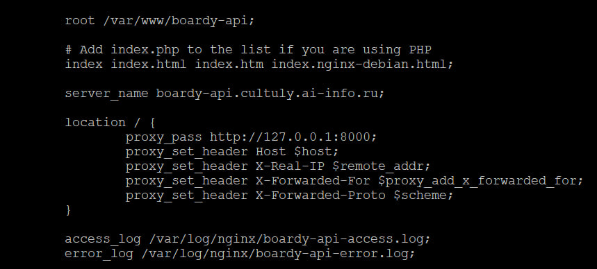
proxy_pass пересылает запросы по HTTP, а fastcgi_pass использует протокол FastCGI.
PHP традиционно работает через PHP-FPM (FastCGI Process Manager), который использует протокол FastCGI
Python-приложение работает как независимый HTTP-сервер и общается с nginx по стандартному HTTP-протоколу

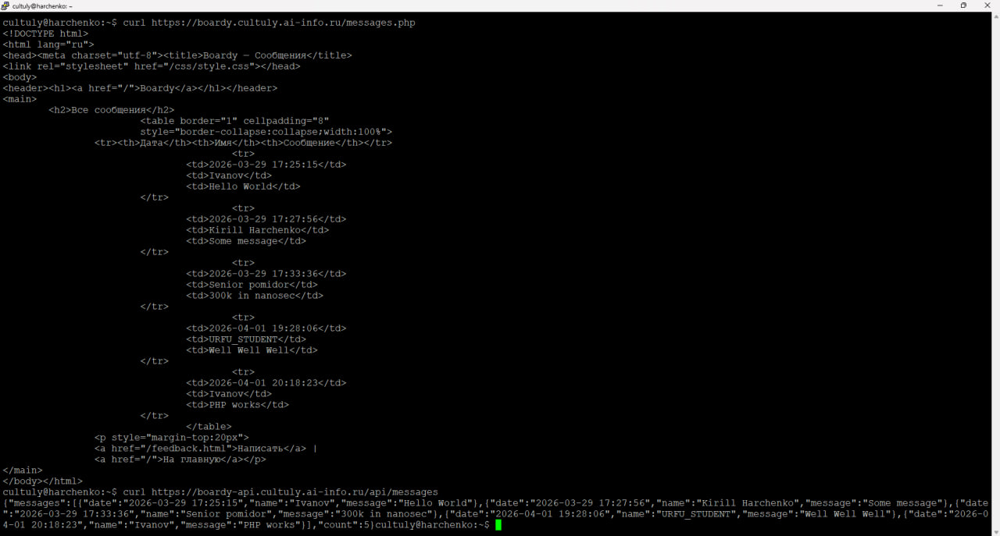
HTML - для людей: готов к отображению в браузере,
содержит разметку, стили, структуру,
человек видит красивую таблицу

JSON - для программ (API):машиночитаемый формат,
легко парсить кодом, только данные без оформления, используется в API для интеграций

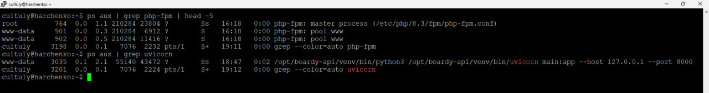

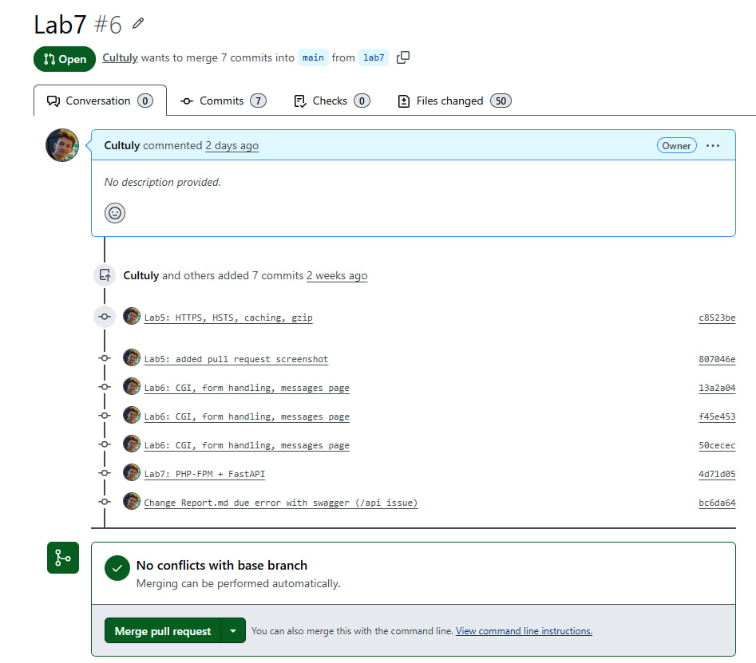
