## Установка MySQL
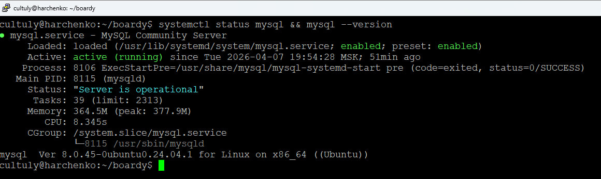

## База данных и пользователь
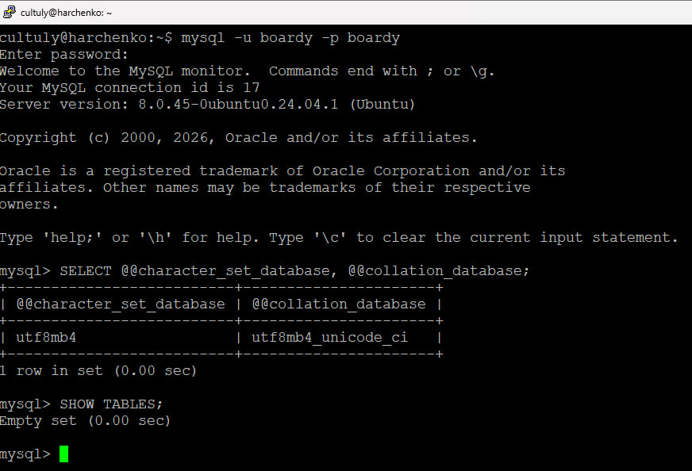
В utf8mb4 поддерживаются все символы Unicode, также это своего рода настройка над utf8, поэтому при переходе данные не потеряются
utf8mb4_unicode_ci- самая подходящая нам сортировка 

## phpMyAdmin

## Три таблицы
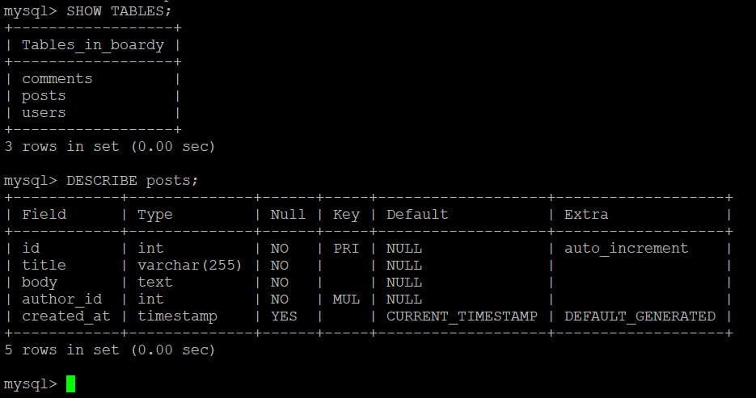

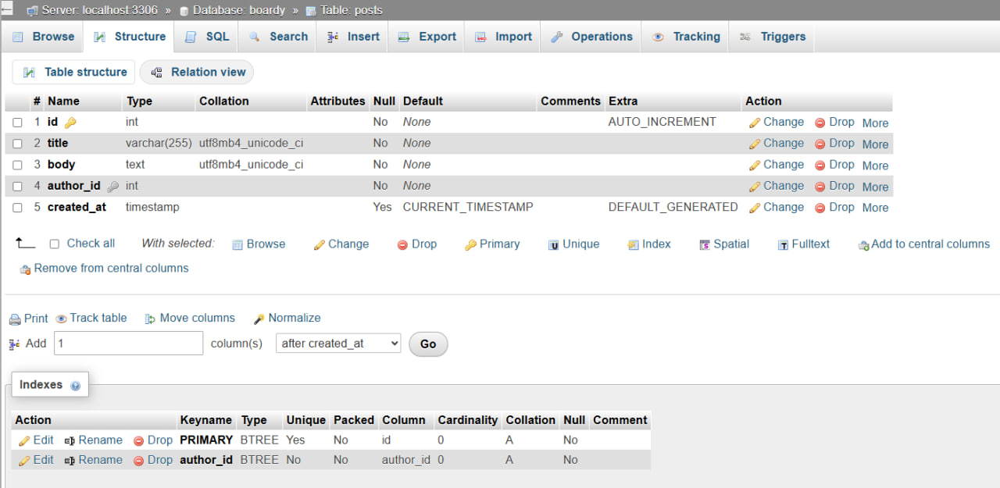
FOREIGN KEY - это указатель на связь между разыми таблицами, которая обеспечивает целостность данных
ON DELETE CASCADE - автоматически удалит все зависимые от удалённой записи
Используем InnoDB т.к. он поддерживает FOREIGN KEY и является современным стандартом (до него был MyISAM)

## SQL - скрипт
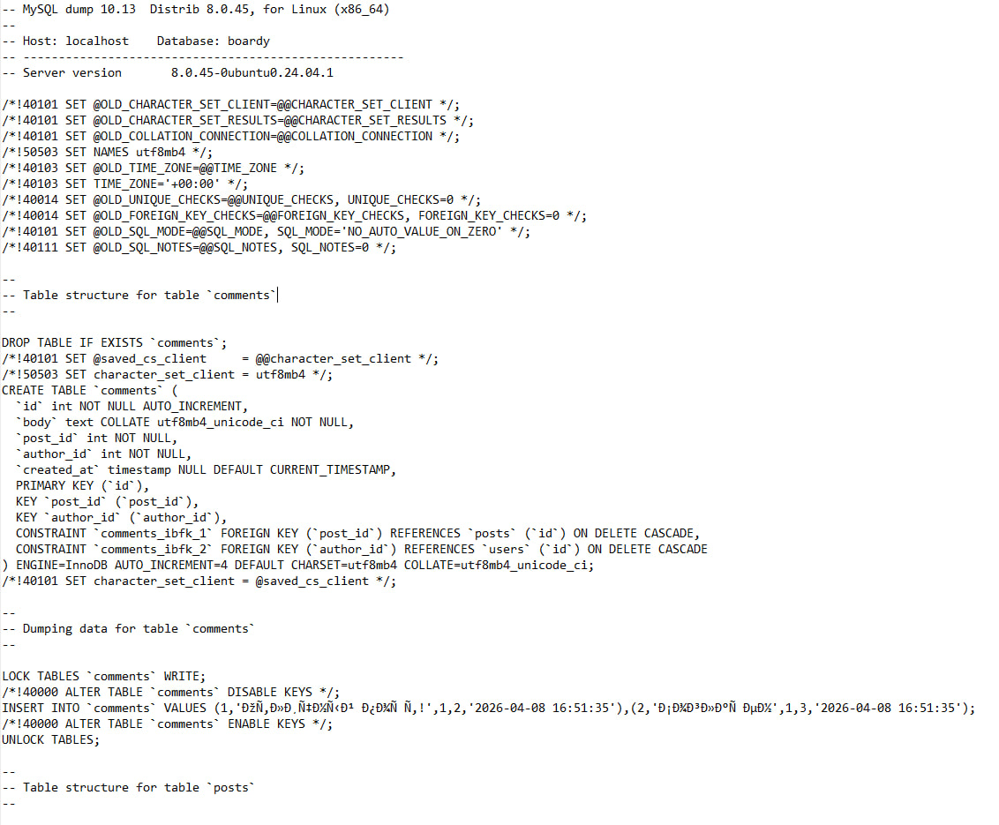

## INSERT
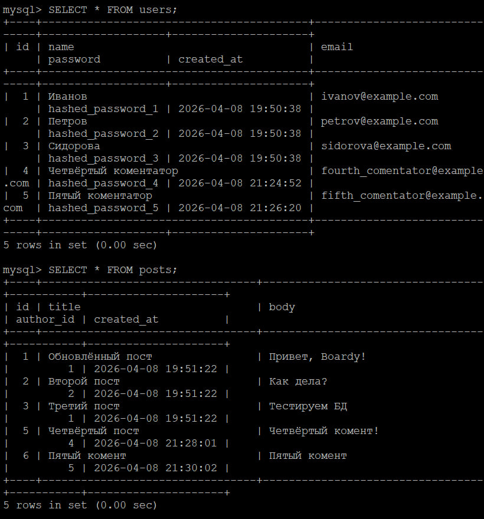

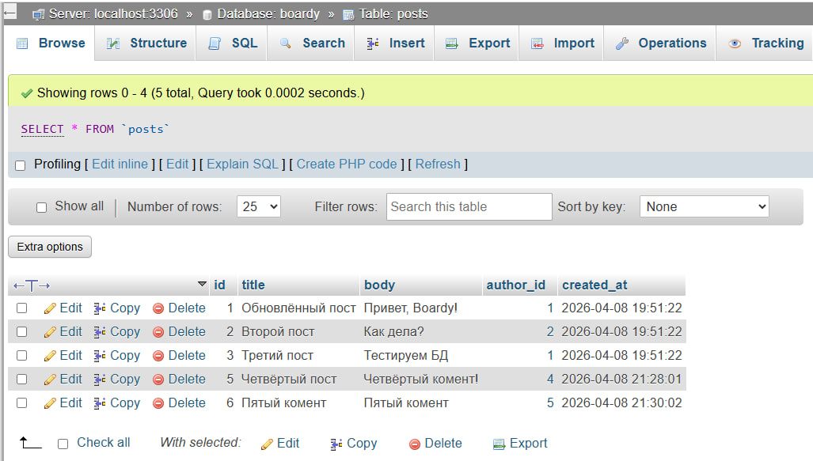

## SELECT + JOIN
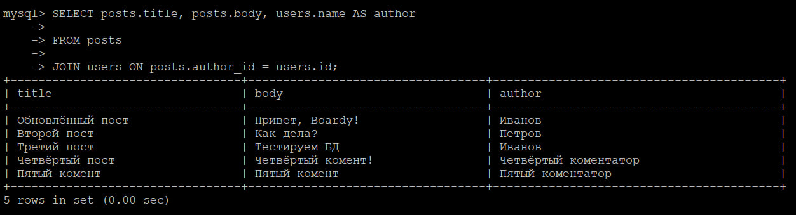

## Foreign Key — защита целостности
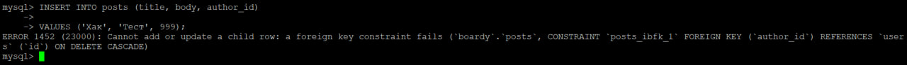

## CASCADE
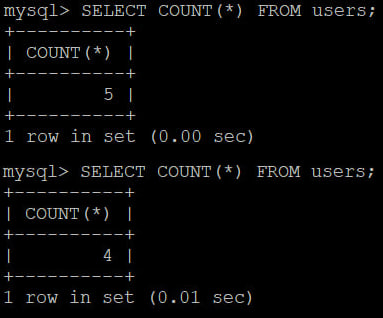

## SQL-инъекция
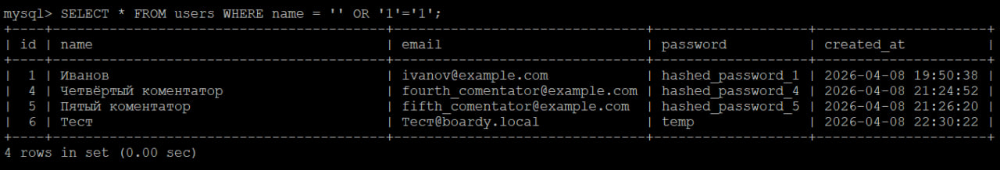
SQL-инъекция возникает, когда злоумышленник вставляет вредоносный SQL-код в пользовательский ввод, а база данных воспринимает его как часть обычного запроса и выполняет. Prepared Statements защищают от этого, потому что запрос и пользовательские данные обрабатываются отдельно. Сначала база данных подготавливает сам SQL-запрос, а затем подставляет введённые данные только как обычные значения, а не как исполняемый код.

## PHP + MySQL
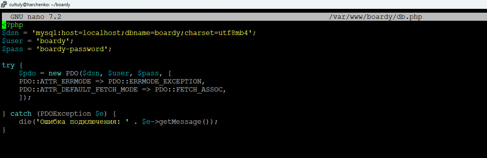

## submit.php через MySQL

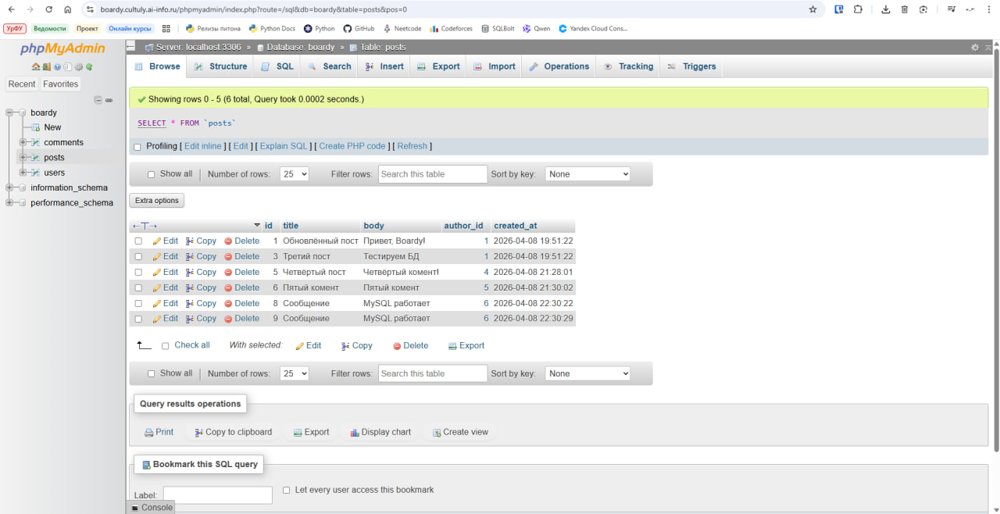

## messages.php через MySQL
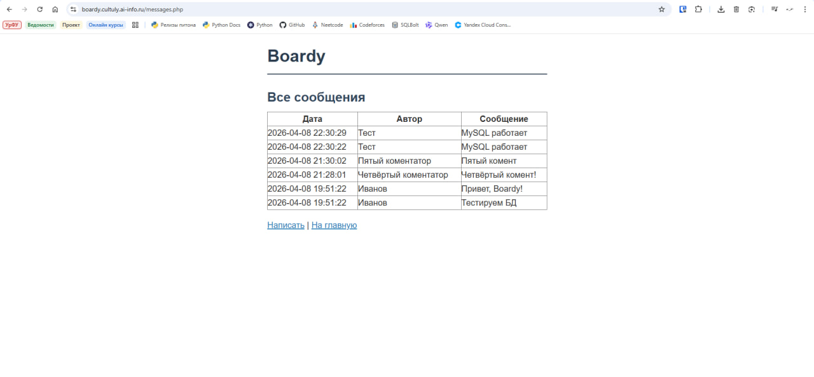

## FastAPI + MySQL
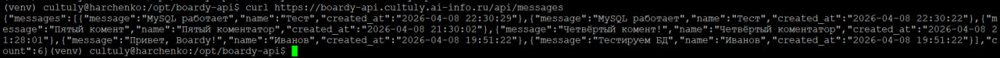

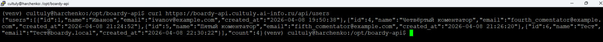
aiomysql — это асинхронный драйвер для работы с MySQL через asyncio. Он позволяет отправлять запросы к базе данных с помощью await, не останавливая выполнение остальных задач
Если использовать обычный (синхронный) драйвер, то во время выполнения запроса event loop будет блокироваться. Пока база данных отвечает, цикл событий не сможет обрабатывать другие задачи, из-за чего производительность приложения может сильно снизится

## Pull Request
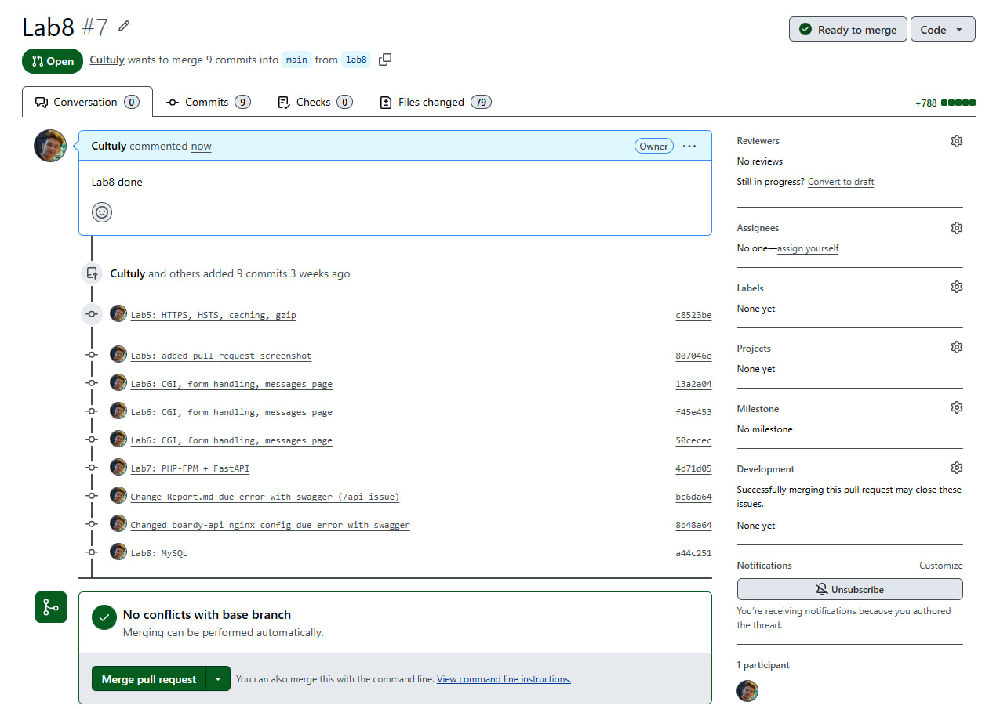
