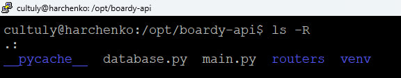

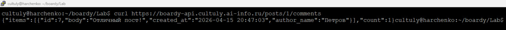
```
SELECT 
    c.id, 
    c.body, 
    c.created_at, 
    u.name AS author_name
FROM children c
JOIN users u ON c.author_id = u.id
WHERE c.parent_id = %s
ORDER BY c.created_at
```
JOIN нужен для того чтобы объединить данные из двух таблиц.

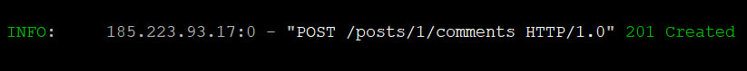
201 Created - код (HTTP-статус) используемый для создания ресурса.
Content-Type: application/json - HTTP-заголовок, оповещающий, что данные отправляются в json формате

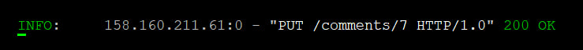
POST - используется на создание ресурса
PUT - на обновление или замену существующего по его id.
При создании комментарий добавляется в коллекцию поста и необходим post_id, а при обновлении достаточно уникального comment_id, так как он уже существует в базе.

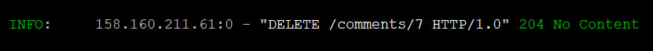
POST: 201 Created, означает что запрос был успешно выполнен и ресурс создан.
PUT: 200 OK, так как сервер корректно обновил существующую запись по её идентификатору.
DELETE: 204 No Content, специальный HTTP-статус, так как содержимое ресурса удалено (содержание пустое).
GET: 200 OK, запрос успешно выполнен и клиент получил запрашиваемые данные с сервера.

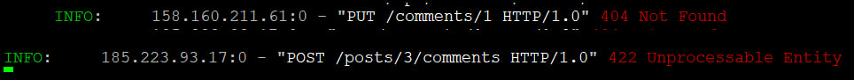

404 Not Found означает, что ресурс указанный в запрсое не найден, то есть его скорее всего нет в бд (в нашем случае посты, коменты).
422 Unprocessable Entity означает, что сервер понял запрос, но данные не прошли проверку.

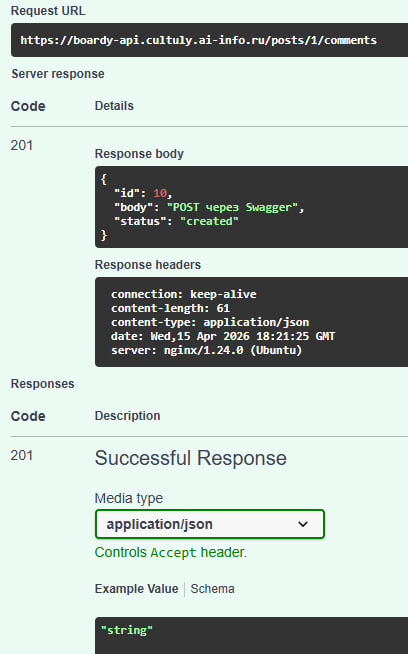

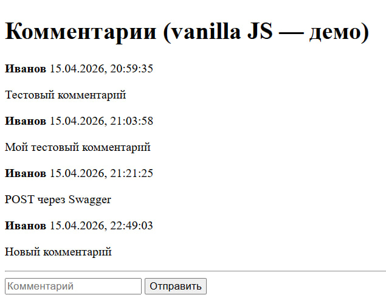

Функция esc() делает пользовательский ввод безопасным, заменяя специальные символы вроде < и > на HTML-сущности. Это нужно, чтобы браузер не воспринимал введённый текст как код. Если не использовать esc(), пользователь может вставить, например, <script> в комментарий, и этот JavaScript-код выполнится у всех, кто откроет страницу. Такая уязвимость называется XSS.

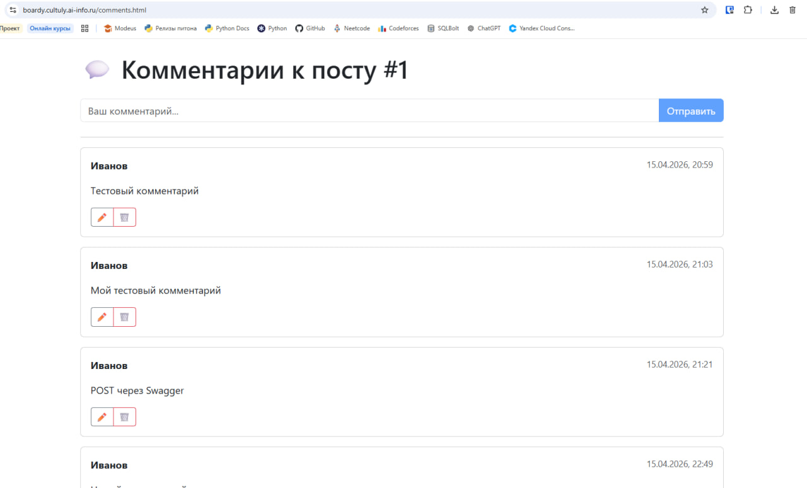

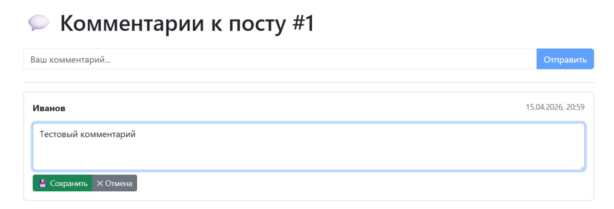

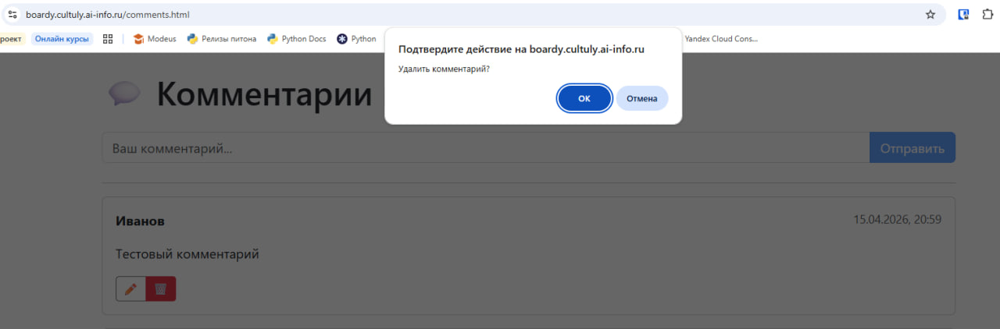

+----------------------+------------------------------------------+------------------------------------------+
| Пункт                | Vanilla JS                               | React                                    |
+----------------------+------------------------------------------+------------------------------------------+
| Где хранится         | В DOM-элементах (element.value) и        | В хуках useState внутри компонентов      |
| состояние            | глобальных переменных                    | (реактивное хранилище)                   |
+----------------------+------------------------------------------+------------------------------------------+
| Как обновляется      | Вручную: innerHTML = ...map().join('')   | Через setItems(): React сам пересчитывает|
| список               | перезаписывает весь контейнер            | виртуальный DOM и точечно обновляет      |
+----------------------+------------------------------------------+------------------------------------------+
| Как реализовано      | Ручная подмена элементов: createElement, | Условный рендеринг в JSX:                |
| редактирование       | replaceChild, флаги состояния            | {editMode ? <input/> : <p>} + useState   |
+----------------------+------------------------------------------+------------------------------------------+
| Защита от XSS        | Вручную: функция esc() экранирует через  | Автоматически: React экранирует все      |
|                      | textContent перед innerHTML              | значения в {}, кроме dangerouslySet...   |
+----------------------+------------------------------------------+------------------------------------------+

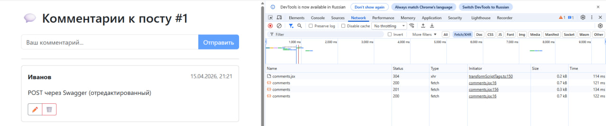
4 запросов, comments (Type: fetch) - это основной запрос к API (к данным по комментариями)

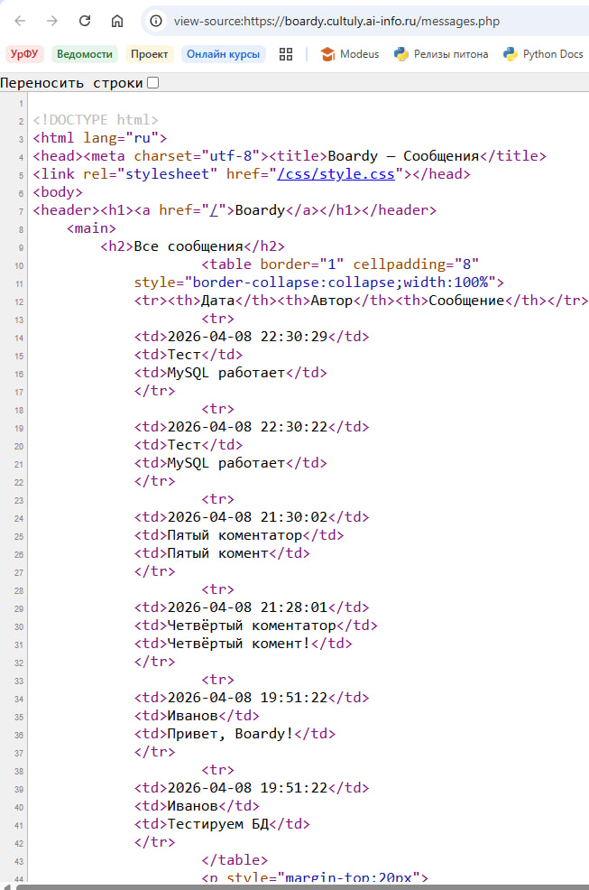

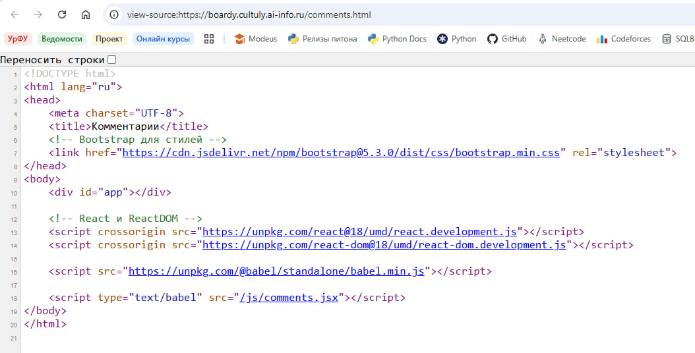
Сервер отправляет только пустой HTML-шаблон и JavaScript-файлы, а основной контент загружается уже в браузере с помощью JavaScript (например React) после открытия страницы. Поэтому в «View Source» видно только исходный шаблон без данных. Простой поисковый бот скорее всего ничего не увидит так как не сможет выполнить js.

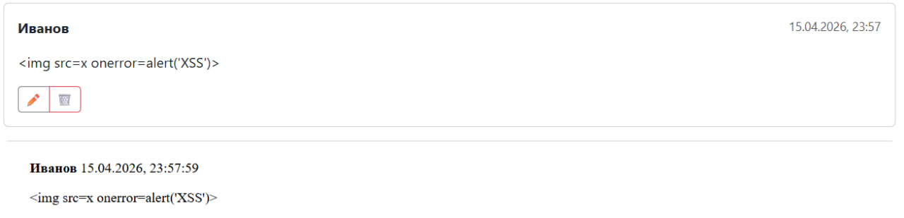
Vanilla JS:
Разработчику нужно самому следить за безопасностью, использовать textContent вместо innerHTML или экранировать пользовательский ввод с помощью специальных функций (например esc()), которые заменяют опасные символы < и > на безопасные HTML-сущности.
React:
React делает это автоматически — все значения в JSX ({variable}) по умолчанию экранируются и вставляются как обычный текст, а не как HTML-код.
Поэтому React считается надёжнее в плане защиты от XSS, так как безопасность встроена в сам фреймворк и меньше зависит от ошибок разработчика.

React будет понадёжнее

+--------------------------------+------------------+------------------+------------------+
|                                |   SSR (PHP)      |   vanilla JS     |   React          |
+--------------------------------+------------------+------------------+------------------+
| Кто рендерит HTML              | Сервер (PHP)     | Браузер (JS)     | Браузер (React)  |
+--------------------------------+------------------+------------------+------------------+
| Формат ответа сервера          | Готовый HTML     | HTML-шаблон +    | HTML-шаблон +    |
|                                |                  | JSON (API)       | JSON (API)       |
+--------------------------------+------------------+------------------+------------------+
| View Source: данные видны?     | Да               | Нет              | Нет              |
+--------------------------------+------------------+------------------+------------------+
| Перезагрузка при отправке      | Да (полная)      | Нет (AJAX)       | Нет              |
|                                |                  |                  | (preventDefault) |
+--------------------------------+------------------+------------------+------------------+
| Защита от XSS                  | Ручная           | Ручная           | Автоматическая   |
|                                | (htmlspecialchars) (textContent,    | (React экранирует|
|                                |                  | esc())           | по умолчанию)    |
+--------------------------------+------------------+------------------+------------------+
| Сложность кода                 | Низкая           | Средняя          | Средняя/Высокая  |
+--------------------------------+------------------+------------------+------------------+
